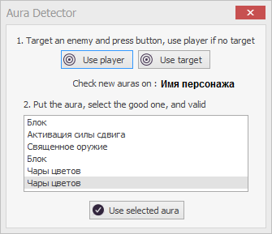
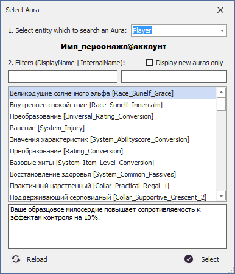

# **Ауры**

<a name = "def-Aura">***Аура (Aura)***</a> - это любой усиливающий (баф) или ослабляющий (дебаф) эффект наложенный на персонажа и других *Entity*.

#  **Окно AuraViewer**

В плагине **EntityTools** реализованно модифицированное окно просмотра списка аур.
<!-- , который с помощью патча заменяет [штатный *Mapper*](https://www.neverwinter-bot.com/forums/viewtopic.php?p=43909#p43909) бота Астрал. -->

|Штатный AuraDetector|Модифицированный AuraViewer|
|:-----:|:--------------:|
|||

1. Вверху окна справа от метки ``Select entity which to search an Aura`` расположен переключатель, позволяющий выбрать объект, ауры которого исследуются:
   - **Player** - персонаж;
   - **Target** - цель персонажа;
   - **Entity** - *Entity*, выбранный в окне [*EntityViewer*](EntityIdentification-RU.md).  
   В строке ниже отображается [InternalName](EntityIdentification-RU.md#ref-Entity-InternalName) выбранного объекта исследования.
3. В центре окна расположен список аур, наложенных на объект исследования.   
   В начале указывается локализованное название ауры (*DisplayName*), а в квадратных скобках - её внутриигровой идентификатор (*InternalName*).   
   В обычном режиме после изменения объекта исследования или фильтров необходимо нажать кнопку ``Reload``, чтобы обновить список аур.  
5. Под списком аур отображается подсказка с описанием выбранной ауры, если она имеется.
2. Над списком аур ниже метки ``Filters`` отображается два текстовых поля редактирования:
   - Справа фильтр **DisplayName**, задающий часть локализованного (русифицированного) имени ауры, которую необходимо найти.
   - Слева фильтр **InternalName**, задающий часть внутриигрового идентификатора ауры, которую необходимо найти.  
   Указанные фильтры позволяют скрыть в списке ауры, не содержащие текст, заданный в соответствующих полях редактирования.  
   В списке будут отображены ауры, удовлетворяющие обоим фильтрам.  
   В обычном режиме после изменения фильтра необходимо нажать кнопку ``Reload``, чтобы обновить список аур.
4. Опция ``Display new auras only``, расположенная над полем редактирования фильтров, включает динамический режим отслеживания ауры.  
   В список будут автоматически добавляться только новые ауры, наложенные на объект исследования, **ПОСЛЕ** активации данного режима.  
   Этот режим удобен для поиска ауры, накладываемой определенным умением персонажа.  
   Нажатие кнопки ``Reload`` очистит список и он начнет заполняться снова.
6. В нижней части окна находится пара кнопок:
   - ``Reload`` обновляет список аур, после выбора объекта исследования или изменения фильтров.
   - ``Select`` копирует идентификатор выбранной ауры в буфер обмена и закрывает окно.

---

<a href="javascript:history.back()">Назад</a>  
[Назад к содержанию](../../index.md)
