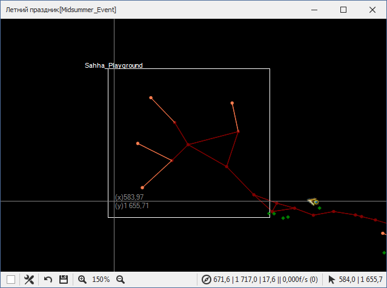
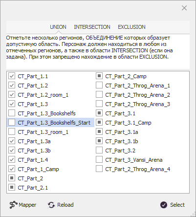

# **CustomRegionSet**

<a name ="def-CustomRegion">**CustomRegion**</a> - это прямоугольная или эллиптическая область на карте в плоскости ***Oxy***, заданная разработчиком quester-профиля и используемая для определения положения персонажа  относительно неё (внутри или снаружи).  
На скриншоте ниже в окне [Mapper](../General/Glossary-RU.md#ref-Mapper)'a отмечен CustomRegion ``Sahha_Playground``  

<a name ="def-CustomRegionSet">**CustomRegionSet**</a> - это область на карте, заданная сочетанием нескольких [CustomRegion](#def-CustomRegion)'ов, которые включены в одну из трех групп:

|**Название**|**Назначение**|
|:-----------|:-------------|
|<a name ="ref-CustomRegion-UNION">***UNION***</a> | **ОБЪЕДИНЕНИЕ** регионов, которое образует допустимую область. Персонаж должен находиться в любом из отмеченных регионов, а также в области [*INTERSECTION*](#ref-CustomRegion-INTERSECTION) (если она задана). При этом запрещено нахождение в области [*EXCLUSION*](#ref-CustomRegion-EXCLUSION).
|<a name ="ref-CustomRegion-INTERSECTION">***INTERSECTION***</a> | **ПЕРЕСЕЧЕНИЕ** регионов, образующее допустимую область. Персонаж должен находиться в каждом из отмеченных регионов, а также в области [*UNION*](#ref-CustomRegion-UNION) (если она задана). При этом запрещено нахождение в области [*EXCLUSION*](#ref-CustomRegion-EXCLUSION).
|<a name ="ref-CustomRegion-EXCLUSION">***EXCLUSION***</a> | Регионы, которые будут **ИСКЛЮЧЕНЫ** из итоговой области. Персонажу запрещено находиться в любом из них.

Изменение состава групп [CustomRegion](#def-CustomRegion)'ов производится в специальном окне. 
- Регионы, входящие в выбранную группу, отмечены ``v``;
- Регионы, входящие в другую группу, отмечены ``■``;
- Регионы, не включенные ни в одну группу, отмечены ``□`` 
