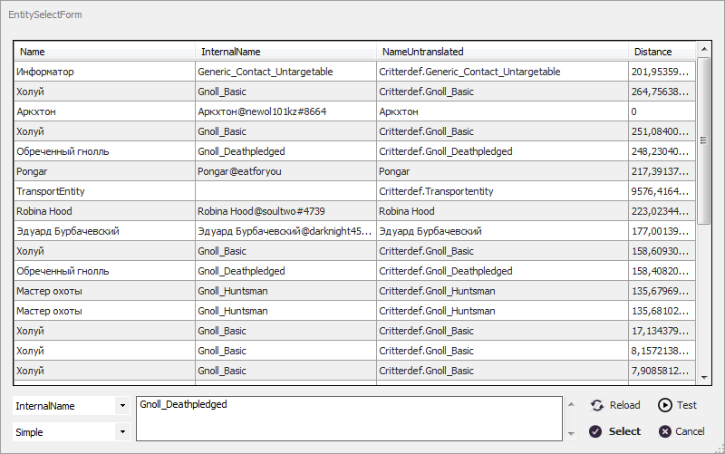

# **Идентификация *Entity***

*Entity* - это внутриигровой объект, являющийся частью игрового процесса или декорацией. К *Entity* относятся все игровые или неигровые персонажи, спутники, противники и босы подземелий, некоторые предметы интерьера, порталы и т.д.  
С помощью *Entity* реализованы некоторые игровые механики, например, горящие области или ядовитые испарения, причиняющие персонажу урон в бою.

Внутриигровые *Entity* имеют множество характеристик, но для их идентификации удобно использовать текстовые идентификаторы:
+ <a name ="ref-Entity-InternalName">***InternalName***</a> - Краткий внутриигровой идентификатор из английских букв и символа ``"_"``.  
Для многих однотипных *Entity* он повторяется (например, для NPC противников). 
У *Entity* игрока в данном свойстве отображается ``ник_персонажа``;
+ <a name ="ref-Entity-NameUntranslated">***NameUntranslated***</a> - Полный внутриигровой идентификатор из английских букв, цифр, символов ``"."`` и ``"_"``. Часто содержит указание на тип сущности, идентификатор карты (локации), порядковый номер и [*Entity.InternalName*](#ref-Entity-InternalName). 
У *Entity* игрока в данном свойстве отображается его полное имя в формате ``ник_персонажа@имя_аккаунта``;

---

В плагине ***EntityTools*** для идентификации *Entity* используется комбинация признаков:

| **Наименование** | **Описание** |
|:-----------------|:-------------|
|<a name ="ref-EntityID">***EntityID***</a> | Текстовый идентификатор *Entity*.
|<a name ="ref-EntityIdType">***EntityIdType***</a> | Переключатель способа интерпретации [*EntityID*](#ref-EntityID): - ***Simple*** : Простая текстовая строка.  В начале и в конце строки допускается использование символа подстановки ``"*"``, заменяющего произвольное число алфавитно-цифровых символов; - ***Regex*** : Регулярное выражение, составленное по правилам [.Net Framework](https://docs.microsoft.com/ru-ru/dotnet/standard/base-types/regular-expressions).
|<a name ="ref-EntityNameType">***EntityNameType***</a> | Переключатель, которые задает свойство *Entity*, с которым сопоставляется идентификатор [*EntityID*](#ref-EntityID): - ***InternalName*** : [*EntityID*](#ref-EntityID) сопоставляется с [*Entity.InternalName*](#ref-Entity-InternalName); - ***NameUntranslated*** : [*EntityID*](#ref-EntityID) сопоставляется с [*Entity.NameUntranslated*](#ref-Entity-NameUntranslated); - ***Empty*** : безымянное *Entity*, у которого все вышеуказанные идентификаторы должны пустые. Такие *Entity* обычно являются частью 
|<a name ="ref-EntitySetType">***EntitySetType***</a> | ***Дополнительная опция***, используемая в некоторых командах и условиях и позволяющая изменить множество *Entity*, в котором производится поиск: - ***Complete*** : Все видимые боту *Entity* (значение по умолчанию). Если опция отсутствует, то поиск производится в данном множестве; - ***Contacts*** : Видимые боту *Entity*, с которыми можно произвести ***взаимодействие***. Как правило это дружественные *NPC*, торговцы и т.п.

---

# **Окно выбора *Entity***
Для настройки вышеуказанных признаков используется **EntitySelectForm**. 
Удерживая клавишу ``Ctrl`` можно перетащить любую строку в поле редактирования [*EntityID*](#ref-EntityID), расположенное в нижней части окна.

- Кнопка ``Reload`` обновляет список *Entity*.
- Кнопка ``Test`` переводит фокус на строку таблицы, описывающую *Entity*, соответствующую заданным признакам.
- Кнопка ``Select`` завершает редактирование признаков *Entity*. Если поле редактирования [*EntityID*](#ref-EntityID) будет пустым, то будет выбран идентификатор *Entity* из активной строки таблицы.

---

[**Вернуться к содержанию**](../index.md)