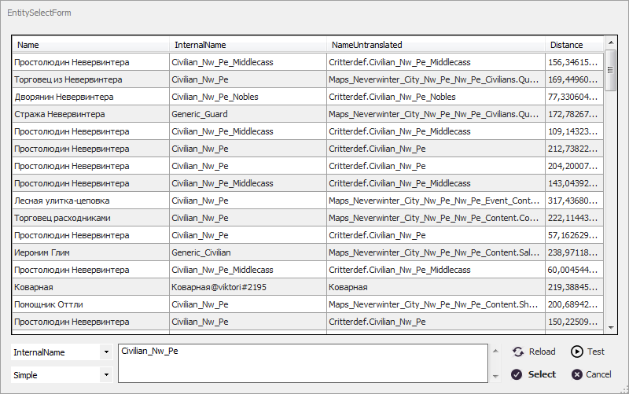

# **Идентификация *Entity***

<a name = "def-Entity">***Entity***</a> - это внутриигровой объект, являющийся частью игрового процесса или декорацией. К *Entity* относятся все игровые или неигровые персонажи, спутники, противники и босы подземелий, <!--некоторые предметы интерьера,--> порталы и т.д.  
С помощью *Entity* реализованы некоторые игровые механики, например, горящие области или ядовитые испарения, причиняющие персонажу урон в бою.

Следует отметить, что бот видит *Entity* в некотором радиусе вокруг персонажа. *Entity* за его пределами удаляются из памяти игры и подгружаются при приближении персонажа к ним. 

Внутриигровые *Entity* имеют множество характеристик, но для их идентификации удобно использовать текстовые идентификаторы:
+ <a name ="ref-Entity-InternalName">***InternalName***</a> - Краткий внутриигровой идентификатор из цифр, латинских букв и символа ``"_"``.  
Для многих однотипных *Entity* он повторяется (например, для NPC противников). 
У *Entity* игрока в данном свойстве отображается ``ник_персонажа``;
+ <a name ="ref-Entity-NameUntranslated">***NameUntranslated***</a> - Полный внутриигровой идентификатор из латинских букв, цифр, символов ``"."`` и ``"_"``. Часто содержит указание на тип сущности, идентификатор карты (локации), порядковый номер и [*Entity.InternalName*](#ref-Entity-InternalName). 
У *Entity* игрока в данном свойстве отображается его полное имя в формате ``ник_персонажа@имя_аккаунта``;

---

В плагине ***EntityTools*** для идентификации *Entity* используется комбинация признаков:

| **Наименование** | **Описание** |
|:-----------------|:-------------|
|<a name ="ref-EntityID">***EntityID***</a> | Текстовый идентификатор *Entity*.
|<a name ="ref-EntityIdType">***EntityIdType***</a> | Переключатель способа интерпретации [*EntityID*](#ref-EntityID): - ***Simple*** : Простая текстовая строка.  В начале и в конце строки допускается использование символа подстановки ``"*"``, заменяющего произвольное число алфавитно-цифровых символов; - ***Regex*** : Регулярное выражение, составленное по правилам [.Net Framework](https://docs.microsoft.com/ru-ru/dotnet/standard/base-types/regular-expressions).
|<a name ="ref-EntityNameType">***EntityNameType***</a> | Переключатель, которые задает свойство *Entity*, с которым сопоставляется идентификатор [*EntityID*](#ref-EntityID): - ***InternalName*** : [*EntityID*](#ref-EntityID) сопоставляется с [*Entity.InternalName*](#ref-Entity-InternalName); - ***NameUntranslated*** : [*EntityID*](#ref-EntityID) сопоставляется с [*Entity.NameUntranslated*](#ref-Entity-NameUntranslated); - ***Empty*** : безымянное *Entity*, у которого все вышеуказанные идентификаторы должны пустые. Такие *Entity* обычно являются частью анимации боевых умений.
|<a name ="ref-EntitySetType">***EntitySetType***</a> | ***Дополнительная опция***, используемая в некоторых командах и условиях и позволяющая изменить множество *Entity*, в котором производится поиск: - ***Complete*** : Все видимые боту *Entity* (значение по умолчанию). Если опция отсутствует, то поиск производится в данном множестве; - ***Contacts*** : Видимые боту *Entity*, с которыми можно произвести ***взаимодействие***. Как правило это дружественные *NPC*, торговцы и т.п.

---

# **Окно выбора *Entity***
Вышеуказанные признаки можно вручную задать в настройках команды или условия, а также использовать в качестве образца *Entity*.
Для этого предназначено окно **EntitySelectForm**.

Основная часть окна занята таблицей, содержащей перечень *Entity*, окружающих персонажа.  

По центру в нижней части окна расположено поле редактирования [*EntityID*](#ref-EntityID).  
Добавить идентификатор [*EntityID*](#ref-EntityID) из таблицы можно перетащив её в поле редактирования, удерживая клавишу ``Ctrl``.  

Слева от поля редактирования [*EntityID*](#ref-EntityID) расположены переключатели, задающие признаки [*EntityIdType*](#ref-EntityIdType) и [*EntityNameType*](#ref-EntityNameType).

Справа от поля редактирования [*EntityID*](#ref-EntityID) расположены кнопки:
- ``Reload`` обновляет список *Entity*.  
- ``Test`` проверяет комбинацию признаков *Entity* и переводит фокус на строку таблицы с *Entity*, соответствующей заданной комбинации признаков.
- ``Select`` завершает редактирование признаков *Entity*. Если поле редактирования [*EntityID*](#ref-EntityID) пусто, то будет выбран идентификатор *Entity* из активной строки таблицы.
- ``Cancel`` закрывает окно. При этом никакие изменения идентифицирующих *Entity* признаков не сохраняются.

---

<a href="javascript:history.back()">Назад</a>  
[Назад к содержанию](../index.md)