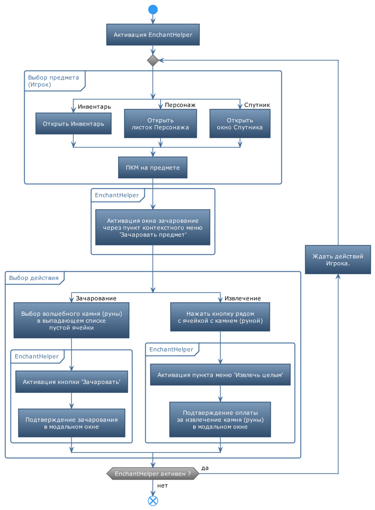

## **Enchant helper**

Это фоновый сервис, помогающий автоматизировать рутинные операции при  зачаровании предметов, то есть установки и извлечения:
- волшебных камней для предметов экипировки персонажа.
- рунных камней для предметов экипировки спутника.

За счет автоматической активации пунктов меню и множества подтверждений ***EnchantHelper*** экономит время пользователя, которому достаточно кликом мыши указать зачаровываемый предмет и нужный камень (руну).

## **Алгоритм**

1. Активируйте ***EnchantHelper*** на панели плагина **EntityTools** на вкладке *Utilites*.
2. Откройте листок персонажа, инвентарь или окно спутника.
   

  
3. Наведите курсор мыши на зачаровываемый предмет и правым кликом мыши (ПКМ) вызовите контекстное меню.
    - При появлении контекстного меню ***EnchantHelper*** активирует пункт меню 'Зачаровать предмет', открывающий окно зачарования.  

    3.1. Для извлечения волшебного камня или руны в окне зачарования откройте контекстное меню рядом с соответствующей ячейкой.  
    

  

    - в контекстном меню ***EnchantHelper*** активирует пункт ``Извлечь целым``, инициирующий извлечение камня (руны);
    - в открывшемся модальном окне ***EnchantHelper*** автоматически активирует подтверждение оплаты, нажав кнопку ``Извлечь``.  
    

  

    3.2. Для установки волшебного камня или руны в окне зачарования предмета кликните на кнопку рядом с пустой ячейкой и выберите в выпадающем списке нужный камень (руну).  
    

  

    - в ***EnchantHelper*** инициирует зачарование, нажав кнопку ``Зачаровать``.
    - в открывшемся модальном окне ***EnchantHelper*** автоматически активирует согласие с установкой камня (руны), нажав кнопку ``OK``.
    

  

4. Зачарование предметов экипировки спутника производится в аналогичном порядке.
5. После зачарования всех нужных предметов отключите ***EnchantHelper*** на панели плагина **EntityTools** на вкладке *Utilites*.

---

## **Блок-схема**

---

<a href="javascript:history.back()">Назад</a>  
[Назад к содержанию](../index.md)