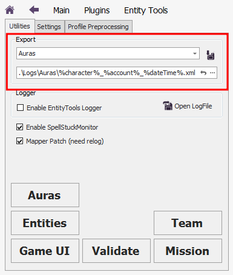
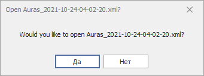

# **Инструмент экспорта**

Для проведения анализа без подключения к игровому миру реализован механизм сохранения в файл следующих наборов данных:
- **Auras** : список всех наложенных на персонажа [эффектов](AuraViewer-RU.md#ref-Aura);
- **Interfaces** : список и состояние внутриигровых элементов интерфейса (GUI);
- **Missions** : список активных и выполненных задач персонажа;
- **States** : список загруженных подсистем [Quester](../General/Glossary-RU.md#ref-Quester)'a и их приоритеты.

Данный инструмент доступен на панели плагина **EntityTools** на вкладке *Unitites*.

В выпадающем списке можно выбрать выгружаемый набор данных.

В поле редактирования ниже задается имя файла, в который будут сохранены данные.
Поддерживается использование ***подстановок***, которые во время выгрузки заменяются на соответствующие им значения:
- ``%character%`` - имя персонажа;
- ``%account%`` - имя аккаунта;
- ``%dateTime%`` - текущие дата и время в формате ``yyyy-MM-dd-hh-mm-ss``.  

Кнопка  восстанавливает имя файла, заданное по умолчанию.  
Кнопка ``...`` открывает диалоговое окно выбора файла, в котором будут сохранены данные. 

Клик по кнопке  сохраняет выбранные данные в файл, после чего выводится запрос на открытие созданного файла.

---

<a href="javascript:history.back()">Назад</a>  
[Назад к содержанию](../index.md)