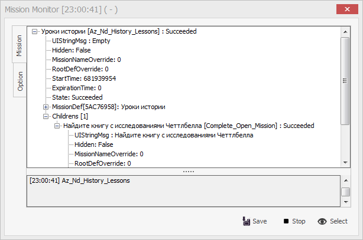
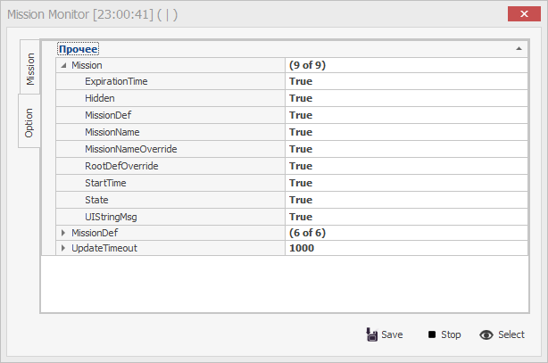

# **Монитор миссий (MissionMonitor)**

Большинство игровых заданий (миссий или квестов) состоят из нескольких отдельных задач, который нужно выполнить в определенном порядке или одновременно. Обычно подзадачи добавляются после выполнения предыдущей подзадачи или определенных условий.  

Каждая задача описывается сочетанием множества параметров и структурой *MissionDef*, а также может иметь собственные подзадачи *Childrens*.  

**MissionMonitor** предназначен для изучения структуры игровых задач и отслеживания её изменений, то есть смену состояния задачи во времени и последовательность добавления подзадач.

---

Чтобы начать мониторинг нажмите кнопку  ``Select`` и выберите нужную миссию. В окне отобразится дерево задачи.

Под деревом выводятся (логируются) сообщения обо всех изменениях в структуре выбранной задачи.  
Их можно сохранить в файл нажав на кнопку  ``Save``.

Остановить наблюдения можно нажав на кнопку  ``Stop``.

---

На вкладке ***Options*** можно выбрать какие параметры задач должны отображаться в дереве задачи на вкладке ***Mission***

---

<a href="javascript:history.back()">Назад</a>  
[Назад к содержанию](../index.md)