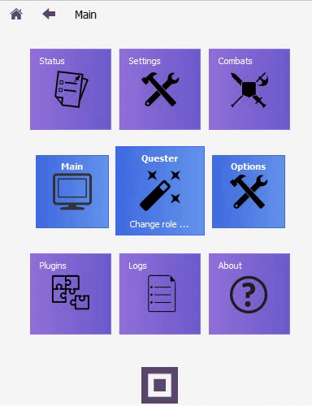
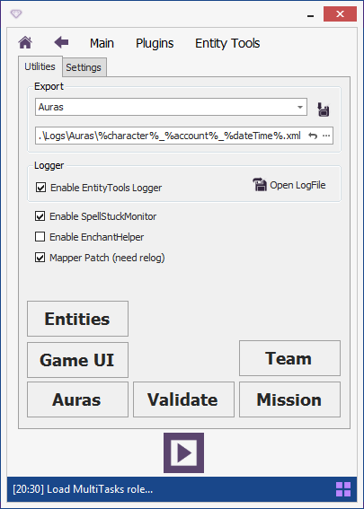
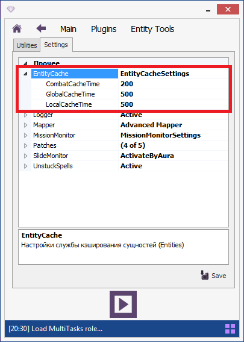

# **Панель плагина EntityTools**

Чтобы открыть панель плагина:
1. В главном окне бота нажмите кнопку "Progins".
2. В списке плагинов найдите кнопку плагина "EntityTools" и нажмите её:

---

# **Содержимое панели плагина EntityTools**

На панели расположены две вкладки:

## **Вкладка Utilites**

На данной вкладке размещены:

- **Инструмент экспорта : [*Exports*](Exporter-RU.md)**
- **Управление логированием : Logger**
- **Активация [SpellStuckMonitor'ом](UnstuckSpells-RU.md)**
- **Активация [EnchantHelper'a](EnchantHelper-RU.md)**
- **Активация расширенного [Mapper'a](../Patches/Mapper/Mapper-RU.md)**
- **Обозреватель [Entities](../General/EntityIdentification-RU.md#ref-EntityViewer)**
- **Обозреватель элементов внутриигрового интерфейса : Game UI**
- **Инструмент исследования аур : [Auras](AuraViewer-RU.md)**
- **Монитор миссий : [Mission](MissionMonitor-RU.md)**
- **Монитор членов группы : Team**
- **Контроль целостности плагина : Validate**

## **Вкладка Settings**

На данная вкладке организован доступ к настройкам всех инструментов и патчей плагина **EntityTools**.

---

<a href="javascript:history.back()">Назад</a>  
[Назад к содержанию](../index.md)