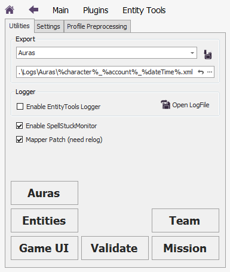
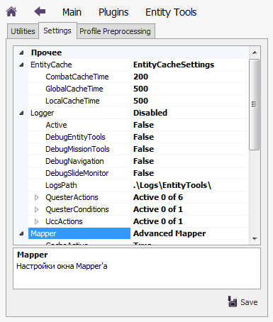
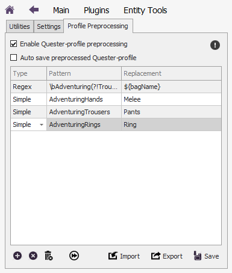

# **Панель плагина EntityTools**

Чтобы открыть панель плагина:
1. В главном окне бота нажмите кнопку "Plugins".
2. В списке плагинов найдите кнопку плагина "EntityTools" и нажмите её:

---

# **Содержимое панели плагина EntityTools**

## **Вкладка Utilites**

- **Инструмент экспорта данных в xml-файл: [*Export*](Exporter-RU.md)**
- **Активация собственного логирования EntityTools - [Logger'a](img/Settings/Logger.png)**
- **Активация [SpellStuckMonitor'а](UnstuckSpells-RU.md)**
- **Активация собственного окна картографирования - [Mapper'a](../Patches/Mapper/Mapper-RU.md)**
- **Обозреватель [Entities](../General/EntityIdentification-RU.md#ref-EntityViewer)**
- **Обозреватель элементов внутриигрового интерфейса : [Game UI](img/UIViewer.png)**
- **Обозреватель аур : [Auras](AuraViewer-RU.md)**
- **Монитор миссий : [Mission](MissionMonitor-RU.md)**
- **Монитор членов группы : Team**
- **Контроль целостности плагина : Validate**
<!-- - **Активация [EnchantHelper'a](EnchantHelper-RU.md)** -->

---

## **Вкладка Settings**

На данной вкладке собраны настройки всех инструментов и патчей плагина **EntityTools**.

---

## **Вкладка Profile Preprocessing**

На данной вкладке находятся настройки сервиса, модифицирующего файл quester-профиля непосредственно перед его загрузкой.  
[*Подробнее...*](QuesterProfilePreprocessing-RU.md)

---

<a href="javascript:history.back()">Назад</a>  
[Назад к содержанию](../index.md)