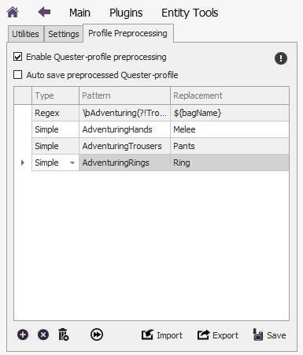
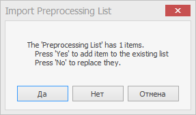
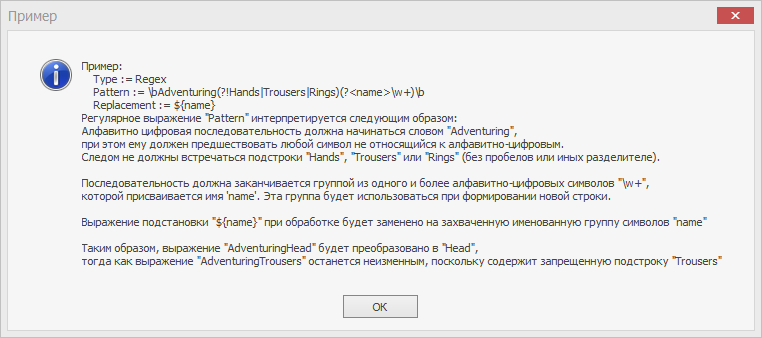

## **Предобработка quester-профиля  (QuesterProfilePreprocessing)**

Это сервис, модифицирующий файл quester-профиля непосредственно перед его загрузкой.
Данный сервис предназначен для исправления ошибок, возникающих при загрузке профилей после обновлений API бота Астрал, например, изменении идентификаторов сумок персонажей (BagsId) 12.01.2022г.

Данный сервис включается на панели плагина **EntityTools** на вкладке *Profile Preprocessing*.

---

## **Алгоритм**

1. Предобработка выполняется перед загрузкой quester-профиля.
2. Каждая строка файла ``profile.xml``, содержащегося в архиве quester-профиля, построчно сопоставляется с каждым элементом в списке замен.
3. Если в строке файла содержится подстрока, соответствующая шаблону [*Pattern*](#ref-Pattern), данная подстрока заменяется на [*Replacement*](#ref-Replacement).
4. Выполнения замены получившаяся строка сопоставляется со следующим элементом в списке замен.

---

## **Настройки**

|Название|Описание|
|:------:|:-------|
|***Auto save preprocessed Quester-profile***| Опция активирует автоматическое сохранение профиля после успешной предобработки, то есть в случае, если была произведена хоть одна замена.|  
|***Список замен***| Каждый элемент списка содержит: - <a name ="ref-Type">**Type**</a> : Тип элемента замены: <list><li>*Simple* : простой текст. Cимволы подстановки '*' не допускаются.<li> *Regex* : регулярное выражение. В этом случае элементы регулярных выражений допускаются как в [*Pattern*](#ref-Pattern) так и в [*Replacement*](#ref-Replacement).</list> - <a name ="ref-Pattern">**Pattern**</a> : шаблон текстовой строки, которая ищется в файле ``profile.xml``; - <a name ="ref-Replacement">**Replacement**</a> : строка подстановки, которая будет вставлена в файл ``profile.xml`` вместо подстроку [*Pattern*](#ref-Pattern).|

---

## **Элементы управления**

- Кнопка  добавляет в [*список замен*](#ref-Replacements) новый элемент.
- Кнопка  удаляет из [*списка замен*](#ref-Replacements) выбранный элемент.
- Кнопка  очищает [*список замен*](#ref-Replacements), то есть удаляет из него все элементы. 

---

- Кнопка  позволяет в тестовом режиме провести предобработку выбранного quester-профиля, а также ознакомиться с подробным отчетом.

---

- Кнопка  *Import* позволяет загрузить из файла [*список замен*](#ref-Replacements).  
  Если текущий список содержит хотя бы один элемент, будет выведен следующий запрос о необходимых действиях:
  + При нажатии на кнопку ``Yes (Да)`` элементы импортируемого списка будут добавлены к существующему;  
  + При нажатии на кнопку ``No (Нет)`` текущий список будет удален и заменен на импортируемый.
  

- Кнопка  *Export* позволяет сохранить в файл текущий [*список замен*](#ref-Replacements).   

---

- Кнопка  *Save* сохраняет все настройки предобработки quester-профиля в файл ``Settings\ProfilePreprocessor.xml``.  
Данные настройки при следующем запуске бота будут загружены автоматически.

---

- Кнопка , расположенная в правом верхнем углу, выводит пример элемента замены и пояснения о его работе. 

---

<a href="javascript:history.back()">Назад</a>  
[Назад к содержанию](../index.md)