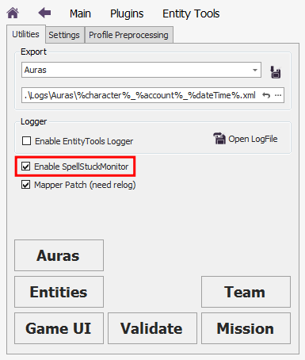
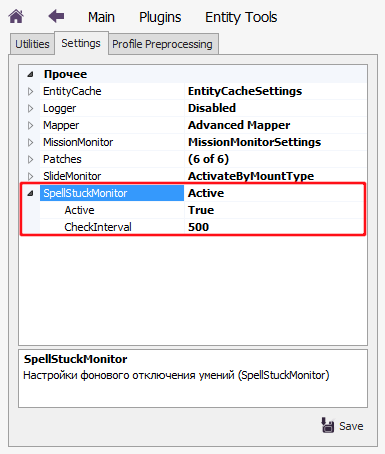

## **SpellsStuckMonitor**

Это фоновый сервис, отслеживающий и устраняющий некорректные состояние персонажа при завершении боя, такие как:
- Активный блок у Паладина (поднятый щит), который замедляет перемещение персонажа;
- Активна способность "Божественный поборник" у Паладина-Юстициара, которая расходует божественный призыв;
- Активное умение "Сила Свыше" у Паладина-Клятвохранителя, которая блокирует перемещение персонажа;
- Активное умение "Сила Свыше" у Клирика (кроме Благочестивца), которая блокирует перемещение персонажа;

Данный сервис включается на панели плагина **EntityTools** на вкладке *Utilites*.

---

## **Алгоритм**

1. **SpellStuckMonitor** активируется, когда персонаж вступает в бой, и с определенной периодичностью ([*CheckInterval*](#ref-CheckInterval)) проверяет окончился ли бой.  
2. Если бой завершен, **SpellStuckMonitor** в зависимости от класса персонажа проверяет активность умений, которые блокируют дальнейшие действия персонажа вне боя, и деактивирует их.

---

## **Настройки**

Опция ***CheckInterval*** задает промежуток времени в миллисекундах между проверками окончания боя и может быть измена на панели плагина **EntityTools** во вкладке *Settings*.

---

<a href="javascript:history.back()">Назад</a>  
[Назад к содержанию](../index.md)