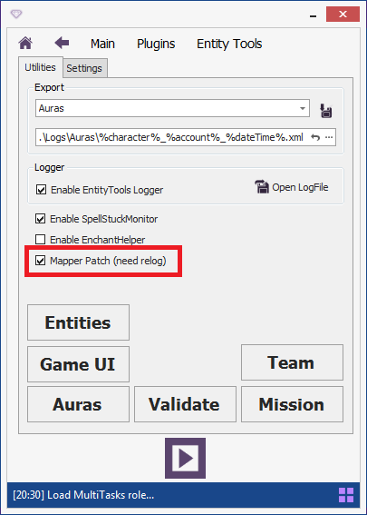
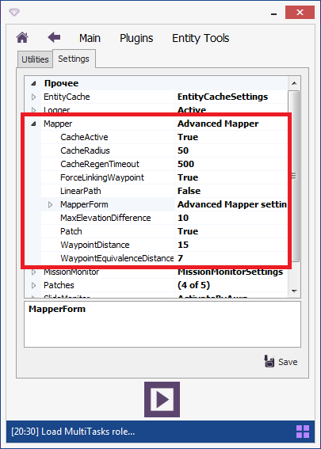

# **Все настройки Mapper'a**

Активация патча, который подменяет [штатный](https://www.neverwinter-bot.com/forums/viewtopic.php?p=43909#p43909) Mapper, выполняется на панели плагина.  
После активации опции, патч будет применен при следующем запуске бота.

Полный список настроек Mapper'a доступен на вкладке ***Settings*** в группе ***Mapper***.  

После выбора опции её описание отобразится внизу окна.

## **Основные**

- **Patch** : Активация (деактивация) патча окна Mapper'a.

## **Опции картографирования:**

Данная группа настроек дублирует настройки, отображающиеся на [панели картографирования Mapper'a](Mapper-MappingTools-RU.md).  
  **WaypointDistance** : Расстояние между добавляемыми путевыми точками.  
  **WaypointEquivalenceDistance** : Радиус, в пределах которого точки пути считаются эквивалентными (новые не добавляются).  
  **MaxElevationDifference** : Максимальная допустимая разница высот между соединяемыми точками пути.  
  **ForceLinkingWaypoint** : Флаг принудительного связывания с предыдущей точкой пути.  
  **LinearPath** : Флаг прокладывания линейного пути (без связей с пересекающимися путями).

###  **Опции кэширования при [картографировании](Mapper-MappingTools-RU.md):**

-  **CacheActive** : Активация кэша путевых точек в режиме прокладывания пути.  
-  **CacheRadius** : Радиус в пределах которого кэшируются путевые точки.
-  **CacheRegenTimeout** : Период времени между обновлениями кэша

## **Настройки окна (группа MapperForm):**
-  **Location** : Координаты окна на экране монитора.
-  **Size** : Размер окна на экране в пикселях.
-  **RedrawMapperTimeout** : Интервал времени между обновлением (перерисовкой) окна Mapper'a. [Подробнее...](GeneralOptions-RU.md#ref-MeshesCaching)  
-  **LayerDepth** : Размер слоя по оси Z, отображаемого в окне Mapper'a. [Подробнее...](GeneralOptions-RU.md#ref-ZLimit)  

### **Настройки видимости панелей инструментов:**
Данная группа настроек может быть изменена через контекстное меню в окне Mapper'a.  
-  **MappingBarVisible** : Видимость панели инструментов '[*Mapping Tools*](Mapper-MappingTools-RU.md)'.
-  **GraphToolsBarVisible** : Видимость панели инструментов '[*Graph Tools*](Mapper-GraphTools-RU.md)'.
-  **GraphEditToolsBarVisible** : Видимость панели инструментов '[*Graph Edit Tools*](Mapper-EditTools-RU.md)'.
-  **CustomRegionBarVisible** : Видимость панели инструментов '[*CustomRegion Tools*](Mapper-CustomRegionTools-RU.md)'.
-  **StatusBarVisible** : Видимость строки состояния '[*StatusBar*](StatusBar-RU.md)'.

### **Цвета путевого графа:**
Данная группа настроек дублирует настройки, отображающиеся в [окне Mapper'a](GeneralOptions-RU.md#ref-MeshesOptions)

  ***BidirectionalPathColor*** : Цвет двунаправленного пути (BidirectionalPath).  
  ***UnidirectionalPathColor*** : Цвет однонаправленного пути (UnidirectionalPath).  
  ***BackgroundColor*** : Цвет фона.

### **Отображение и цвета объектов:**
Данная группа настроек дублирует настройки, отображающиеся в [окне Mapper'a](GeneralOptions-RU.md#ref-ObjectsOptions)
-  ***DrawEnemies*** : Отображение врагов.
-  ***EnemyColor*** : Цвет врагов.
-  ***DrawEnemies*** : Отображение дружественных NPC и Entity.
-  ***FriendColor*** : Цвет дружественных NPC и Entity.
-  ***DrawPlayers*** : Отображение игроков.
-  ***PlayerColor*** : Цвет игроков.
-  ***DrawOtherNPC*** : Отображение нейтральных NPC и Entity.
-  ***OtherNPCColor*** : Цвет нейтральных NPC и Entity.
-  ***DrawNodes*** : Отображение точек взаимодействия (Node).
-  ***NodeColor*** : Цвет точек взаимодействия (Node).
-  ***DrawSkillNodes*** : Отображение точек проверки талантов (SkillNode).
-  ***SkillNodeColor*** : Цвет точек проверки талантов (SkillNode).

---

<a href="javascript:history.back()">Назад</a>  
[Назад к описанию Mapper'a](Mapper-RU.md)  
[Назад к содержанию](../../index.md)