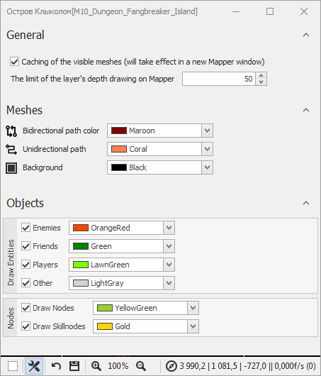
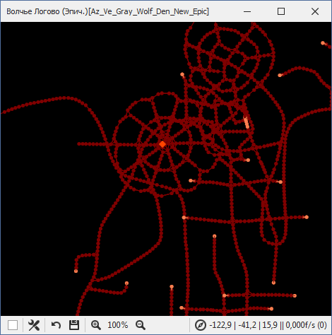
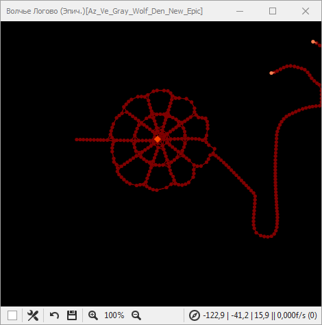
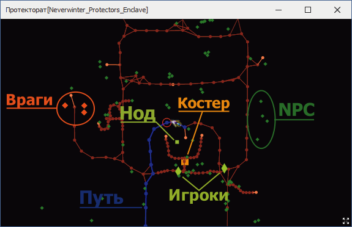

# **Настройки отображения**

Панель настроек Mapper'a открывается при нажатии на кнопку , расположенную в строке состояния.

Настройки разделены на следующие группы:

## **General**

Группа настроек, отвечающих за механизм формирования изображения.
-  Опция **Caching of thе visible meshes** активирует механизм кэширования путевых точек.  

    При включении кэширования вычисляется область внутриигрового пространства, которая на 25% превышает область отображаемую в окне Mapper'a. Все путевые точки, попадающие в указанную область вносятся в специальных буфер, который используется при формировании изображения путевого графа. В режиме отслеживания персонажа или при ручном перемещении карты область кэширования пересчитывается, а буфер путевых точек обновляется с частотой 1 раз в секунду.  

    Данный механизм позволяет существенно снизить затраты вычислительных ресурсов компьютера на формирование изображения в окне Mapper'a ценой появления незначительного запаздывания отрисовки путевого графа вблизи границ окна, возникающего при высокой скорости перемещения персонажа.  

    Такой подход выгодно отличается от [штатного](https://www.neverwinter-bot.com/forums/viewtopic.php?p=43909#p43909) Mapper'a, формирующего полноразмерное изображение со всеми путевыми точками, однако, отображающего лишь небольшую видимую часть путевого графа.

    При отключении данной опции кэширование путевых вершин отключается, и повторяет реализованный в [штатном](https://www.neverwinter-bot.com/forums/viewtopic.php?p=43909#p43909) Mapper'е подход к формированию изображения.

- Опция **The limit of the layer's depth drawing on Mapper** задает размер слоя по оси Z, отображаемого в окне Mapper'a.  

    Данная опция отсекает (скрывает) путевые точки, расположенные относительно точки фиксации выше и ниже на заданную величину.  Точкой фиксации является:
    + персонаж, в режиме отслеживания;
    + центр экрана, в свободном режиме.  
        Координаты **X** и **Y** точки фиксации изменяются при перемещении карты, которое производится путем перемещение курсора мыши с одновременным удержанием правой кнопки мыши.  
        Координату **Z** можно изменить прокручивая колесо мыши, удерживая ``Alt``.  
    Трехмерные координаты точки фиксации в игровом пространстве отображаются в строке состояния рядом с иконкой компаса  в формате `` X,y | Y,y | Z,z ``.

    Это удобно при работе на картах с несколькими уровнями, расположенными друг над другом, например в "***Логове Волка***". В [штатном](https://www.neverwinter-bot.com/forums/viewtopic.php?p=43909#p43909) Mapper'e такая опция отсутствует.  

    |Без ограничения глубины слоя|С ограничением глубины слоя|
    |:--------------------------:|:-------------------------:|
    |||

    На таких сложных картах пути наслаиваются друг на друга, что затрудняет ориентирование и работу с путевым графом.

---

## **Meshes**

Группа настроек, определяющих цвета путевого графа:  
 Цвет элементов **двунаправленного** пути (точек и ребер).  
 Цвет элементов **однонаправленного** пути (точек и ребер).  
 Цвет **фона**.

---

## **Objects**

Группа настроек, позволяющих включать или отключать отображение различных объектов в окне Mapper'a, а также устанавливать их цвет.

- **Drawing Entities** - настройки отображаемых *Entity*:
  +  ***Enemies*** : отображение и цвет врагов;
  +  ***Friends*** : отображение и цвет дружественных NPC и *Entity*;
  +  ***Players*** : отображение и цвет игроков;
  +  ***Others*** : отображение и цвет нейтральных NPC и *Entity*.

- **Nodes** - настройки отображения статических интерактивных объектов (сундуки, двери, рычаги и т.п.), называемых нодами:
  +  ***Skillnodes*** : отображение и цвет точек проверки талантов, то есть тайников, открываемых с помощью талантов персонажа "*Единение с природой*", "*Знание подземелий*", "*Ловкость рук*", "*Тайное знание*", "*Теология*";
  +  ***Nodes*** : отображение и цвет всех остальных нодов.

---

<a href="javascript:history.back()">Назад</a>  
[Назад к описанию Mapper'a](Mapper-RU.md)  
[Назад к содержанию](../../index.md)