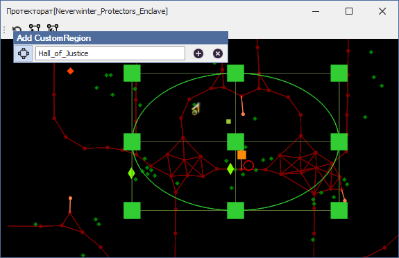

# **Инструмент добавления CustomRegion (Add CustomRegion)**

Инструмент расположен на панели [*'CustomRegion Tools'*](Mapper-CustomRegionTools-RU.md) и активируется нажатием на кнопку .   
Он предназначен для добавления нового *CustomRegion'а*.
После его активации, открывается плавающая панель ***'Add CustomRegion'***, на которой находятся:

- Кнопка переключения формы *CustomRegion'а*, изменяющая свой вид в зависимости от выбранной формы:  
   - прямоугольный;  
  

  

   - эллиптический.
  

- Поле для ввода имени добавляемого *CustomRegion'а*.  
  Повторение имен не допускается;
- Кнопка  добавляет в quester-профиль *CustomRegion* с заданными параметрами закрывает панель ***'Add CustomRegion'***.
- Кнопка  закрывает панель ***'Add CustomRegion'*** без добавления *CustomRegion'а*.

---

## **Последовательность действий**

1. *CustomRegion* задается путем указания двух противоположных углов опорного прямоугольника, охватывающего нужную область. Например, левым нижним и правым верхним углами.
   - Кликните правой кнопки мыши (ПКМ) в любом месте на Mapper'e для задания первого угла опорного прямоугольника.  
   В отличие от [штатного Mapper'а](https://www.neverwinter-bot.com/forums/viewtopic.php?p=43909#p43909) можно начинать разметку с любого угла, а не только с левого верхнего.
   - Кликните ПКМ второй раз, для задания противоположного угла опорного прямоугольника.
   - Нажатие ``Escape`` сбросить опорный прямоугольник и оба угла нужно будет задавать снова.
2. После задания опорного прямоугольника его размеры или положение можно изменить перетащив границы за "квадратные" якорьки.  
   

  - Клик ПКМ цепляет якорь и активирует перетаскивание. Второй клик ПКМ завершает перетаскивание.  
  - Перемещение всего опорного прямоугольника без изменения размеров производится за центральный якорь.  
  Если размеры *CustomRegion'а* меньше 25 единиц, отключаются якори на гранях опорного прямоугольника и остаются только по углам и в центре.  
    

   
3. В любой момент можно изменить форму *CustomRegion'а*, нажав соответствующую кнопку на панели ***'Add CustomRegion'***.
4. Наконец, следует задать имя *CustomRegion'y* и нажать на кнопку с .

---

<a href="javascript:history.back()">Назад</a>  
[Назад к описанию 'CustomRegion Tools'](Mapper-CustomRegionTools-RU.md)  
[Назад к описанию Mapper'a](Mapper-RU.md)  
[Назад к содержанию](../../index.md)