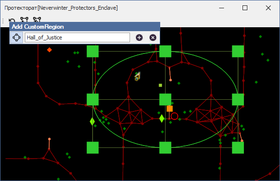
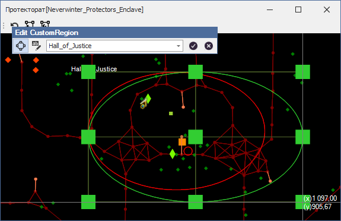

# **Инструменты для работы с CustomRegion (CustomRegion Tools)**

<a name ="ref-CustomRegion">**CustomRegion**</a> - это прямоугольная или эллиптическая область на карте в плоскости ***Oxy***, заданная разработчиком quester-профиля и используемая для определения положения персонажа  относительно неё (внутри или снаружи).  
CustomRegion может иметь одну из двух форм:  
 прямоугольную;  
 элиптическую.

---

На панели **'CustomRegion Tools'** сгруппированы инструменты для добавления нового или изменения существующего *CustomRegion'а*.  

---

 Инструмент **<a name="ref-AddCustomRegion">Add CustomRegion</a>** предназначен для добавления нового *CustomRegion'а*. [Подробнее...](Mapper-CustomRegionTools-Add-RU.md)  

---

 Инструмент **<a name="ref-EditCustomRegion">Edit CustomRegion</a>** предназначен для изменения существующих *CustomRegion'ов*. [Подробнее...](Mapper-CustomRegionTools-Edit-RU.md)  

<!--

* Выберите в выпадающем списке редактируемый CustomRegion. Карта переместится к выбранному региону и отобразятся якори для изменения его размеров.
* Изменение типа региона (прямоугольный/элиптический) производится первой кнопкой на панели (квадрат с выделенными углами);
* Для переименования региона нажмите иконку, следующую за полем с наименованием CustomRegion'a
* Изменение геометрических размеров производится перетаскиванием его границ за якори (зеленые квадраты)
* Для подтверждения внесенных изменений нажмите на панели кнопку Accept (птичка в круге). Изменения будут сохранены и можно будет выбрать другой регион для редактирования.
* Закрыть инструмент редактирования регионов можно нажав на панели кнопку Cancel (крест на круге) 

---

Если размеры CustomRegion'а меньше 25 единиц, отключаются якори на гранях опорного прямоугольника и остаются только по углам и в центре.
Если размеры  CustomRegion'а меньше 10 единиц - отключаются все якори (остается только опорный прямоугольник и эллипс) -->

---

<a href="javascript:history.back()">Назад</a>  
[Назад к описанию Mapper'a](Mapper-RU.md)  
[Назад к содержанию](../../index.md)