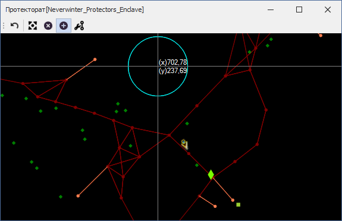
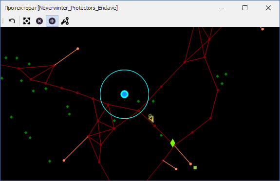
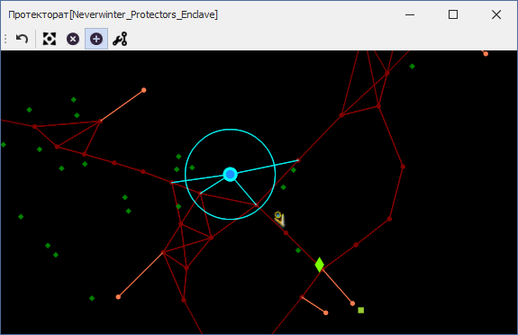
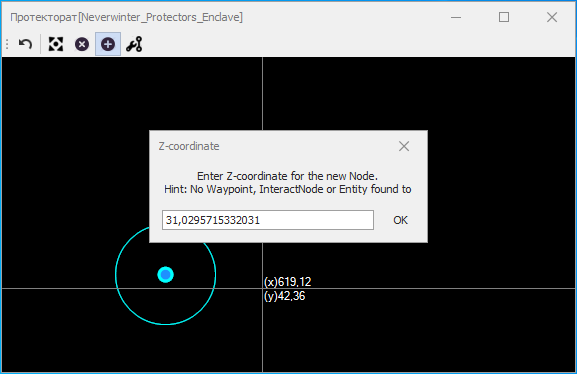
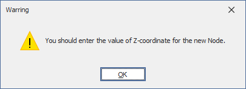

# **Инструмент добавления путевых точек (Add Nodes)**

Инструмент расположен на панели [*Graph Edit Tools*](Mapper-EditTools-RU.md) и активируется нажатием кнопки .  
Он предназначен для ручного добавления **новых** точек в путевой граф.   
Поскольку в **Mapper'e** отображается проекция графа на плоскость *Oxy*, при ручном добавлении новой вершины возникает дополнительная задача вычисления её Z-координаты (высоты).   

## **Последовательность действий**

1. Фиксация планируемых координат (X, Y) новой точки:
   - Расположите курсор мыши в месте планируемого размещения новой путевой точки и нажмите правой кнопкой мыши (ПКМ). Бирюзовой окружностью указывается область, в которой будет производиться поиск эталонного объекта для определения Z-координаты новой точки.  
   Радиус данной окружности задается опцией [*WaypointDistance*](Mapper-MappingTools-RU.md#ref-WaypointDistance).  
     

  
   - После фиксации координат (X, Y) размещения новой путевой точки, она отобразается синей точкой с бирюзовой окантовкой.
     

   - Для отмены фиксации кординат достаточно нажать клавишу ``Esc``.  

2. <a name="ref-LinkingNodes">Добавление ребер (связей)</a> между новой и существующими путевыми точками.
   - Для добавления двунаправленных ребер нужно кликнуть правой кнопкой мыши (ПКМ) на существующей вершине. Требуемая точность клика определяется опцией [*NodeEquivalenceDistance*](Mapper-MappingTools-RU.md#ref-NodeEquivalenceDistance).  
     

  
   - Для отказа добавления ребер (связей) необходимо нажать клавишу ``Esc``.  
   - Добаление ребер (связей) рекомендуется, но не обязательно. Добавление однонаправленных ребер не предусмотренно при использовании данного инструмента.

3. Добавление в путевой граф новой точки. Вычисление Z-координаты.
   - Для добавления новой точки в путевой граф нажамите клавишу ``Enter``.  
   - Если на [*2 (втором) этапе*](#ref-LinkingNodes) были добавлены ребра (связи), то Z-координата новой точки будет вычислена как среднее арифметическое Z-координат связанных с ней путевых точек.
   - Если на [*2 (втором) этапе*](#ref-LinkingNodes) не были добавлены ребра (связи), то производится поиск эталонного объекта, используя который можно будет вычислить Z-координату новой путевой точки. Поиск производится в области, обозначенной бирюзовой окружностью, последовательно в следующих группах объектов:
      + Путевые точки экспортированного из игры путевого графа;
      + Интерактивные ноды;
      + Неигровые персонажи (Entity).  
      При обнаружении нескольких однотипных объектов в заданной области, Z-координата новой точки будет вычислена как среднее арифметическое Z-координат таких объектов.
   - Если поиск эталонного объекта окажется безрезультатым, будет выведено диалоговое окно ввода z-координаты, в котором можно будет указать необходимое значение. В качестве значения по умолчанию будет указана z-координата персонажа.   
     

  
   - Если все  способы определения Z-координаты окажутся безрезультатными, то текущий инструмет будет возвращен к выполнению [*2 (второого) этапа*](#ref-LinkingNodes).
     

  

4. После успешного добавления путевой точки инструмет готов к добавлению следующей путевой точки.

5. Для отключения инструмента добавления путевых точек снова нажмите на кнопку  или активируйте другой инструмент.

---

<a href="javascript:history.back()">Назад</a>  
[Назад к описанию Mapper'a](Mapper-RU.md)  
[Назад к содержанию](../../index.md)