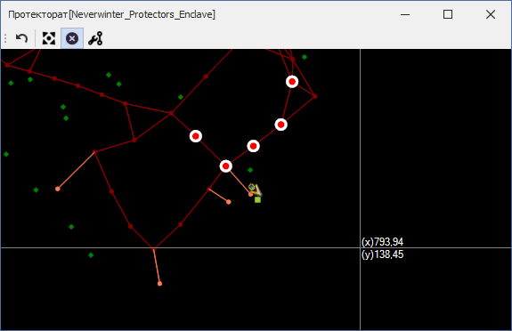
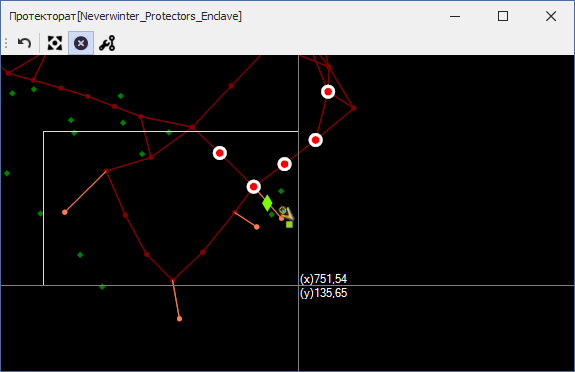
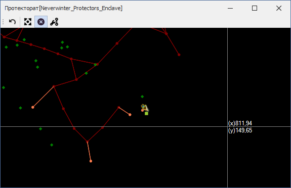

# **Инструмент удаления путевых точек (Delete Nodes)**

Инструмент расположен на панели [*Graph Edit Tools*](Mapper-EditTools-RU.md) и активируется нажатием на кнопку   
Hot-key: ``Ctrl-Shift-D``

## **Последовательность действий**

1. Выделите одну или несколько путевых точек:
   - Для выбора путевой точки достаточно кликнуть на неё правой кнопкой мыши (ПКМ). Требуемая точность клика определяется опцией [*NodeEquivalenceDistance*](Mapper-MappingTools-RU.md#ref-NodeEquivalenceDistance);
   - Для добавления точки в группу удаляемых точек необходимо, удерживая ``Ctrl``, кликнуть на неё правой кнопкой мыши (ПКМ);  
                
        

 

   - Для добавления нескольких точек в группу удаляемых, удерживая ``Shift``, последовательными кликами ПКМ задайте прямоугольную область выделения, охватывающую необходимые точки.  
        Первый ПКМ отмечает начальную точку области выделения.  
        Второй ПКМ - добавляя в группу удаляемых все точки, находящиеся в прямоугольной области выделения.  
        

 
   - Если отпустить ``Ctrl`` и кликнуть на любую путевую точку, то она будет выбрана, а группа удаляемых точек - очищена.
   - Нажатие кнопки ``Escape`` очищает группу выделенных путевых точек. 

2. Нажатие кнопки ``Del`` удалит выбранные путевые точки.
   

3. Для отключения инструмента удаления путевых точек снова нажмите на кнопку  или активируйте другой инструмент.

---

<a href="javascript:history.back()">Назад</a>  
[Назад к описанию Mapper'a](Mapper-RU.md)  
[Назад к содержанию](../../../index.md)