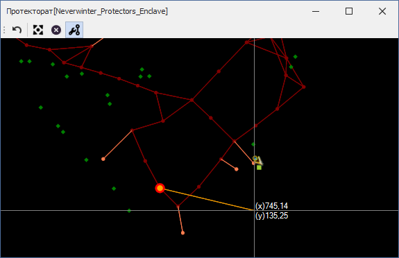

# **Инструмент редактирования ребер (Edit Edges)**

Инструмент расположен на панели [*Graph Edit Tools*](Mapper-EditTools-RU.md) и активируется нажатием на кнопку .   
Он предназначен для добавления или удаления ребер между **существующими** путевыми точками.  
Hot-key: ``Ctrl-Shift-R``

## **Последовательность действий**

1. Кликом правой кнопки мыши (ПКМ) выделите начальную путевую точку, из которой выходит ребро. Требуемая точность клика определяется опцией [*NodeEquivalenceDistance*](Mapper-MappingTools-RU.md#ref-NodeEquivalenceDistance).  
   Выбранная точка будет отмечена красной окружностью с оранжевым центром.  
   От выбранной точки к курсору мыши будет отображаться линия, обозначая готовность добавить (удалить) ребро.  

   

 

2. **Добавление новой связи (ребра)** производится кликом ПКМ на путевой точке, которая **НЕ СВЯЗАНА** с начальной (выбранной) точкой. Добавленное ребро будет **двунаправленным (bidirectional)**, допускающим перемещение как в прямом, так и в обратном направлении.
   Если при этом удерживать ``Ctrl``, то будет добавлено **однонаправленное ребро (Unidirectional)** в направлении от начальной точки к текущей, то есть переход персонажа между ними будет возможен только в указанном направлении.

3. **Удаление существующей связи (ребра)** производится кликом ПКМ на путевой точке, которая **СВЯЗАНА** с начальной (выбранной) точкой. Это удалит любое ребро, в результате чего переход персонажа между точками будет невозможен ни в прямом, ни в обратном направлении.  
   
4. Сброс выбранной вершины (отмена выделения) возможен следующими способами:
   - повторным кликом ПКМ на ней;
   - нажатием кнопки ``Escape``;
   - нажатием кнопки ``Enter``.
   
5. Для отключения инструмента редактирования ребер снова нажмите на кнопку  или активируйте другой инструмент.

---

<a href="javascript:history.back()">Назад</a>  
[Назад к описанию Mapper'a](Mapper-RU.md)  
[Назад к содержанию](../../index.md)