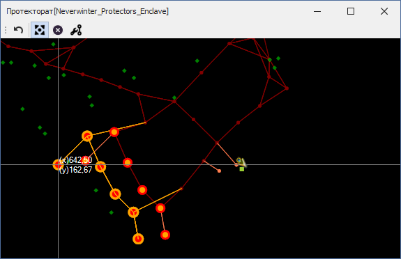

# **Ручное редактирование путевого графа  (Graph Edit Tools)**

Инструменты ручного редактирования путевого графа размещены на панели **'Graph Edit Tools'.**  

---

 ** Отмена последнего изменения**  
Нажатие на кнопку отменяет результаты последнего действия в Mapper'е, не ограничиваясь изменениями, произведенными нижеописанными инструментами. [Подробнее...](Mapper-GraphTools-RU.md#ref-Undo)

---

 ** Перемещение путевых точек (Relocate Nodes)**  
Нажатие на кнопку активирует [инструмент изменения координат путевых точек](Mapper-EditTools-RelocateNodes-RU.md).  
Hot-key: ``Ctrl-Shift-R``  

---

 ** Удаление путевых точек (Delete Nodes)**  
Нажатие на кнопку  активирует [инструмент удаления путевых точек](Mapper-EditTools-DeleteNodes-RU.md).  
Hot-key: ``Ctrl-Shift-D``

<!--  -->

---

 ** Изменение ребер (Edit Edges)**  
Нажатие на кнопку  активирует инструмент [изменение связей между путевыми точками](Mapper-EditTools-EditEdges-RU.md).  
Hot-key: ``Ctrl-Shift-E``

<!--  -->

---

<a href="javascript:history.back()">Назад</a>  
[Назад к описанию Mapper'a](Mapper-RU.md)  
[Назад к содержанию](../../index.md)