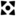
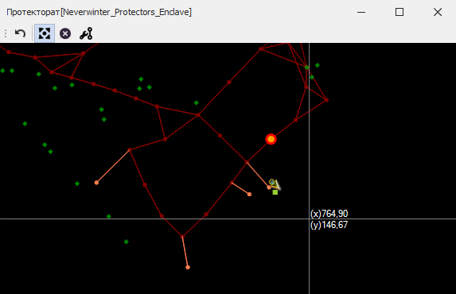
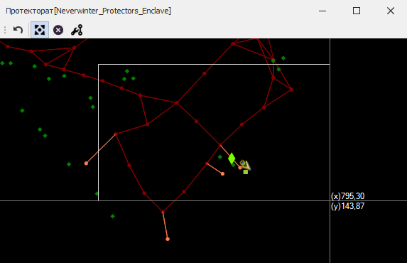
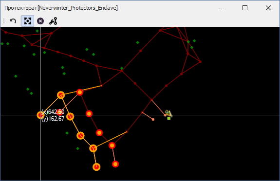

# **Инструмент перемещения путевых точек (Relocate Nodes)**

Инструмент расположен на панели [*Graph Edit Tools*](Mapper-EditTools-RU.md) и активируется нажатием кнопки .  
Он предназначен для изменения ``x`` и(или) ``y`` координат **существующих** путевых точек.  
Hot-key: ``Ctrl-Shift-R``

## **Последовательность действий**

1. Выделите одну или несколько путевых точек:
   - Для добавления точки в группу перемещаемых точек необходимо кликнуть правой кнопкой мыши (ПКМ) на неё, удерживая ``Ctrl``. Требуемая точность клика определяется опцией [*NodeEquivalenceDistance*](Mapper-MappingTools-RU.md#ref-NodeEquivalenceDistance).  
                
        

 
   - Повторный клик на выделенной точке при нажатом ``Ctrl`` исключает её из группы.
   - Для добавления нескольких точек в группу перемещаемых, удерживая ``Shift``, последовательными кликами ПКМ задайте прямоугольную область выделения, охватывающую необходимые точки.  
        + Первый ПКМ отмечает начальную точку области выделения.  
        + Второй ПКМ - добавляет в группу перемещаемых все точки, находящиеся в прямоугольной области выделения.  
        

 
   - Нажатие кнопки ``Escape`` очищает группу выделенных путевых точек. 

2. Отпустив кнопки ``Ctrl`` и ``Shift``, переместите выделенные точки в новое местоположение и кликните правой кнопкой мыши для их "установки" в новую позицию (либо нажмите Enter в версии).  
     
    

    Исходное положение каждой перемещаемой точки будет отмечено красной окружностью с оранжевым центром.  
    Новое положение путевых точек и ребер отображается оранжевым цветом.
    Оранжевыми линиями изображены новое положение ребер, изменяющихся в связи с перемещением выбранных точек.   

3. Для отключения инструмента перемещения путевых точек снова нажмите на кнопку  или активируйте другой инструмент.

---

<a href="javascript:history.back()">Назад</a>  
[Назад к описанию Mapper'a](Mapper-RU.md)  
[Назад к содержанию](../../index.md)