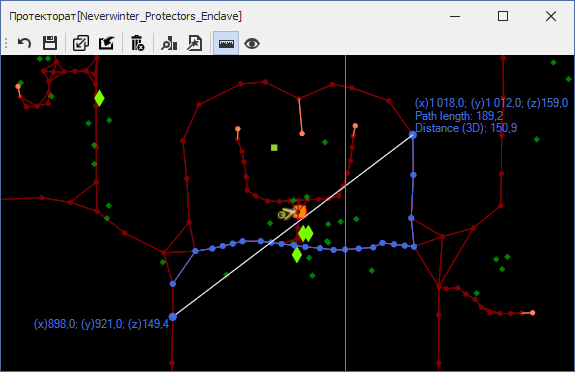

# **Инструмент измерения расстояния (Distance Measurement)**

Инструмент **Distance Measurement** позволяет измерить:
- линейное расстояние между двумя путевым точкам или отображаемым объектам с учетом их 3D координат;
- проекцию линейного расстояния на плоскость Oxy (т.е. 2D) без привязки к путевым точкам или объектам;
- длину пути, проложенному по точкам графа;
- длину пути, проложенному навигационой системой с использованием геометрии ландшафта игрового мира.

## **Последовательность действий**

1. После активации инструмента рядом с координатами курсора мыши синим цветом отобразятся его внутриигровые координаты.
   

2. Выделите начальную точку (*Start*). Требуемая точность клика определяется опцией [*NodeEquivalenceDistance*](Mapper-MappingTools-RU.md#ref-NodeEquivalenceDistance).  
   - **2D точка**, в плоскости ***Oxy***, может быть задана кликом правой кнопки мыши (ПКМ) в любом месте Mapper'a.
   - **3D точка** может быть задана только с привязкой к одному из отображаемых объектов (персонаж, путевая точка, нод и т.п.). Для этого удерживая ``Ctrl`` кликните ПКМ рядом нужным объектом.  
    
   Выбранная точка будет отмечена cиним кругом, рядом с которым отобразятся его координаты x, y, z (при наличии).  
   От выбранной точки к курсору мыши будет тянуться линия, обозначающая готовность выбрать вторую точку.  
   При этом рядом с курсором синим цветом будут выведены его координаты и расстояние до начальной точки.
   Нажатие ``Escape`` сбосит выделение точки.  
   

3. Выделите конечную точку (*End*) описанным выше способом.

4. Если начальна (*Start*) и конечная (*End*) точки заданы в 3D, т.е. привязаны к объекту и имеют координату z, будет выведен запрос о способе построения пути:  
   
   

   - При положительном ответе (Да, или Yes) путь будет построен **Pathfinder**'ом основываясь на геометрии карты.  
 
     

   - При отрицательном ответе (Нет или No) путь будет построен на основании путевого графа текущей карты.  
    
     

 
   - При отказе (Отмена или Cancel) путь строиться не будет.

5. Нажатие ``Escape`` сбосит выделение конечной точки (*End*) и сотрет построенный путь.  
   Повторное нажатие ``Escape`` сбосит выделение начальной точки (*Start*).

6. Для отключения инструмента измерения расстояния снова нажмите на кнопку  или активируйте другой инструмент.

## **Блок-схема**

---

<a href="javascript:history.back()">Назад</a>  
[Назад к описанию Mapper'a](Mapper-RU.md)  
[Назад к содержанию](../../index.md)