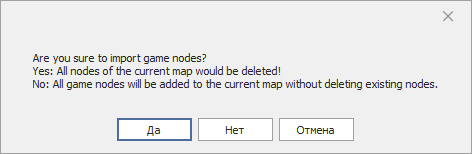
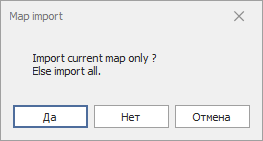
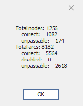
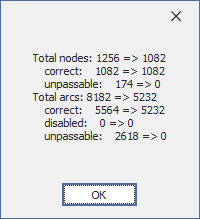
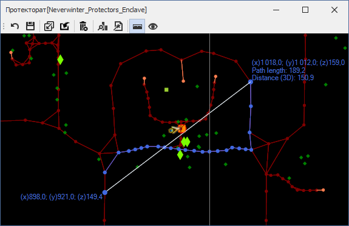
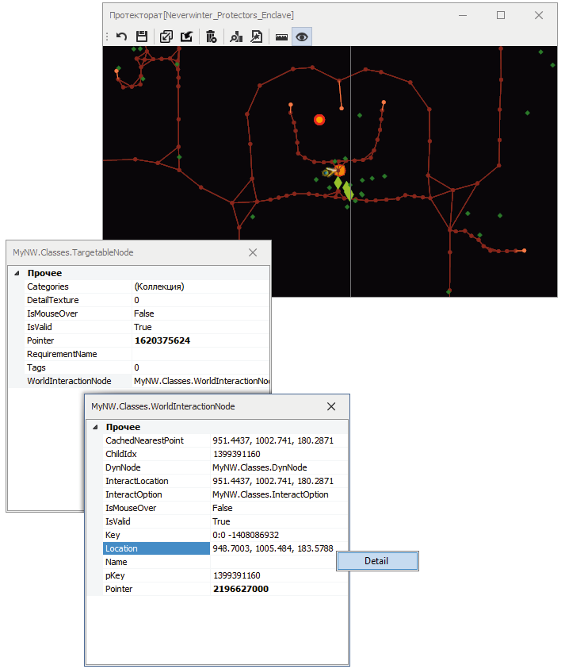

# Дополнительные инструменты (Graph Tools)

Дополнительные инструменты для путевого графа размещены на панели **'Graph Tools'**  

---

 **<a name="ref-Save">Save</a>**  
Сохранение в файл всех изменений, произведенных в Mapper'e, включая изменение путевого графа и [*CustomRegion*](../../General/Glossary-RU.md#ref-CustomRegion)'ов.  
Перед сохранением путевой граф [оптимизируется](#ref-Compression).  
После сохранения очередь отмены *Undo* очищается.  
Hot-key: ``Ctrl+Shift+S``  

---

##  **Импорт путевого графа**

 **<a name="ref-ImportFromGame">Import from Game</a>**  
Импорт путевого графа из игры, который используется для отображения дорожки задания.
После нажатия на кнопку открывается следующий запрос:  

- **Замена существующих путевых точек на внутриигровые** будет произведена при положительном ответе (Да, или Yes). В этом случае все существующие путевые точки удаляются.

- **Добавление внутриигровых точек к существующим** будет произведена при отрицательном ответе (Нет или No). В этом случае в путевой граф к ранее существующим точкам будут добавлены внутриигровые точки.  
  Этот режим импорта удобен в картах, разделенных на внутриигровые регионы, поскольку импортируются лишь путевые точки региона, в котором находится персонаж. Импорт с заменой удалит из графа путевые точки всех регионов, на которые разделена карта.

---

 **<a name="ref-ImportFromProfile">Import from Profile</a>**  
Импорт путевых графов из файла другого quester-профиля.  
Данная операция может быть сделана вручную, поскольку файл quester-профиля представляет собой zip-архив.

1. После нажатия на кнопку открывается стандартное диалоговое окно, в котором необходимо указать на файл, содержащий путевые графы для нужных карт.
   
2. Если выбранный файл содержит путевой граф для текущей карты, откроется следующий запрос:  

  

  

  - **Замена путевого графа для текущей карты** будет произведена при положительном ответе (Да, или Yes).

  - **Импорт путевых графов для всех карт**, содержащихся в файле выбранного quester-профиля, будет произведена при отрицательном ответе (Нет или No). В редактируемом quester-профиле будут заменены файлы путевых графов для всех карт, содержащихся в quester-профиле.

---

 **<a name="ref-Delete">Delete</a>**  
Удаляет путевой граф для текущей карты.  

---

##  **Оптимизация путевого графа (*Meshes*)**

Существенным недостатком [штатного Mapper'a](https://www.neverwinter-bot.com/forums/viewtopic.php?p=43909#p43909) является алгоритм удаления путевых точек. Вместо удаления он их просто скрывает. При этом путевые точки и ребра продолжают храниться в графе и, как следствие, занимают место в памяти, а также обрабатываются навигационной подсистемой при поиске пути, бессмысленно растрачивая вычислительную мощность компьютера.

В целях устранения данного недостатка применен патч, который принудительно [оптимизирует](#ref-Compression) путевой граф перед сохранением.

Кроме того в *Mapper*'e реализованы следующие инструменты:

---

 **<a name="ref-MeshesInfo">MeshesInfo</a>**  
Анализ путевого графа для текущей карты, по результатам которого выводится следующая информация:  

- **Total nodes** - полное количество путевых точек в графе.
  + **correct** - количество "видимых" путевых точек, через которые навигационная подсистема может проложить путь.
  + **unpassable** - количество "скрытых" путевых точек, которые не используются для построения пути. Точка помечается как "скрытая" при удалении [штатным Mapper'ом](https://www.neverwinter-bot.com/forums/viewtopic.php?p=43909#p43909) либо [инструментом удаления путевых точек](Mapper-EditTools-DeleteNodes-RU.md).
- **Total arcs** - полное количество ребер в графе, связывающих путевые точки.
  + **correct** - количество "видимых" ребер, используемых для построения пути.
  + **disabled** - количество ребер, помеченных на удаление [инструментом редактирования ребер](Mapper-EditTools-EditEdges-RU.md).
  + **unpassable** - количество "скрытых" ребер, у которых одна или обе путевые точки являются "скрытыми" и не используются для построения пути.

---

 **<a name="ref-Compression">Compression</a>**  
Оптимизация путевого графа текущей карты, состоящая в удалении "скрытых" путевых точек и связанных сними ребер, а также ребер помеченных на удаление.  

После обработки графа выводится сообщение с информацией об изменении количества путевых точек и ребер.
Аналогичная операция выполняется перед сохранением путевого графа, независимо от того, выполняется это средствами Mapper'a или из Quester-редактора.

---

## **Вспомогательные инструменты**

 **<a name="ref-DistanceMeasurement">Distance Measurement</a>**  
Данный инструмент позволяет измерить линейное расстояние и длину пути между двумя точками. [Подробнее...](Mapper-GraphTools-DistanceMeasurement-RU.md)

---

 **<a name="ref-ObjectInfo">ObjectInfo</a>**  
Данный инструмент позволяет осмотреть любой объект, отображаемый в *Mapper'e*. Для этого достаточно нажать кнопку  и кликнуть правой кнопкой мыши (ПКМ) на интересующем объекте.

В окне с информацией об объекте можно кликнуть ПКМ на любом свойстве, выбрать ``Detail`` для просмотра его вложенных свойств в отдельном окне.

---

<a href="javascript:history.back()">Назад</a>  
[Назад к описанию Mapper'a](Mapper-RU.md)  
[Назад к содержанию](../../index.md)