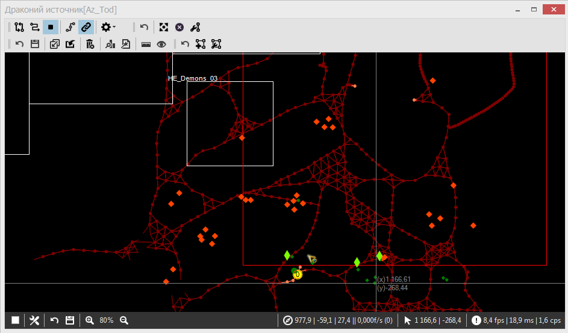
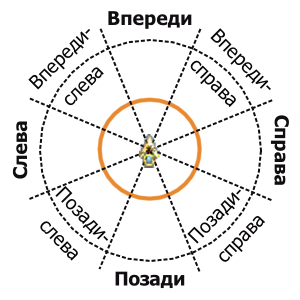
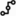
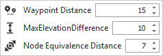
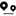
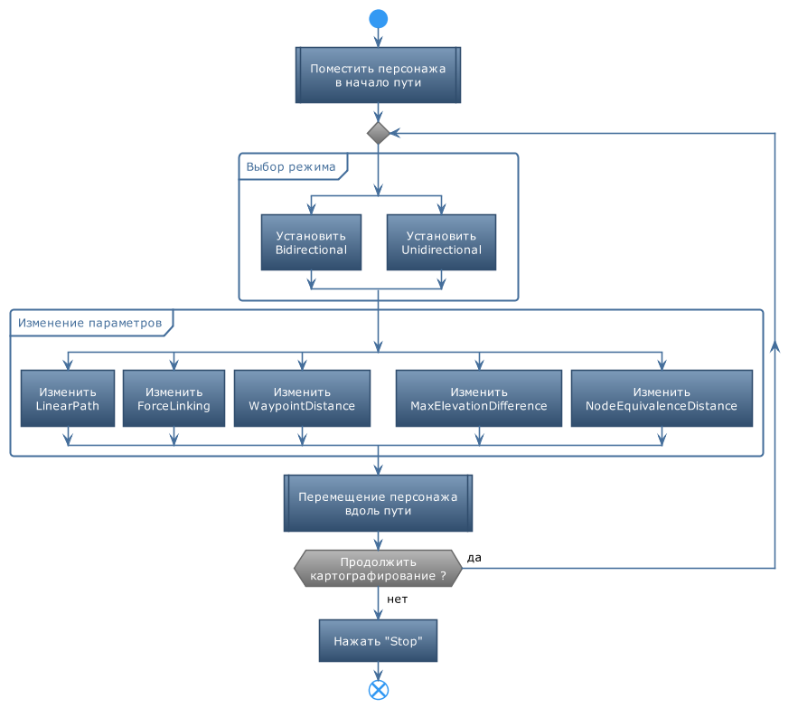
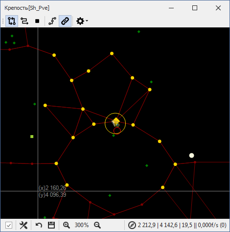

# **Инструменты картографирования (MappingTools)**

Данный набор инструментов позволяет зафиксировать и сохранить в quester-профиле путь, по которому пользователь вручную в игре перемещает персонажа. В последствии при выполнении quester-профиля навигационная подсистема бота будет использовать данных путь для перемещения персонажа без участия пользователя.  

Альтернативный способ задания путей - [импортировать](Mapper-GraphTools-RU.md#ref-ImportFromGame) их из игры.

Пути задаются в виде множества путевых точек в трехмерном игровом пространстве (*Waipoint*), соединенных направленными ребрами (*Edge*), обозначающими допустимые направления перемещения персонажа между ними.  
Такая структура называется граф или ***Meshes*** (меши) и обычно сохраняется в zip-архиве quester-профиля в файле с названием, совпадающим с идентификатором карты, и расширением ``bin``.  
Например, путевой граф карты **"Драконий источник"** хранится в файле:
```
Az_Tod.bin
```

<p align="center"></p>

Пути бывают двух видов:
- **<font color=Maroon>Двунаправленные пути (Bidirectional)</font>** позволяют навигационной подсистеме перемещать персонажа **в прямом и обратном направлении** вдоль пути.
- **<font color=Coral>Однонаправленные пути (Unidirectional)</font>** позволяют навигационной подсистеме перемещать персонажа только в **одном направлении**. Перемещение в обратном направлении по такому пути невозможно.

---

## **Панель картографирования**


### <a name="ref-MappingModes"></a> **Режимы прокладывания пути (картографирования):**

 **<a name="ref-BidirectionalMapping">Bidirectional Mapping</a> - прокладывания двунаправленного пути**  
После нажатия на кнопку  будут добавляться новые путевые точки и соединяться двунаправленными ребрами с ближайшими соседними точками по одной на каждый из восьми секторов вокруг персонажа;  
<p align="center"></p>
Перемещение по данному пути будет возможно в прямом и обратном направлении вдоль каждого ребра.  

 **<a name="ref-UnidirectionalMapping">Unidirectional Mapping</a> - прокладывания однонаправленного пути**  
После нажатия на кнопку  будут добавляться путевые точки и соединяться однонаправленными ребрами с соседними точками. Перемещение по данному пути будет возможно только в направлении следования персонажа.

 **<a name="ref-Stop"> Stop</a> - остановка картографирования**.


### <a name="ref-LinkingModes"></a> **Параметры связывания путевых точек:**

 **<a name="ref-LinearPath">Linear Path</a> - параметр "Линейный путь"**  
Отключает поиск и связывания с соседними путевыми точками.  
Если кнопка нажата, то при прокладывании пути новая путевая точка будет связываться только с последней добавленной точкой. 

 **<a name="ref-ForceLinking">Force Linking</a> - параметр "Принудительное связывание"**.  
По умолчанию при прокладывании пути ребрами связываются путевые точки расположенные в пределах [*WaypointDistance*](#ref-WaypointDistance). Точки за пределами указанного расстояния не будут соединены с добавляемой.
Если кнопка нажата, то при прокладывании пути новая путевая точка всегда соединяется с путевой точкой, которая была добавлена последней, независимо от расстояния до неё.

### <a name="ref-MappingOptions"></a> **Панель дополнительных параметров**
Нажатие на кнопку  открывает панель:  


 <a name="ref-WaypointDistance">Waypoint Distance</a> - расстояние ("шаг") между путевыми точками.  Точки, расстояние между которыми больше данной величины, не будут соединены. Оптимальное значение, установленное опытным путем, составляется 15 единиц.  

 <a name="ref-MaxElevationDifference">Max Elevation Difference</a> - максимальная допустимая разница высот между парой связываемых путевых точек. Точки, расстояние между которыми больше данной величины, не будут соединены.    

 <a name="ref-NodeEquivalenceDistance">Node Equivalence Distance</a> - расстояние между путевыми точками, в пределах которого они считаются эквивалентны.  
Иначе говоря, новая путевая точка не будет добавлена, если в пределах указанного расстояния от её предполагаемого местоположения есть другая точка. Путь будет проложен через существующую "эквивалентную" точку.  
Значение не может превышать половины [*WaypointDistance*](#ref-WaypointDistance).  

---

## **Алгоритм картографирования**

1. В игре переместите персонажа в начальную точку пути.  
   
2. Активируйте нужный [режим](#ref-MappingModes) картографирования<!-- ( [одно-](#ref-UnidirectionalMapping) или  [двунаправленного](#ref-BidirectionalMapping) пути)-->.  
   Переключение между режимами возможно "на лету" без [остановки](#ref-Stop), равно как изменение любых [параметров связывания](#ref-LinkingModes) или [дополнительных параметров](#ref-MappingOptions).  

3. Установите нужные [параметры](#ref-LinkingModes) картографирования.

4. Перемещайте в игре персонажа по пути, который вы хотите зафиксировать в графе.  
   После удаления персонажа от начальной или последней добавленной точки на расстояние [*WaypointDistance*](#ref-WaypointDistance), Mapper:
   - добавит новую путевую точку, если рядом с персонажем нет точек, попадающих в радиус [*NodeEquivalenceDistance*](#ref-NodeEquivalenceDistance);
   - соединит новую (или эквивалентную ей) путевую точку с ближайшими соседними точками по одной на каждый из восьми секторов вокруг персонажа;
   - если активна опция [*Force Linking*](#ref-ForceLinking), будет добавлена связь с ранее добавленной точкой.  
   
5. Отключите режим картографирования, нажав на кнопку <!-- --> [Stop](#ref-Stop).

<p align="center"></p>

В режиме картографирования в окне *Mapper'a* вокруг персонажа, обозначенного , отображается окружность, радиус которой соответствует [*NodeEquivalenceDistance*](#ref-NodeEquivalenceDistance).  
Желтым ромбом обозначена последняя добавленная путевая точка, или эквивалентная ей. Желтыми точкам помечены ближайшие к персонажу путевые точки, помещенные в кэш для оптимизации алгоритма картографирования.

<p align="center"></p>

---

## **Преимущества перед [штатным Mapper'ом](https://www.neverwinter-bot.com/forums/viewtopic.php?p=43909#p43909)**
- В [штатном](https://www.neverwinter-bot.com/forums/viewtopic.php?p=43909#p43909) Mapper'e  [расстояние между путевыми точками](#ref-WaypointDistance)) составляло всего 5 единиц, возможность его изменения отсутствовала.  
  Движение по пути с часто расположенными путевыми точками при высокой скорости перемещения или лагах приводило к циклическим танцам персонажа вокруг какой нибудь точки.  
- В [штатном](https://www.neverwinter-bot.com/forums/viewtopic.php?p=43909#p43909) Mapper'e  отсутствовала проверка на наличие [эквивалентных точек](#ref-NodeEquivalenceDistance), в результате чего путевой граф был перенасыщен лишними ними данными.
- Использование кэширования ближайших точек (помечаются желтым цветом) значительно уменьшило вычислительную сложность добавления новых путевых точек и ребер, что исключило разрывы пути, наблюдавшиеся на больших картах, например, в "Море движущегося льда". [Штатный](https://www.neverwinter-bot.com/forums/viewtopic.php?p=43909#p43909) Mapper при добавлении новых точке анализировал весь путевой граф.
- [Штатный](https://www.neverwinter-bot.com/forums/viewtopic.php?p=43909#p43909) Mapper не имеет аналогов параметрам [*Force Linking*](#ref-ForceLinking) и [*Linear Path*](#ref-LinearPath).

---

<a href="javascript:history.back()">Назад</a>  
[Назад к описанию Mapper'a](Mapper-RU.md)  
[Назад к содержанию](../../index.md)