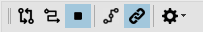
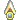

# **Инструменты картографирования (MappingTools)**

Пути задаются в виде множества путевых точек в трехмерном игровом пространстве (*Waipoint*), соединенных направленными ребрами (*Edge*), обозначающими допустимые направления перемещения персонажа между ними.  
Такая структура называется ***Meshes*** (меши) и обычно сохраняется в zip-архиве quester-профиля в файле с названием, совпадающим с идентификатором карты, и расширением ``bin``.  
Например, меши карты **"Драконий источник"** хранятся в файле:
```
Az_Tod.bin
```

<p align="center"></p>

Пути бывают двух видов:
- **<font color=Maroon>Двунаправленные пути (Bidirectional)</font>** позволяют навигационной подсистеме перемещать персонажа **в прямом и обратном направлении** вдоль пути.
- **<font color=Coral>Однонаправленные пути (Unidirectional)</font>** позволяют навигационной подсистеме перемещать персонажа только в **одном направлении**. Перемещение в обратном направлении по такому пути невозможно.

---

## **Панель картографирования**


Кнопки на панели выполняю следующие функции (слева на право):

1.  **<a name="ref-BidirectionalMapping">Bidirectional Mapping</a> - активация прокладывания двунаправленного пути**  
   После нажатия на при перемещении персонажа будут добавляться новые путевые точки и соединяться с соседними точками двунаправленными ребрами. Перемещение по данному пути возможно в прямом и обратном направлении вдоль каждого ребра.

2.  **<a name="ref-UnidirectionalMapping">Unidirectional Mapping</a> - активация прокладывания однонаправленного пути**  
   После нажатия на неё и перемещении персонажа будут добавляться путевые точки и соединяться однонаправленными ребрами с соседними вершинами. Перемещение по данному пути будет возможно только в направлении следования персонажа.

3.  **<a name="ref-Stop"> Stop</a> - остановка картографирования**

4.  **<a name="ref-LinearPath">Linear Path</a> - опция "Линейный путь"**  
   Отключает связывание новых путевых точек с соседними (слева, справа и впереди).  
   Если кнопка нажата, то при прокладывании пути добавляемая путевая точка будет связываться только с последней добавленной точкой. 

5.  **<a name="ref-ForceLinking">Force Linking</a> - опция "Принудительное связывание"**.  
   По умолчанию при прокладывании пути ребрами связываются путевые точки расположенные в пределах [WaypointDistance](#ref-WaypointDistance). Точки за пределами указанного расстояния не будут соединены с добавленной.
   Если кнопка нажата, то при прокладывании пути новая путевая точка всегда соединяется с путевой точкой, которая была добавлена последней, независимо от расстояния до неё.

6.  **Параметры**  
   В раскрывающемся меню можно изменить следующие параметры:  
     
    <a name="ref-WaypointDistance">WaypointDistance</a> - расстояние ("шаг") между путевыми точками.  Точки, расстояние между которыми больше данной величины, не будут соединены;  
    <a name="ref-MaxElevationDifference">MaxElevationDifference</a> - максимальная допустимая разница высот между парой связываемых путевых точек. Точки, расстояние между которыми больше данной величины, не будут соединены;  
    <a name="ref-NodeEquivalenceDistance">NodeEquivalenceDistance</a> - расстояние между путевыми точками, в пределах которого они считаются эквивалентны.  
   Иначе говоря, новая путевая точка не будет добавлена, если в пределах указанного расстояния от её предполагаемого местоположения есть другая точка. Путь будет проложен через существующую "эквивалентную" точку.

---

## **Порядок картографирования**

1. В игре переместите персонажа в начальную точку пути.  
   
2. Активируйте нужный режим картографирования ( [одно-](#ref-UnidirectionalMapping) или  [двунаправленного](#ref-BidirectionalMapping) пути).  
   Переключение между режимами возможно "на лету" без [остановки](#--stop---остановка-прокладывания-пути), равно как изменение любых [параметров](#-параметры) или включение(отключение) [опций](#ref-LinearPath).  

3. Установите нужные опции и параметры картографирования.

4. Перемещайте в игре персонажа по пути, который вы хотите зафиксировать в *Meshes*.  
   После удаления персонажа от начальной или последней добавленной точки на расстояние [*WaypointDistance*](#ref-WaypointDistance), Mapper:
   - добавит новую путевую точку, если рядом с персонажем нет точек, попадающих в радиус [*NodeEquivalenceDistance*](#ref-NodeEquivalenceDistance);
   - соединит новую (или эквивалентную ей) путевую точку с ближайшими соседними точками по одной на каждый из восьми секторов вокруг персонажа (впереди, впереди-слева, впереди-справа, справа, слева, позади-слева, позади-справа, позади);
   - если активна опция [*Force Linking*](#ref-ForceLinking), будет добавлена связь с ранее добавленной точкой.  
   
5. Отключите режим картографирования, нажав на кнопку [ Stop](#ref-Stop).

<p align="center"></p>

В режиме картографирования в окне *Mapper'a* вокруг персонажа, обозначенного , отображается окружность, радиус которой соответствует [*NodeEquivalenceDistance*](#ref-NodeEquivalenceDistance).  
Желтыми точками отображаются ближайшие к персонажу путевые точки.

<!--  -->
<p align="center"></p>

---

<a href="javascript:history.back()">Назад</a>  
[Назад к описанию Mapper'a](Mapper-RU.md)  
[Назад к содержанию](../../../index.md)