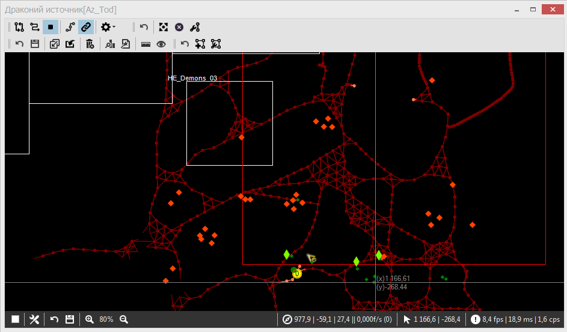
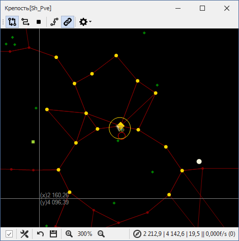

# **Инструменты картографирования (MappingTools)**

Пути задаются в виде множества путевых точек в трехмерном игровом пространстве (*Waipoint*), соединенных направленными ребрами (*Edge*), обозначающими допустимые направления перемещения персонажа между ними.  
Такая структура называется ***Meshes*** (меши) и обычно сохраняется в zip-архиве quester-профиля в файле с названием, совпадающим с идентификатором карты, и расширением ``bin``.  
Например, меши карты **"Драконий источник"** хранятся в файле:
```
Az_Tod.bin
```



Пути бывают двух видов:
- **<font color=Maroon>Двунаправленные пути (Bidirectional)</font>** позволяют навигационной подсистеме перемещать персонажа **в прямом и обратном направлении** вдоль пути.
- **<font color=Coral>Однонаправленные пути (Unidirectional)</font>** позволяют навигационной подсистеме перемещать персонажа только в **одном направлении**. Перемещение в обратном направлении по такому пути невозможно.

---

## **Панель картографирования**


Кнопки на панели выполняю следующие функции (слева на право):

###  **<a name="ref-BidirectionalMapping">Bidirectional Mapping</a> - активация прокладывания двунаправленного пути**  
После нажатия на при перемещении персонажа будут добавляться новые путевые точки и соединяться с соседними точками двунаправленными ребрами. Перемещение по данному пути возможно в прямом и обратном направлении вдоль каждого ребра.

###  **<a name="ref-UnidirectionalMapping">Unidirectional Mapping</a> - активация прокладывания однонаправленного пути**  
После нажатия на неё и перемещении персонажа будут добавляться путевые точки и соединяться однонаправленными ребрами с соседними вершинами. Перемещение по данному пути будет возможно только в направлении следования персонажа.

###  **<a name="ref-Stop"> Stop</a> - остановка картографирования**

###  **<a name="ref-LinearPath">Linear Path</a> - опция "Линейный путь"**  
Отключает связывание новых путевых точек с соседними (слева, справа и впереди).  
Если кнопка нажата, то при прокладывании пути добавляемая путевая точка будет связываться только с последней добавленной точкой. 

###  <a name="ref-ForceLinking"> **Force Linking</a> - опция "Принудительное связывание"**.  
По умолчанию при прокладывании пути ребрами связываются путевые точки расположенные в пределах [WaypointDistance](#ref-WaypointDistance). Точки за пределами указанного расстояния не будут соединены с добавленной.
Если кнопка нажата, то при прокладывании пути новая путевая точка всегда соединяется с путевой точкой, которая была добавлена последней, независимо от расстояния до неё.

###  **Параметры**  
В раскрывающемся меню можно изменить следующие параметры:  
  
-  <a name="ref-WaypointDistance">WaypointDistance</a> - расстояние ("шаг") между путевыми точками.  Точки, расстояние между которыми больше данной величины, не будут соединены;  
  
-  <a name="ref-MaxElevationDifference">MaxElevationDifference</a> - максимальная допустимая разница высот между парой связываемых путевых точек. Точки, расстояние между которыми больше данной величины, не будут соединены;  
  
-  <a name="ref-NodeEquivalenceDistance">NodeEquivalenceDistance</a> - расстояние между путевыми точками, в пределах которого они считаются эквивалентны.  
Иначе говоря, новая путевая точка не будет добавлена, если в пределах указанного расстояния от её предполагаемого местоположения есть другая точка. Путь будет проложен через существующую "эквивалентную" точку.

---

## **Инструкция по картографированию**

1. Поместите персонажа в игре в точку, в которой начинается путь.  
   
2. Активируйте нужный режим картографирования ( [одно-](#ref-UnidirectionalMapping) или  [двунаправленного](#ref-BidirectionalMapping) пути).  
   Переключение между режимами возможно "на лету" без [остановки](#--stop---остановка-прокладывания-пути), равно как изменение любых [параметров](#-параметры) или включение(отключение) [опций](#ref-LinearPath).  

3. Перемещайте персонажа по пути, который вы хотите зафиксировать в *Meshes*.  
   
4. Отключите режим картографирования, нажав на кнопку [ Stop](#ref-Stop).



В режиме картографирования в окне *Mapper'a* вокруг персонажа, обозначаемого , отображается окружность, радиус которой соответствует [*NodeEquivalenceDistance*](#ref-NodeEquivalenceDistance).  
Желтыми точками отображаются ближайшие к персонажу путевые точки.


---

<a href="javascript:history.back()"><b>Назад</b></a>
<!--[**Вернуться**](Mapper-RU.md)-->