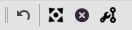

# **Ручное редактирование мешей (Node Tools)**

## **Панель NodeTools**

Кнопки на панели выполняю следующие функции (слева на право):

1. **<a name="ref-Undo">Undo</a> - отмена последнего действия**  
   Нажатие на кнопку отменяет результаты последнего действия в Mapper'е, не ограничиваясь изменениями, произведенными нижеописанными инструментами

2.  **<a name="ref-RelocateNodes">Relocate Nodes</a> - перемещение путевых точек**  
   Нажатие на кнопку активирует инструмент перемещения путевых точек, описанный в статье.  
   Hot-key: ``Ctrl-Shift-R``  
   

3.  **<a name="ref-DeleteNodes">Delete Nodes</a> - удаление путевых точек**  
   Нажатие на кнопку активирует инструмент удаления путевых точек, описанный в статье.  
   Hot-key: ``Ctrl-Shift-D``

4.  **<a name="ref-EditEdges">Edit Edges</a> - изменение ребер**  
   Нажатие на кнопку активирует инструмент изменение связей между путевыми точками, описанный в статье.  
   Hot-key: ``Ctrl-Shift-E``

---

<a href="javascript:history.back()">Назад</a>  
[Назад к описанию Mapper'a](Mapper-RU.md)  
[Назад к содержанию](../../../index.md)