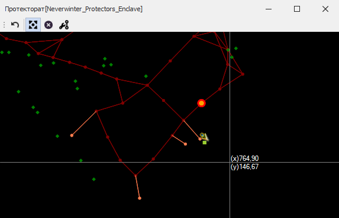

# **Инструмент перемещения путевых точек (RelocateNodes)**

Инструмент расположен на панели [*Node Tools*](Mapper-NodesTools-RU.md) и активируется нажатием на кнопку   
Hot-key: Ctrl-Shift-R (в версии 0.20.919.542)

## **Последовательность действий**

1. Выделите одну или несколько путевых точек:
   - Для добавления точки в группу перемещаемых точек необходимо кликнуть правой кнопкой мыши (ПКМ) на неё, удерживая ``Ctrl``. Требуемая точность клика определяется опцией [*NodeEquivalenceDistance*](Mapper-MappingTools-RU.md#ref-NodeEquivalenceDistance).  
        
         
   - Повторный клик на выделенной точке при нажатом ``Ctrl`` исключает её из группы.
   - Для добавления нескольких точек в группу перемещаемых, удерживая ``Shift``, последовательными кликами ПКМ задайте прямоугольную область выделения, охватывающую необходимые точки.  
        Первый ПКМ отмечает начальную точку области выделения.  
        Второй ПКМ - добавляя в группу перемещаемых все точки, находящиеся в прямоугольной области выделения.  
        
   - Нажатие кнопки ``Escape`` очищает группу выделенных путевых точек. 

2. Отпустив кнопки ``Ctrl`` и ``Shift``, переместите выделенные точки в новое местоположение и кликните правой кнопкой мыши для их "установки" в новую позицию (либо нажмите Enter в версии).  
 
    

    Исходное положение перемещаемых точек будет отмечено красной окружностью с оранжевым центром.  
    Новое положение путевых точек и ребер отображается оранжевым цветом.   

3. Для отключения инструмента перемещения путевых точек снова нажмите на кнопку  или активируйте другой инструмент.

---

<a href="javascript:history.back()">Назад</a>  
[Назад к описанию Mapper'a](Mapper-RU.md)  
[Назад к содержанию](../../../index.md)