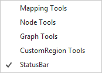
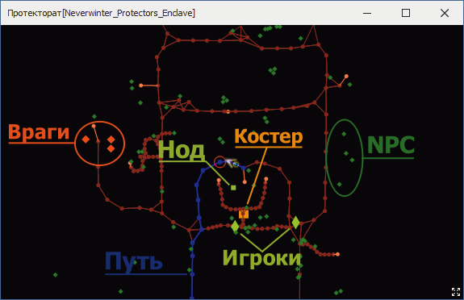

# Mapper

**Mapper** - это специальный инструмент для разметки путей на карте, которые будут использоваться навигационной подсистемой бота для перемещения персонажа. 
Пути задаются в виде множества путевых точек в трехмерном игровом пространстве (*Waipoint*), соединенных направленными ребрами (*Edge*), обозначающими допустимые направления перемещения персонажа между ними.  
Такая структура называется граф или ***Meshes*** (меши) и обычно сохраняется в zip-архиве quester-профиля в файле, имя которого совпадает с идентификатором карты, и расширением ``bin``.

В плагине **EntityTools** реализирован расширенный *Mapper*, который с помощью патча заменяет [штатный *Mapper*](https://www.neverwinter-bot.com/forums/viewtopic.php?p=43909#p43909) бота Астрал.

|Штатный Mapper|Модифицированный Mapper|
|:------------:|:---------------------:|
|||

## **Отличия модифицированного Mapper отличается от [штатного](https://www.neverwinter-bot.com/forums/viewtopic.php?p=43909#p43909)**

- Собственный оптимизированный механизм отрисовки, позволяющий выбрать [отображаемые объекты и их цвет](GeneralOptions-RU.md#ref-MeshesOptions);
- Собственный механизм [прокладывания пути](Mapper-MappingTools-RU.md), позволяющий гибко настроить расстояние между путевыми точками и способ их соединения;
- Собственных механизм [удаления путевых точек](Mapper-EditTools-DeleteNodes-RU.md), позволяющий предварительно выбрать удаляемое множество, а также отменить операцию;
- Инструменты ручного [перемещения путевых точек](Mapper-EditTools-RelocateNodes-RU.md), а также [добавления и удаления ребер](Mapper-EditTools-EditEdges-RU.md);
- Графические [инструменты](Mapper-CustomRegionTools-RU.md) для добавления и изменения [*CustomRegion*](../../General/Glossary-RU.md#ref-CustomRegion)'ов;
- Инструмент [анализа](Mapper-GraphTools-RU.md#ref-MeshesInfo) и [оптимизации](Mapper-GraphTools-RU.md#ref-Compression) графа, который удаляет скрытые (неиспользуемые) путевые точки и ребра;
- Инструмент для [измерения расстояния](Mapper-GraphTools-DistanceMeasurement-RU.md);
- Инструмент [осмотра](Mapper-GraphTools-RU.md#ref-ObjectInfo) любого отображаемого объекта (*Waypoint*, *Entity* или *Node*);
- Отображение [информации](StatusBar-RU.md#ref-Info) о координатах персонажа, скорости его перемещения, координат курсора мыши и т.д.

Панели инструментов Mapper'a можно перетаскивать, пристыковывать к любым границам окна, оставить плавающей в любом месте рабочего стола или закрыть.

## **Описание панелей инструментов**

1. **[Инструменты прокладывания пути (картографирования)](Mapper-MappingTools-RU.md)**.  
   
2. **[Инструменты ручного редактирования графа](Mapper-EditTools-RU.md)**.  
   
3. **[Инструменты для работы с CustomRegion](Mapper-CustomRegionTools-RU.md)**.  
   
4. **[Дополнительные инструменты](Mapper-GraphTools-RU.md)**.  
   
5. **[Строка состояния](StatusBar-RU.md)**
   

Любая панель инструментов может быть скрыта через контекстной меню, отображающееся после клика правой кнопкой мыши (ПКМ) на любой из них.  

Если скрыты все панели, включая строку состояния, в правом нижнем углу Mapper'a отображается иконка , клик на которую раскрывает строку состояния.

---

## **[Настройки отображения](GeneralOptions-RU.md)**

Состав и цвета отображаемых объектов можно настроить на соответствующей [панели](GeneralOptions-RU.md), которая открывается  и закрывается нажатием кнопки  в строке состояния.

## **[Все настройки](AllSettings-RU.md)**

Полный список настроек Mapper'a доступен на панели плагина на вкладке ***Settings*** в группе ***Mapper***. 

---

<a href="javascript:history.back()">Назад</a>  
[Назад к содержанию](../../index.md)
