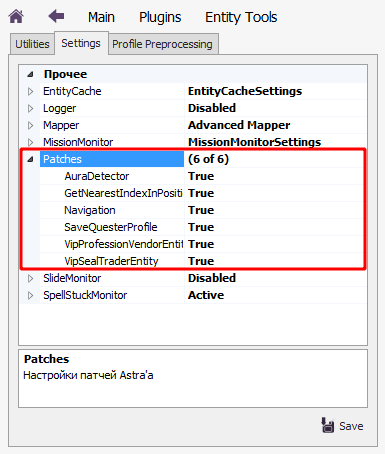

# **Патчи**

В плагине **EntityTools** реализовано несколько патчей,исправляющих наиболее неприятные ошибки бота, или улучшающие его функционал.  
Патчи реализованы с помощью библиотеки [*Harmony*](https://harmony.pardeike.net/articles/intro.html), которая в целях удобства использования интегрирована в dll-плагина. 

<!-- Patch the getter of the property 'Astral.Quester.Core.Meshes' succeeded
Patch the getter of the property 'Astral.Quester.Core.MapsMeshes' succeeded
Patch the setter of the property 'Astral.Quester.Core.MapsMeshes' succeeded
Patch of 'Astral.Quester.Core.Load' succeeded
Patch of 'Astral.Quester.Core.Save' succeeded
Patch of 'Astral.Controllers.Plugins.InitAssemblies()' succeeded
Patch of 'Astral.Functions.XmlSerializer.GetExtraTypes()' succeeded 

Patch of the 'ActionsPlayer.CheckAlly' succeeded!
Patch of the 'AddClass.Show' succeeded!
Patch of the 'VIP.get_SealTraderEntity' succeeded!
Patch of the 'VIP.get_ProfessionVendorEntity' succeeded!
Patch of the 'General.GetNearestIndexInPositionList' succeeded!
Patch 'ComplexPatch_Navigation' succeeded
Patch 'ComplexPatch_Mapper' succeeded
Patch 'ComplexPatch_Quester_UccEditing' succeeded-->

---

## **Комплексный патч сериализации, сохранения и загрузки профилей**

Профили квестовой подсистемы (*Quester'a*) и боевой подсистемы (*UCC*) сериализуются и сохраняются в виде *xml-файлов*.  

### **Патч сериализации**
Плагин **EntityTools** является [динамически загружаемой сборкой .Net с поздним связыванием](https://docs.microsoft.com/ru-ru/dotnet/framework/reflection-and-codedom/dynamically-loading-and-using-types), поэтому сериализатору должны быть предоставлены списки типов объектов, используемых при построении вышеуказанных профилей и реализованных в плагине.  

Патч сериализации улучшает механизм формирования списков типов, путем:
- добавления в список недостающие типы, реализованные в плагине **EntityTools**;
- сохраняет список типов в кэше, что избавляет от необходимости формировать его при каждой сериализации/десериализации профилей *Quester'а* и *UCC*.

### **Патч сохранения Quester-профиля**
Основным назначением данного патча является оптимизация [путевого графа](Mapper/Mapper-GraphTools-RU.md#ref-Compression).  
Кроме того, улучшена работа с zip-архивами. Бот Астрал перед сохранением Quester-профиля выполнял загрузку всех элементов архива (файл профиля и [меши карт](Mapper/Mapper-RU.md#ref-Meches)), формировал новый архив и перезаписывал содержимое файла целиком.  
Реализованный в патче подход перезаписывает лишь те элементы архива, которые были изменены, тем самым сокращая затраты вычислительных ресурсов компьютера.

### **Патч загрузки Quester-профиля**
Патч загрузки необходим, чтобы при десериализации Quester-профиля использовался [расширенный список типов](#ref-GetExtraTypes).
В противном случае во время загрузки профиля, использующего [расширения Quester'a](../Quester/EntityTools-QuesterExtensions-RU.md) из плагина **EntityTools**, возникнет ошибка.

---

## **Патч VipProfessionVendorEntity**

Данный патч исправляет идентификатор призываемого торговца профессиональными ресурсами, в результате чего, бот может с ним корректно взаимодействовать. 

---

## **Патч VipSealTraiderEntity**

Данный патч исправляет идентификатор призываемого торговца печатями, в результате чего, бот может с ним корректно взаимодействовать.

---

### **Патч CheckAlly**

Данный патч изменяет поведение бота в бою. Он исключает [спутников персонажей]() из числа дружественных NPC, на которых применяются исцеляющие умения.  

---

<!-- ### **Патч AddClass.Show**

---

### **Комплексный патч Quester.UccEditing**

---

### **Патч GetNearestIndexInPositionList**

---

### **Комплексный патч Navigation**

Данный патч подменяет группу методов, вызываемых навигационной подсистемой бота при поиске пути.  

--- -->

## **Патч [Окна картографирования (Mapper)](Mapper/Mapper-RU.md)** 
Патча заменяет [штатное окно картографирования](https://www.neverwinter-bot.com/forums/viewtopic.php?p=43909#p43909) бота Астрал на расширенное. [Подробнее...](Mapper/Mapper-RU.md)

---

<a href="javascript:history.back()">Назад</a>  
[Назад к содержанию](../index.md)
