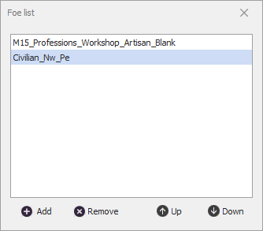

# **AddIgnoredFoes**

Команда задает противников [*Foes*](#ref-Foes), игнорируемых во время боя. 
Последовательное выполнение нескольких команд ***AddIgnoredFoes*** не отменяет друг друга, но приводит к формированию общего списка игнорируемых врагов.
Список игнорируемых врагов ассоциирован с профилем и сохраняется до истечения [*Timeout'a*](#ref-Timeout) или перегрузки бота.

Действие команды может быть отменено командой [***RemoveIgnoreFoes***](RemoveIgnoredFoes-RU.md), которая очищает список временно игнорируемых противников.

---

# **Настройки команды**

| **Наименование** | **Описание** 
|:-----------------|:-------------
|<a name ="ref-Foes">***Foes***</a> | Список противников, которые нужно игнорировать в бою в дополнении к противникам из списка *Blacklist* quester-профиля. При выборе идентификаторов нужно использовать ТОЛЬКО *InternalName* без каких-либо символов подстановки.  Заданные противники игнорируются только при выполнении текущего  quester-профиля. Расширенный список игнорируемых врагов восстанавливается при повторной загрузке данного  quester-профиля.  
|<a name ="ref-Timeout">***Timeout***</a> | Период времени в миллисекундах, в течение которого противники из списка [*Foes*](#ref-Foes) будут игнорироваться. По окончании заданного времени бот снова начнет их атаковать.   По умолчанию задано ``30 000`` мс.  При установке значения ``0`` противники будут игнорироваться до перезагрузки бота или до вызова команды [*RemoveIgnoreFoes*](./RemoveIgnoredFoes-RU.md).

---

# **Завершение команды**

Команда добавляет противников из [*Foes*](#ref-Foes) в список игнорируемых врагов в дополнение к противникам из списка *Blacklist* quester-профиля.

Настройка [принудительного завершения](ForcedQuesterActionTermination-RU.md) команды не имеет смысла, поскольку она выполняется единовременно.

---

# **Аналоги**
В базовом функционале бота похожие команды отсутствуют.

---

<a href="javascript:history.back()">Назад</a>  
[Назад к перечню команд](../EntityTools-QuesterExtensions-RU.md#Команды)  
[Назад к содержанию](../../index.md)