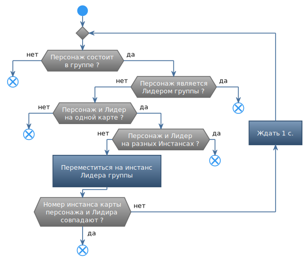

# **ChangeInstanceToLeader**

Команда предназначена для перехода на инстанс текущей карты, в котором находится лидер группы. 
Команда повторяется (зацикливается) пока смена инстанса недоступна. Например, установлен временный запрет на смену инстанса (кулдаун).

---

# **Настройки команды**
Отсутствуют.

---

# **Внутренние условия**

Перед запуском команды проверяется истинность следующих условий:
- Персонаж состоит в группе.
- Персонаж не является лидером группы.
- Персонаж и лидер группы находятся на разных инстансах одной карты.
Команда пропускается, если хотя бы одно из условий не выполняется.

---

# **Завершение команды**

Команда завершается когда персонаж перешел на инстанс карты, на котором находится лидер группы.

---

# **Блок-схема**

---

# **Аналоги**

Похожие команды, входящие в базовый функционал бота:
- [***ChangeInstance***](Astral-Actions-RU.md#ref-ChangeInstance).

---

<a href="javascript:history.back()">Назад</a>  
[Назад к перечню команд](../EntityTools-QuesterExtensions-RU.md#ref-Actions)  
[Назад к содержанию](../../index.md)