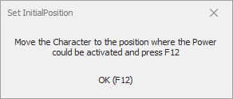
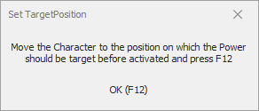
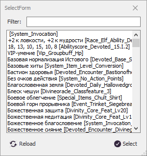

# **ExecutePowerExt**

Команда предназначена для активации [умения персонажа](#ref-PowerId), требующих активации в [определенном месте](#ref-InitialPosition) и наведения на заранее [заданную область](#ref-TargetPosition).  
В качестве примера использования данной команды можно указать:
* Прыжки между парящими островами в полуплане Джайриона (Кампания "Незримое господство");
* Взбирание на гору в Долине драконьих костей (Кампания "Долина драконьих костей").

## **Описание алгоритма**

1. Команда проверяет нахождение персонажа в области активации, заданной группой опций [Location](#ref-Location).
   <!-- * [CurrentMap](#ref-CurrentMap)
   * [CurrentRegion](#ref-CurrentRegion)
   * [CustomRegions](#ref-CustomRegions)
   * [ZRange](#ref-ZRange) -->
2. Если все проверки из группы [Location](#ref-Location) истины, то персонаж перемещается к точке [*InitialPosition*](#ref-InitialPosition).  
    При этом персонаж во время перемещения игрорирует противников и не вступает с ними в бой, если задана опция [*IgnoreCombat*](#ref-IgnoreCombat), а условие [*IgnoreCombatCondition*](#ref-IgnoreCombatCondition) истинно.
3. Когда персонаж находится в точке активации умения [*InitialPositioni*](#ref-InitialPosition), персонаж разворачивается лицом к целевой точке [*TargetPosition*](#ref-TargetPosition) и активируется умение [*PowerId*](#ref-PowerId).
4. После активации умения, если задана опция [*TargetRadius*](#ref-TargetRadius), проверяется расстояние между персонажем и целевой точкой [*TargetPosition*](#ref-TargetPosition).  
    В случае, если указанное расстояние превышает [*TargetRadius*](#ref-TargetRadius), выполнение команды повторяется с шага 1.

---

# **Настройки команды**

| **Наименование** | **Описание** |
|:-----------------|:-------------|
||**Настройки умения  (категория "Power")**
|<a name ="ref-PowerId">***PowerId***</a> | Идентификатор умения, которое должно быть активировано.
|<a name ="ref-CastingTime">***CastingTime***</a> | Время активации умения [PowerId](#ref-PowerId). Минимальное значение 500 мс.
|<a name ="ref-Pause">***Pause***</a> | Время бездействия после активации умения [*PowerId*](#ref-PowerId). Минимальное значение 500 мс.
||**Настройки области активации  (категория "Location")**
|<a name ="ref-InitialPosition">***InitialPosition***</a> | Точка в игровом пространстве, в которую должен переместиться персонаж перед активацией умения [PowerId](#ref-PowerId).
|<a name ="ref-CurrentMap">***CurrentMap***</a> | Идентификатор карты, на которой может быть выполнена команда.  Опция игнорируется, если значение не задано.
|<a name ="ref-CurrentRegion">***CurrentRegion***</a> | Идентификатор внутриигрового региона, в котором может быть выполнена команда.  Опция игнорируется, если не задано значение [*CurrentRegion*](#ref-CurrentRegion).
|<a name ="ref-CustomRegions">***CustomRegions***</a> | Набор *CustomRegion*'ов, задающих допустимую область выполнения команды. Подробное описание приведено в разделе [CustomRegionSet](../../General/CustomRegionSet-RU.md).
|<a name ="ref-ZRange">***ZRange***</a> | Комплексная опция, задающая ограничение игрового пространства в виде интервала допустимой высоты (минимальной и максимальной Z-координаты), в пределах которых персонаж может переместиться к начальной точке [*InitialPosition*](#ref-InitialPosition). Опция игнорируется если 'Min' равно 'Max'.
||**Настройки цели  (категория "Target")**
|<a name ="ref-TargetPosition">***TargetPosition***</a> | Точка в игровом пространстве, которая будет задана целью умения [PowerId](#ref-PowerId), при его активации.
|<a name ="ref-TargetRadius">***TargetRadius***</a> | Радиус целевой области с центром в точке [*TargetPosition*](#ref-TargetPosition).  Чтобы команда завершилась, в результате применения умения [*PowerId*](#ref-PowerId) персонаж должен переместиться к точке [*TargetPosition*](#ref-TargetPosition) на расстояние менее [*TargetRadius*](#ref-TargetRadius). В проитвном случае, выполнение команды автоматически повторится.  Опция игнорируется, если значение равно нулю.
||**Управление боем  (категория "Manadge Combat")**
|<a name ="ref-IgnoreCombat">***IgnoreCombat***</a> | Игнорирования боя при перемещении к начальной точке [*InitialPosition*](#ref-InitialPosition).
||**Значения по уполчанию  (категория "Default option")**
|<a name ="ref-DefaultTargetRadius">***DefaultTargetRadius***</a> | Значение по уполчанию для опции [*TargetRadius*](#ref-TargetRadius), для каждой новой команды 'ExecutePowerExt'.
|<a name ="ref-DefaultPowerId">***DefaultPowerId***</a> | Значение по уполчанию для опции [*PowerId*](#ref-PowerId), для каждой новой команды 'ExecutePowerExt'.
|<a name ="ref-ZDeviation">***ZDeviation***</a> | Величина отклонения Z-координаты, используемая для вычисления диапазона [*ZRange*](#ref-ZRange), для каждой новой команды 'ExecutePowerExt'.  При добавление новой команды 'ExecutePowerExt' диапазон [*ZRange*](#ref-ZRange) следующим образом:   Min = [*InitialPosition*](#ref-InitialPosition).Z - ZDeviation    Max = [*InitialPosition*](#ref-InitialPosition).Z + ZDeviation.

---

# **Мастер настройки (GatherInfo)**

Мастер настройки вызывается автоматически при добавлении новой команды, или при нажатии кнопки **[GatherInfo]**. Для настройки команды выполните следующие действия:  

1. Переместите персонажа в место, где должно быть активировано умение и нажмите кнопку "ОК" или горячую клавишу ``F12``, чтобы задать [*InitialPosition*](#ref-InitialPosition):  

  

2. Переместите персонажа в место, которое должно быть целью умения и нажмите кнопку "ОК" или горячую клавишу ``F12``, чтобы задать [*TargetPosition*](#ref-TargetPosition):  

3. В окне ``SelectForm`` выберите умение, которое должно активироваться командой, чтобы задать [*PowerId*](#ref-PowerId):  

  

* Если известно название умения, для упрощения поиска его можно внести в полем фильтра и нажать кнопку ``Reload``.
* Если в настройках любой команды ***ExecutePowerExt*** указать [*DefaultPowerId*](#ref-DefaultPowerId), то последний шаг настройки (выбор идентификатора умения) будет пропушен, а в опцию [*PowerId*](#ref-PowerId) будет автоматически внесено значение по уполчанию.

---

# **Внутренние условия**

1) Задан идентификатор умения [*PowerId*](#ref-PowerId).
2) Персонаж находится в области активации, заданной группой опций [Location](#ref-Location).

---

# **Завершение команды**

Команда завершается после активации умения [*PowerId*](#ref-PowerId), а если задана опция [*TargetRadius*](#ref-TargetRadius), дополнительным условием завершения команды является расстояние до целевой точки [*TargetPosition*](#ref-TargetPosition).
Команда может завершиться, если в процессе её выполнения персонаж выйдет за пределы области активации, заданной группой опций [Location](#ref-Location).

Принудительное завершение команды возможно одним из [перечисленных в статье способов](ForcedQuesterActionTermination-RU.md).

---

# **Аналоги**

Данная команда имеет следующие отличия от команды ***ExecutePower***, входящие в базовый функционал бота:  
1) Целью команды ***ExecutePower*** является исключительно персонаж.  
    Указать иную цель не представляется возможным.
2) Применение команды ***ExecutePower*** 

---

<a href="javascript:history.back()">Назад</a>  
[Назад к перечню команд](../EntityTools-QuesterExtensions-RU.md#ref-Actions)  
[Назад к содержанию](../../index.md)