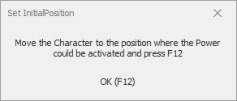
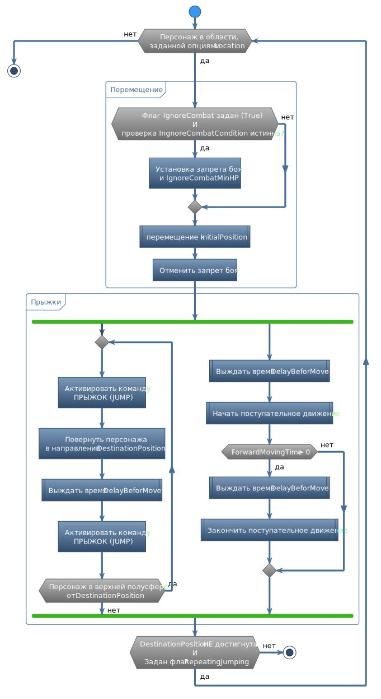

# **Jumping**

Команда предназначена для перемещения персонажа прыжками из [начальной точки](#ref-InitialPosition) в направлении [целевой точки](#ref-DestinationPosition).  

## **Описание алгоритма**

1. Команда проверяет нахождение персонажа в области, заданной группой опций [Location](#ref-Location).
2. Если все проверки из группы [Location](#ref-Location) истины, то персонаж перемещается к точке [*InitialPosition*](#ref-InitialPosition).  
    При этом персонаж во время перемещения игрорирует противников и не вступает с ними в бой, если задана опция [*IgnoreCombat*](#ref-IgnoreCombat), а условие [*IgnoreCombatCondition*](#ref-IgnoreCombatCondition) истинно.
3. Персонаж разворачивается лицом к целевой точке [*DestinationPosition*](#ref-DestinationPosition) и активируется внутриигровую команду-прыжок и, через заданный интервал времени [*DelayBeforMove*](#ref-DelayBeforMove) начинает движение по направлению к [*DestinationPosition*](#ref-DestinationPosition).
    - Если задана опция [*ForwardMovingTime*](#ref-ForwardMovingTime), то по истечение заданного интервала времени поступательное движение персонажа прекращается.
    - По истечении времени [*JumpingTime*](#ref-JumpingTime) деактивируется внутриигровая команда прыжок.
5. Если задана опция [*RepeatingJumping](#ref-RepeatingJumping), а расстояние от персонажа до целевой точкой [*DestinationPosition*](#ref-DestinationPosition) превышает [*DestinationRadius*](#ref-DestinationRadius) (или 5 единиц если опция не задана), выполнение команды повторяется с шага 3.

---

# **Настройки команды**

| **Наименование** | **Описание** |
|:-----------------|:-------------|
||**Настройки прыжка  (категория "Jumping")**
|<a name ="ref-DelayBeforMove">***DelayBeforMove***</a> | Время в миллисекундах между моментом активации внутриигровой команды-прыжка и началом движения в направлении [DestinationPosition](#ref-DestinationPosition).
|<a name ="ref-ForwardMovingTime">***ForwardMovingTime***</a> | Время движения в направлении [*DestinationPosition*](#ref-DestinationPosition).  Если значение равно нулю, тогда движение будет прекращено только после того, как персонаж переместится в целевую область область, заданную верхней полусферов [*DestinationRadius*](#ref-DestinationRadius).
|<a name ="ref-JumpingTime">***JumpingTime***</a> | Время между активацией и декактивацией внутриигровой команды-прыжка в миллисекундах. Минимальное значение 500 мс.
|<a name ="ref-RepeatingJumping">***RepeatingJumping***</a> | Флаг, активирующий серию прыжков до достижения персонажем целевой области.  При отключенном флаге персонаж выполняет единственный прыжок, после чего команда завершается. При активации флага настоятельно рекомендуется установить нулевое значение для опции [*ForwardMovingTime*](#ref-ForwardMovingTime).
||**Настройки целевой точки  (категория "Destination")**
|<a name ="ref-DestinationPosition">***DestinationPosition***</a> | Точка в игровом пространстве, к которой персонаж должен допрыгнуть.
|<a name ="ref-DestinationRadius">***DestinationRadius***</a> | Радиус верхней полусферы с центром в точке [*DestinationPosition*].  (#ref-DestinationPosition).  Чтобы команда завершилась, в результате применения умения [*PowerId*](#ref-PowerId) персонаж должен переместиться к точке [*DestinationPosition*](#ref-DestinationPosition) на расстояние менее [*DestinationRadius*](#ref-DestinationRadius). В проитвном случае, выполнение команды автоматически повторится.  Опция игнорируется, если значение равно нулю.
||**Настройки начальной области  (категория "Location")**
|<a name ="ref-InitialPosition">***InitialPosition***</a> | Точка в игровом пространстве, в которую должен переместиться персонаж, чтобы начать прыжкок (серию прыжков).
|<a name ="ref-CurrentMap">***CurrentMap***</a> | Идентификатор карты, на которой может быть выполнена команда.  Опция игнорируется, если значение не задано.
|<a name ="ref-CurrentRegion">***CurrentRegion***</a> | Идентификатор внутриигрового региона, в котором может быть выполнена команда.  Опция игнорируется, если не задано значение [*CurrentRegion*](#ref-CurrentRegion).
|<a name ="ref-CustomRegions">***CustomRegions***</a> | Набор *CustomRegion*'ов, задающих допустимую область выполнения команды. Подробное описание приведено в разделе [CustomRegionSet](../../General/CustomRegionSet-RU.md).
|<a name ="ref-ZRange">***ZRange***</a> | Комплексная опция, задающая ограничение игрового пространства в виде интервала допустимой высоты (минимальной и максимальной Z-координаты), в пределах которых персонаж может переместиться к начальной точке [*InitialPosition*](#ref-InitialPosition). Опция игнорируется если 'Min' равно 'Max'.
||**Управление боем  (категория "Manadge Combat")**
|<a name ="ref-IgnoreCombat">***IgnoreCombat***</a> | Игнорирования боя при перемещении к начальной точке [*InitialPosition*](#ref-InitialPosition).
||**Значения по уполчанию  (категория "Default option")**
|<a name ="ref-DefaultDestinationRadius">***DefaultDestinationRadius***</a> | Значение по уполчанию для опции [*DestinationRadius*](#ref-DestinationRadius), для каждой новой команды 'Jumping'.
|<a name ="ref-ZRangeRadius">***ZRange Radius***</a> | Величина отклонения Z-координаты, используемая для вычисления диапазона [*ZRange*](#ref-ZRange), для каждой новой команды 'ExecutePowerExt'.  При добавление новой команды 'ExecutePowerExt' диапазон [*ZRange*](#ref-ZRange) следующим образом:   Min = [*InitialPosition*](#ref-InitialPosition).Z - ZRangeRadius    Max = [*InitialPosition*](#ref-InitialPosition).Z + ZRangeRadius.

---

# **Мастер настройки (GatherInfo)**

Мастер настройки вызывается автоматически при добавлении новой команды, или при нажатии кнопки **[GatherInfo]**. Для настройки команды выполните следующие действия:  

1. Переместите персонажа в место, в котором должен начинаться прыжок (серия прыжков), и нажмите кнопку "ОК" или горячую клавишу ``F12``, чтобы задать [*InitialPosition*](#ref-InitialPosition).  
<!-- 

   -->

2. Переместите персонажа в место, до которого необходимо допрыгнуть, и нажмите кнопку "ОК" или горячую клавишу ``F12``, чтобы задать [*DestinationPosition*](#ref-DestinationPosition).  
<!-- 

 -->

---

# **Внутренние условия**

Персонаж находится в области активации, заданной группой опций [Location](#ref-Location).

---

# **Завершение команды**

Команда завершается после совершения прыжка (серии прыжков).  
Команда завершается, когда персонаж оказывается в верхней полусфере с радиусом [*DestinationRadius*](#ref-DestinationRadius) и центом [*DestinationPosition*](#ref-DestinationPosition).  
Команда может завершиться, если в процессе её выполнения персонаж выйдет за пределы области активации, заданной группой опций [Location](#ref-Location).
Принудительное завершение команды возможно одним из [перечисленных в статье способов](ForcedQuesterActionTermination-RU.md).

# **Блок-схема**

---

# **Аналоги**
В базовом функционале бота похожие команды отсутствуют.

---

<a href="javascript:history.back()">Назад</a>  
[Назад к перечню команд](../EntityTools-QuesterExtensions-RU.md#ref-Actions)  
[Назад к содержанию](../../index.md)