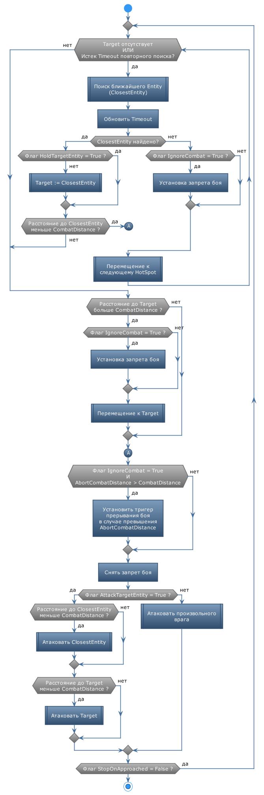

# **MoveToEntity**

Команда предназначена для патрулирования по *HotSpots* и поиска заданного *Entity*.

## **Описание алгоритма**

1. Бот перемещается между точками *HotSpots* производя поиск ближайшего *Entity*, удовлетворяющего критериям поиска.  
   - Патрулирование может производиться с запретом боя [*IgnoreCombat*](#ref-IgnoreCombat). 
   - Область поиска *Entity* может быть ограничена опциями [*CustomRegions*](#ref-CustomRegions),  [*ReactionRange*](#ref-ReactionRange) и [*ReactionZRange*](#ref-ReactionZRange).

2. Когда целевое *Entity* найдено, бот следует к нему по кратчайшему пути.
   - Целевое *Entity* может быть принудительно атаковано, если установлен флаг [*AttackTargetEntity*](#ref-AttackTargetEntity). При этом игнорируется список *Blacklist* выполняемого quester-профиля.

3. После исчезновения (уничтожения) всех *Entity*, удовлетворяющих критериям поиска, бот возобновляет патрулирование.

---

# **Настройки команды**

| **Наименование** | **Описание** 
|:-----------------|:-------------
||**Настройки идентификации *Entity* (категория "Entity")**
|<a name ="ref-EntityID">***EntityID***</a> <a name ="ref-EntityIdType">***EntityIdType***</a> <a name ="ref-EntityNameType">***EntityNameType***</a> | Идентификация *Entity* производится сочетанием трех перечисленных слева свойств, которые подробно описаны в разделе [Идентификация *Entity*](../../General/EntityIdentification-RU.md).
||**Дополнительные фильтры *Entity* (категория "Optional")**
|<a name ="ref-ReactionRange">***ReactionRange***</a> | Максимальное допустимое расстояние от *Entity* до персонажа. *Entity* на большем расстоянии игнорируются.  Опция отключается при установке значения ``0``. При этом поиск производится среди всех видимых боту *Entity*.
|<a name ="ref-ReactionZRange">***ReactionZRange***</a> | Максимальная допустимая разница по высоте (ZAxis) между *Entity* и персонажем. *Entity*, находящиеся выше (ниже) заданной величины относительно персонажа, - игнорируются.   Опция отключается при установке значения ``0``. При этом поиск производится среди всех видимых боту *Entity*.
|<a name ="ref-RegionCheck">***RegionCheck***</a> | Флаг, активирующий дополнительную проверку внутриигрового региона (не то же самое, что *CustomRegion*), в котором находится *Entity*. - ***True*** : Поиск *Entity* производится в том же регионе, в котором находится персонаж; - ***False*** : Проверка региона при поиске *Entity* не производится.
|<a name ="ref-HealthCheck">***HealthCheck***</a> | Дополнительная проверка уровня здоровья *Entity* (HP). - ***True*** : Игнорируются *Entity* с нулевым количеством очков здоровья (HP) либо, имеющие флаг ***IsDead***; - ***False*** : Здоровье *Entity* (HP) не проверяется.
|<a name ="ref-HoldTargetEntity">***HoldTargetEntity***</a> | Флаг удержания *Entity*. - ***True*** : Бот продолжает следовать к ранее найденному *Entity*, даже в том случае, если будет обнаружено *Entity* поближе; - ***False*** : Бот постоянно производит поиск и следует к ближайшему *Entity*.
|<a name ="ref-CustomRegions">***CustomRegions***</a> | Набор *CustomRegion*'ов, задающих область поиска *Entity*. Подробное описание приведено в разделе [CustomRegionSet](../../General/CustomRegionSet-RU.md).
||**Опции, модифицирующие поведение (категория "Interruptions")**
|| **Управление боем**
|<a name ="ref-IgnoreCombat">***IgnoreCombat***</a> | Флаг, предписывающий активировать режим игнорирования боя *IgnoreCombat* при следовании к целевой *Entity*.
|<a name ="ref-CombatDistance">***CombatDistance***</a> | Расстояние до целевой *Entity*, на котором отключается режим игнорирования боя *IgnoreCombat*.   При установке значения более ``5`` на [Mapper](../../Patches/Mapper/Mapper-RU.md) соответствующая область отображается окружностью, центром которой является соответствующая *Entity*.
|<a name ="ref-AbortCombatDistance">***AbortCombatDistance***</a> | Расстояние от *Entity*, за пределами которого бой принудительно прерывается.   Бой снова активируются на расстоянии [*CombatDistance*](#ref-CombatDistance) от целевой *Entity*. При значении меньшем [*CombatDistance*](#ref-CombatDistance) или при выключенном флаге [*IgnoreCombat*](#ref-IgnoreCombat), опция отключается;
|<a name ="ref-AttackTargetEntity">***AttackTargetEntity***</a> | Флаг, предписывающий атаковать целевую *Entity*.   Опция игнорируется, если флаг [*IgnoreCombat*](#ref-IgnoreCombat) не установлен.
|| **Прерывание команды**
|<a name ="ref-StopOnApproached">***StopOnApproached***</a> | Флаг, завершающий выполнение команды после того как персонаж приблизился к целевой *Entity* на расстояние [*CombatDistance*](#ref-CombatDistance).
|| **Прочие опции**
|<a name ="ref-ResetCurrentHotSpot">***ResetCurrentHotSpot***</a> | Флаг, предписывающий двигаться к ближайшему *HotSpot*'у после исчезновения (уничтожения) всех видимых целевых *Entity*.  Если флаг не установлен, бот "запоминает" последний *HotSpot*, к которому двигался перед обнаружением *Entity*, и после уничтожения всех видимых *Entity* (их исчезновения), продолжает движение к этому *HotSpot'у*.

---

# **Внутренние условия**

Перед запуском команды проверяется истинность одного из условий:
- Задана опция [*EntityID*](#ref-EntityID).
- Опции [*EntityNameType*](#ref-EntityNameType) имеет значение *Empty*.

---

# **Завершение команды**

Команда самостоятельно не завершается, если не задан флаг [*StopOnApproached*](#ref-StopOnApproached).

Принудительное завершение команды возможно одним из способов, перечисленных в [статье](General/ForcedQuesterActionTermination-RU.md).

---

# **Схема функционирования**

---

# **Аналоги**

Похожие команды, входящие в базовый функционал бота:
- [***Grind***](Astral-Actions-RU.md#ref-Grind).

---

<a href="javascript:history.back()">Назад</a>  
[Назад к перечню команд](../EntityTools-QuesterExtensions-RU.md#Команды)  
[Назад к содержанию](../../index.md)