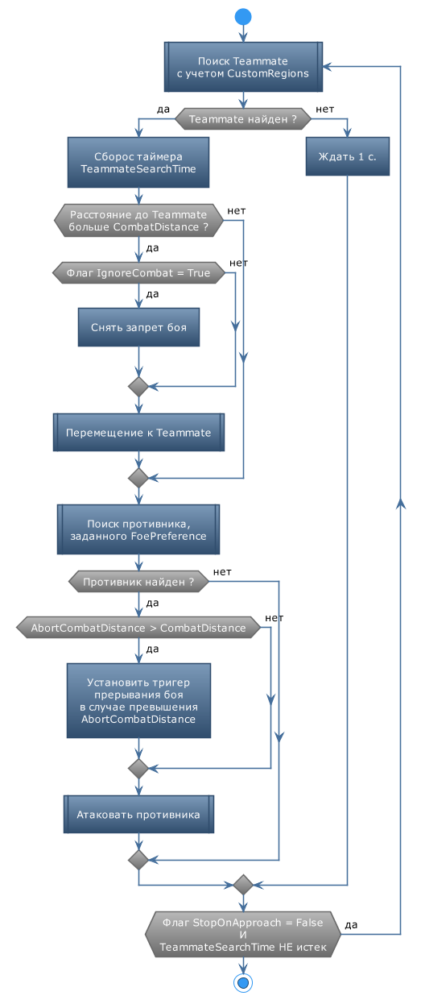

# **MoveToTeammate**

Команда предназначена для сопровождения и оказания поддержки члену группы ([*Teammate*](#ref-Teammate)).

## **Краткое описание**

1. Бот производит поиск члена группы [*Teammate*](#ref-Teammate).  
   - Персонаж и [*Teammate*](#ref-Teammate) должны находиться на одной карте, в одном инстансе и в одном внутриигровом регионе.
   - Область поиска [*Teammate*](#ref-Teammate) может быть ограничена опцией [*CustomRegions*](#ref-CustomRegions).
2. Когда *Teammate* найден, бот перемещает персонажа к нему.
3. Приблизившись к персонажу на расстояние [*CombatDistance*](#ref-CombatDistance), персонаж атакует противника, заданного опцией [*FoePreference*](#ref-FoePreference).

# **Настройки команды**

| **Наименование** | **Описание** 
|:-----------------|:-------------
|**SupportOptions**| комплексная опция, позволяющая задать члена группы ([*Teammate*](#ref-Teammate)) и способ оказания ему поддержки. - <a name ="ref-Teammate">***Teammate***</a> : Переключатель, определяющий правило выбора члена группы. <a name ="ref-FoePreference">- ***FoePreference***</a> : Переключатель, определяющий правило выбора противника. Подробное описание приведено в разделе [*SupportTeammate*](../../General/SupportTeammate-RU.md).
||**Дополнительные фильтры *Teammate*  (категория "Optional")**
|<a name ="ref-CustomRegions">***CustomRegions***</a> | набор *CustomRegion*'ов, задающих область поиска *Teammate*. Подробное описание приведено в разделе [CustomRegionSet](../../General/CustomRegionSet-RU.md).
||**Управление боем**
|<a name ="ref-IgnoreCombat">***IgnoreCombat***</a> | флаг, предписывающий активировать режим игнорирования боя *IgnoreCombat* при следовании к *Teammate*.
|<a name ="ref-IgnoreCombatMinHP">***IgnoreCombatMinHP***</a> | минимальный уровень здоровья (в процентах), при котором может быть активирован режим игнорирования боя *IgnoreCombat* при следовании к *Teammate*.
|<a name ="ref-CombatDistance">***CombatDistance***</a> | расстояние до *Teammate*, на котором отключается режим игнорирования боя *IgnoreCombat*.   При установке значения более ``5`` на [Mapper](../../Patches/Mapper/Mapper-RU.md) соответствующая область отображается окружностью, центром которой является соответствующая *Teammate*.
|<a name ="ref-AbortCombatDistance">***AbortCombatDistance***</a> | расстояние от *Entity*, за пределами которого бой принудительно прерывается.   Бой снова активируются на расстоянии [*CombatDistance*](#ref-CombatDistance) от целевой *Entity*. При значении меньшем [*CombatDistance*](#ref-CombatDistance) или при выключенном флаге [*IgnoreCombat*](#ref-IgnoreCombat), опция отключается;
||**Прерывание команды**
|<a name ="ref-StopOnApproached">***StopOnApproached***</a> | флаг, завершающий выполнение команды после того как персонаж приблизился к *Teammate* на расстояние [*CombatDistance*](#ref-CombatDistance).
|<a name ="ref-TeammateSearchTime">***TeammateSearchTime***</a> | Время поиска в миллисекундах, в течение которого бот пытается обнаружить *Teammate*, удовлетворяющего критериям поиска.  Команда прерывается, если до истечения заданного времени *Teammate* не будет обнаружен.  Опция отключается при установке значения ``0``. При этом поиск продолжается неограниченное время.

<!-- |**SupportOptions**|**Комплексная опция, позволяющая задать члена группы ([*Teammate*](#ref-Teammate)) и способ оказания ему поддержки.**
|<a name ="ref-Teammate">*SupportOptions.**Teammate***</a> | Переключатель, определяющий правило выбора члена группы:  - ***Leader*** : лидер группы; - ***Tank*** : танк; - ***Healer*** : целитель; - ***Sturdiest*** : наиболее выносливый член группы (c наибольшим значением максимума ХР); - ***SturdiestDD*** : наиболее выносливый (сильный) дамагер (c наибольшим значением максимум ХР).   Урон, и хп персонажа сейчас считаются от ОУП'a с разными коэффициентами, поэтому можно принять MaxHP за приблизительную оценку DPS; - ***Weakest*** : слабейший член группы (c наименьшим значением максимума ХР); - ***WeakestDD*** : слабейший дамагер (c наименьшим значением максимума ХР).  Урон, и хп персонажа сейчас считаются от ОУП'a с разными коэффициентами, поэтому можно принять MaxHP за приблизительную оценку DPS; - ***MostInjured*** : наиболее израненный член группы (c наименьшим значением ХР);  - ***MostInjuredDD*** : наиболее израненный дамагер (c наименьшим значением ХР).
|<a name ="ref-FoePreference">*SupportOptions.**FoePreference***</a>|Переключатель, определяющий правило выбора противника:  - ***TeammatesTarget*** : противник, которого атакует заданный член группы; - ***ClosestToPlayer*** : Ближайший к игроку противник; - ***ClosestToTeammate*** : Противник, ближайший к поднадзорному члену группы; - ***Sturdiest*** : Самый выносливый противник (c наибольшим значением максимума ХР); - ***Weakest*** : Наименее выносливый противник (c наименьшим значением максимума ХР); - ***MostInjured*** : Наиболее раненый противник (с наименьшим НР).
-->
---

# **Внутренние условия**

Персонаж должен состоять в группе. 
В противном случае команда пропускается.

---

# **Завершение команды**

Команда завершается в следующих случаях:
- [*Teammate*](#ref-Teammate) не был найден в течение времени [*TeammateSearchTime*](#ref-TeammateSearchTime).
- Задан флаг [*StopOnApproached*](#ref-StopOnApproached) и персонаж приблизился к [*Teammate*](#ref-Teammate) на расстояние [*CombatDistance*](#ref-CombatDistance).

Принудительное завершение команды возможно одним из способов, перечисленных в [статье](ForcedQuesterActionTermination-RU.md).

---

# **Схема функционирования**

---

# **Аналоги**
В базовом функционале бота похожие команды отсутствуют.

---

<a href="javascript:history.back()">Назад</a>  
[Назад к перечню команд](../EntityTools-QuesterExtensions-RU.md#Команды)  
[Назад к содержанию](../../index.md)
