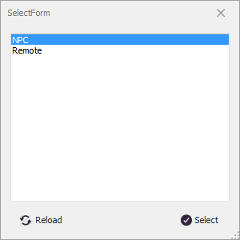
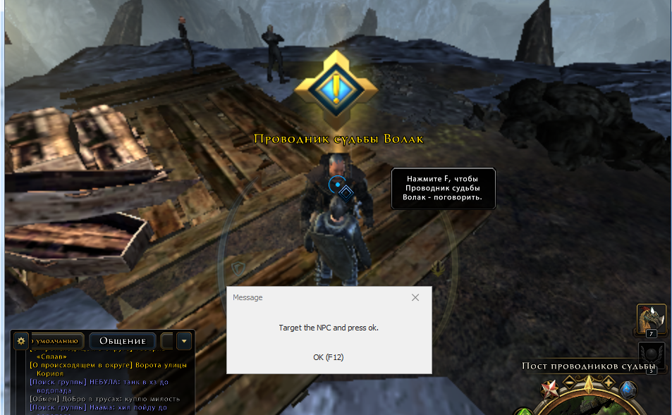

# **PickUpMissionExt**

Команда предназначена для взятия квестового задания (миссии) у конкретного неигрового персонажа - квестодателя (NPC) или у вспомогательной внутриигровой диалоговой подсистемы (Remote).

## **Описание алгоритма**

1. Проверяется отсутствие миссии в журнале активных и выполненных задач персонажа. Если миссия есть в журнале - команда завершается.
2. Если задан квестодатель-NPC, проверяется текущая карта и регион в котором находится персонаж. При несоответствии карты/региона - команда завершается.
3. Персонаж перемещается к квестодателю-NPC и производит взаимодействие с ним, либо активирует внутриигровую диалоговую подсистему *Remote*.
4. Если задан [*RequiredRewardItem*](#ref-RequiredRewardItem), то проверяется его наличие в составе наград за выполнение миссии, и при его отсутствии - команда завершается.
5. Персонаж принимает миссию и команда завершается.

---

# **Настройки команды**

| **Наименование** | **Описание** 
|:-----------------|:-------------
||**Обязательные настройки (категория "Required")**
|<a name ="ref-MissionId">***MissionId***</a> | Текстовый идентификатор миссии состоящий из алфавитно-цифровых символов.  В начале и в конце строки допускается использование символа подстановки ``*``, заменяющего произвольное число алфавитно-цифровых символов.
<a name ="ref-Giver">***Giver***</a> | Комплексная опция, идентифицирующая квестодателя, который выдает миссию.   Подробное описание приведено в статье [*MissionGiverInfo*](../../General/MissionGiverInfo-RU.md).
||**Настройки взаимодействия (категория "Interaction")**
|<a name ="ref-Dialogs">***Dialogs***</a>|Последовательность ответов в диалоге с квестодателем, которую необходимо пройти перед получением возможности принять миссию. Опция не обязательна.
|<a name ="ref-InteractDistance">***InteractDistance***</a> | Максимальное допустимое расстояние, на котором возможно взаимодейтсвие с квестодателем-NPC.
|<a name ="ref-SkipOnFail">***SkipOnFail***</a> | Флаг, предписывающий завершить команду после безуспешной попытки принять заданную миссию.
|<a name ="ref-ReactionZRange">***ReactionZRange***</a> | Максимальная допустимая разница по высоте (ZAxis) между квестодателем-NPC и персонажем.   Минимальное допустимое значение : ``5``.
|<a name ="ref-CloseContactDialog">***CloseContactDialog***</a> | Флаг, предписывающий закрывать диалог с квестодателем после взятия миссии. По умолчанию не установлен.
||**Дополнительные опции  (категория "Optional")**
|<a name ="ref-ContactHaveMission">***ContactHaveMission***</a> | Переключатель, активирующий проверку на наличие у квестодателя-NPC квестового задания: - ***Any*** : любой тип миссии (значение по умолчанию) - ***Main*** : миссия, относящаяся к Приключению (Adventure) - ***Repeatable*** : повторяемая миссия (дейлик) - ***Disable*** : проверка отключена  Активация данной опции позволяет исключить лишние перемещения персонажа, поскольку позволяет определить отсутствие у квестодателя-NPC миссии не приближаясь к нему в плотную и не выполняя взаимодействия.  Следует отметить, что проверка будет работать некорректно, если иконка над персонажем отличается от стандартных иконок квестовых заданий, например, иконка магазина.
|<a name ="ref-IgnoreCombat">***IgnoreCombat***</a> | Флаг, предписывающий активировать режим игнорирования боя *IgnoreCombat* при следовании к квестодателю-NPC.        Режим игнорирования боя отключается только при [штатном завершении команды](#завершение-команды). В случае [принудительного прерывания команды](../../General/ForcedQuesterActionTermination-RU.md) режим игнорирования боя может продолжать действовать и влиять на выполнение quester-профиля.
|<a name ="ref-RequiredRewardItem">***RequiredRewardItem***</a> | Идентификатор предмета, который должен быть в наградах за выполнение миссии. Пустая строка отключает проверку. Миссия не будет принята при отсутствии заданного предмета.   В начале и в конце строки допускается использование символа подстановки ``*`` , заменяющего произвольное число алфавитно-цифровых символов.  Чтобы выбрать нужный предмет в игре должно быть открыто диалоговое окно принятия миссии.

---

# **Мастер настройки (GatherInfo)**

Мастер настройки вызывается автоматически при добавлении новой команды, или при нажатии кнопки **[GatherInfo]**. Для настройки команды выполните следующие действия: 
1. В quester-редакторе в диалоговом окне ***SelectForm***  выберите [типа квестодателя](../../General/MissionGiverInfo-RU.md#ref-Type):
   - *NPC* : неигровой персонаж-квестодатель, расположенный в определенном месте игрового мира;
   - *Remote* : дистанционная диалоговая система, доступная из любой точки игрового мира. Обычно с таких миссий начинаются кампании. 
   
2. Идентифицируйте квестодателя.
   - Идентификация квестодателя-*NPC* производится в игровом окне. Для этого нужно подвести игрового персонажа вплотную к соответствующему *NPC*, направить на него игровую камеру и нажать F12.  Информация о выбранном *NPC* будет занесена в опцию [*Giver*](#ref-Giver).  
   
   - Идентификация дистанционного квестодателя (*Remote*) производится в диалоговорм окне ***GetAnId*** в quester-редакторе. 
    
   После идентификации квестодателя-NPC игровой персонаж самостоятельно произведет взаимодействие с ним и дождётся появления внутриигрового диалогового окна.
3. В окне quester-редактора в диалоговом окне ***GetAnId*** выбрите пункт диалога, соответствующий принимаемому квестовому заданию. 
    
Если закрыть окно ***GetAnId*** без выбора пункта диалога - откроется стандартное окно выбора миссии. 
После выбора пункта диалога в редакторе, бот активирует в игре соответствующий пункт диалога, что приводит к открытию экрана принятия миссии. На этом этапе возможно подвисание до 3 секунд, связанное с необходимостью "ожидания отклика" игрового интерфейса и обновления игрового журнала заданий. 
Бот попытается самостоятельно извлечь идентификатор миссии [*MissionId*](#ref-MissionId).
4. Если боту не удалось извлечь идентификатор миссии [*MissionId*](#ref-MissionId), в quester-редакторе отобразится диалоговое окно ***Get a mission id***, в котором необходимо выбрать нужную миссию.  

5. В quester-редакторе в диалоговом окне ***Get an item id***, можно выбрать один из предметов, выдаваемых в качестве награды за выполнение миссии.  
По умолчанию открывается вкладка с наградами за выполнение миссии, однако, для поиска нужного предмета можно переключиться другую вкладку.  
Идентификатор выбранной награды заносится в опцию [*RequiredRewardItem*](#ref-RequiredRewardItem).  
Если закрыть окно, то опция [*RequiredRewardItem*](#ref-RequiredRewardItem) останется незаполненной, а проверка - отключится. 

---

# **Внутренние условия**

Перед запуском команды проверяется истинность следующих условий:
- Миссия, заданная опцией [*MissionId*](#ref-MissionId), отсутствует в журнале активных или выполненных задач персонажа.
- Персонаж и квестодатель-*NPC* находятся на одной карте и в одном регионе.
Команда пропускается, если хотя бы одно из условие не выполняется.

---

# **Завершение команды**

Команда завершается:
- после взаимодействия с квестодателем и принятия заданной миссии;
- при отсутствии [*RequiredRewardItem*](#ref-RequiredRewardItem) в списке наград за выполнение миссии.
 
Принудительное завершение команды возможно одним из способов, перечисленных в [статье](ForcedQuesterActionTermination-RU.md).

---

# **Аналоги**

Отличия от команд [***PickUpMission***](Astral-Actions-RU.md#ref-PickUpMission) и [***InteractNPC***](Astral-Actions-RU.md#ref-InteractNPC), встроенных в базовый функционал бота:
+ возможность проверки наличия в наградах за миссию заданного [предмета](#ref-RequiredRewardItem "Опция 'RequiredRewardItem'") и отказ от принятия миссии при его отсутствии.    
+  встроенная проверка наличий миссии в журнале активных или завершенных задач персонажа;
+  встроенная проверка [карты](../../General/MissionGiverInfo-RU.md#ref-MapName "Опция 'Giver.MapName'") и [региона](../../General/MissionGiverInfo-RU.md#ref-RegionName "Опция 'Giver.RegionName'"), в которых находится квестодатель-NPC. Команда прерывается, если персонаж находится на иной карте или в ином регионе;
+  возможность активировать режим [игнорирования боя](#ref-IgnoreCombat "Опция 'IgnoreCombat'");
+  встроенная проверка наличия квестовых заданий у заданного квестодателя-NPC [*ContactHaveMission*](#ref-ContactHaveMission "Опция 'ContactHaveMission'");
+  удобный [мастер настройки (GatherInfo)](#мастер-настройки-gatherinfo) 

---

<a href="javascript:history.back()">Назад</a>  
[Назад к перечню команд](../EntityTools-QuesterExtensions-RU.md#Команды)  
[Назад к содержанию](../../index.md)