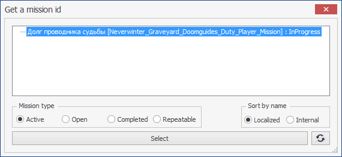

# **TurnInMissionExt**

Команда предназначена для сдачи квестового задания (миссии) конкретному неигровому персонажу (NPC).

## **Описание алгоритма**

1. Проверяется статус миссии в журнале задач персонажа. Если миссия отсутствует в журнале или её статус отличен от *Succeeded* - команда завершается.
2. Проверяется совпадение текущей карты и регион, в котором находится персонаж, с информацией о местонахождении NPC, заданной в опции [*Giver*](#ref-Giver). При несоответствии карты или региона - команда завершается.
3. Персонаж перемещается к NPC и производит взаимодействие с ним.
4. Если задан [*RequiredRewardItem*](#ref-RequiredRewardItem), то проверяется его наличие в составе наград за выполненную миссию, и при его отсутствии - команда завершается без сдачи миссии.
5. Персонаж сдает миссию и команда завершается.

---

# **Настройки команды**

| **Наименование** | **Описание** 
|:-----------------|:-------------
||**Обязательные опции (категория "Required")**
|<a name ="ref-MissionId">***MissionId***</a> | текстовый идентификатор миссии состоящий из алфавитно-цифровых символов.  В начале и в конце строки допускается использование символа подстановки ``*``, заменяющего произвольное число алфавитно-цифровых символов.
|<a name ="ref-Giver">***Giver***</a> | комплексная опция, идентифицирующая *NPC*, которому сдается миссия.   Подробное описание приведено в статье [*MissionGiverInfo*](../../General/MissionGiverInfo-RU.md).
|| **Настройки взаимодействия**
|<a name ="ref-Dialogs">***Dialogs***</a> | последовательность ответов в диалоге с [*Giver*](#ref-Giver), которую необходимо пройти перед получением возможности сдать миссию. Опция не обязательна.
|<a name ="ref-InteractDistance">***InteractDistance***</a> | максимальное допустимое расстояние, на котором возможно взаимодейтсвие с [*Giver*](#ref-Giver).
|<a name ="ref-SkipOnFail">***SkipOnFail***</a> | флаг, предписывающий завершить команду после безуспешной попытки сдать заданную миссию.
|<a name ="ref-ReactionZRange">***ReactionZRange***</a> | максимальная допустимая разница по высоте (ZAxis) между [*GIVER*](#REF-GIVER) и персонажем.   Минимальное допустимое значение ``5``.
|<a name ="ref-CloseContactDialog">***CloseContactDialog***</a> | флаг, предписывающий закрывать диалог с [*GIVER*](#REF-GIVER) после сдачи миссии.   По умолчанию не установлен.
||**Дополнительные опции**
|<a name ="ref-IgnoreCombat">***IgnoreCombat***</a> | флаг, предписывающий активировать режим игнорирования боя *IgnoreCombat* при следовании к [*GIVER*](#REF-GIVER).   Режим игнорирования боя отключается только при [штатном завершении команды](#завершение-команды). В случае [принудительного прерывания команды](./../../General/ForcedQuesterActionTermination-RU.md) режим игнорирования боя может продолжать действовать и влиять на выполнение quester-профиля.
|<a name ="ref-RequiredRewardItem">***RequiredRewardItem***</a> | идентификатор предмета, который должен быть в наградах за выполнение миссии.  Пустая строка отключает проверку.  Миссия не будет сдана при отсутствии заданного предмета.   В начале и в конце строки допускается использование символа подстановки ``*``, заменяющего произвольное число алфавитно-цифровых символов.  Чтобы выбрать нужный предмет в игре должно быть открыто диалоговое окно принятия миссии.

# **Мастер настройки (GatherInfo)**

Мастер настройки вызывается автоматически при добавлении новой команды, или при нажатии кнопки **[GatherInfo]**. Для настройки команды выполните следующие действия: 
1. В quester-редакторе в диалоговом ***Get a mission id*** выберите идентификатор миссии [*MissionId*](#ref-MissionId).  

2. Укажите *NPC*, принимающего миссию. 
Для этого в игровом окне нужно подвести игрового персонажа вплотную к соответствующему *NPC*, направить на него игровую камеру и нажать F12.  
    
   Информация о выбранном *NPC* будет занесена в опцию [*Giver*](#ref-Giver), игровой персонаж самостоятельно произведет взаимодействие с ним, дождется появления внутриигрового диалогового окна и активирует пункт меню, соответствующий выбранной миссии [*MissionId*](#ref-MissionId). При этом сдавать миссиию бот не будет.
3. В quester-редакторе откроется диалоговое окне ***Get an item id***, в котором можно выбрать один из предметов, выдаваемых в качестве награды за выполнение миссии.  
По умолчанию открывается вкладка с наградами за выполнение миссии, однако, для поиска нужного предмета можно переключиться другую вкладку.  
Идентификатор выбранной награды заносится в опцию [*RequiredRewardItem*](#ref-RequiredRewardItem).  
Если закрыть окно, то опция [*RequiredRewardItem*](#ref-RequiredRewardItem) останется незаполненной, а проверка - отключится. 

---

# **Внутренние условия**

Перед запуском команды проверяется истинность следующих условий:
- Миссия, заданная опцией [*MissionId*](#ref-MissionId), имеет статус *Succeeded*, то есть содержится в журнале задач и выполнена успешно.
- Персонаж и [*Giver*](#ref-Giver) находятся на одной карте и в одном регионе
Команда пропускается, если хотя бы одно из условие не выполняется.

---

# **Завершение команды**

Команда завершается:
- после взаимодействия с [*Giver*](#ref-Giver) и успешной сдачи миссии, которая меняет статус на *Completed*.
- при отсутствии [*RequiredRewardItem*](#ref-RequiredRewardItem) в списке наград за выполнение миссии.

Принудительное завершение команды возможно одним из способов, перечисленных в [статье](ForcedQuesterActionTermination-RU.md).

---

# **Аналоги**

Отличия от команд [***TurnInMission***](Astral-Actions-RU.md#ref-TurnInMission) и [***InteractNPC***](Astral-Actions-RU.md#ref-InteractNPC), встроенных в базовый функционал бота:
+ возможность проверки наличия в наградах за миссию заданного [предмета](#ref-RequiredRewardItem "Опция 'RequiredRewardItem'") и отказ от завершения миссии при его отсутствии.    
+  встроенная проверка статуса миссии в журнале активных или завершенных задач персонажа;
+  встроенная проверка [карты](../../General/MissionGiverInfo-RU.md#ref-MapName "Опция 'Giver.MapName'") и [региона](../../General/MissionGiverInfo-RU.md#ref-RegionName "Опция 'Giver.RegionName'"), в которых находится [*Giver*](#ref-Giver). Команда прерывается, если персонаж находится на иной карте или в ином регионе; 
+  возможность активировать режим [игнорирования боя](#ref-IgnoreCombat "Опция 'IgnoreCombat'");
+  Удобный [мастер настройки (GatherInfo)](#мастер-настройки-gatherinfo) 

---

<a href="javascript:history.back()">Назад</a>  
[Назад к перечню команд](../EntityTools-QuesterExtensions-RU.md#Команды)  
[Назад к содержанию](../../index.md)