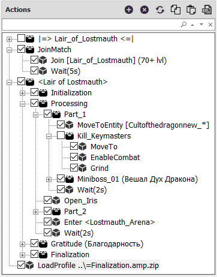
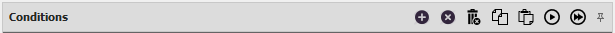
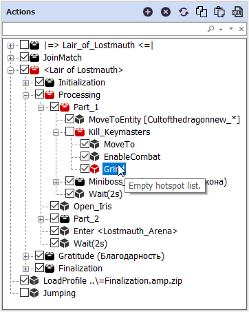
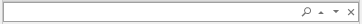
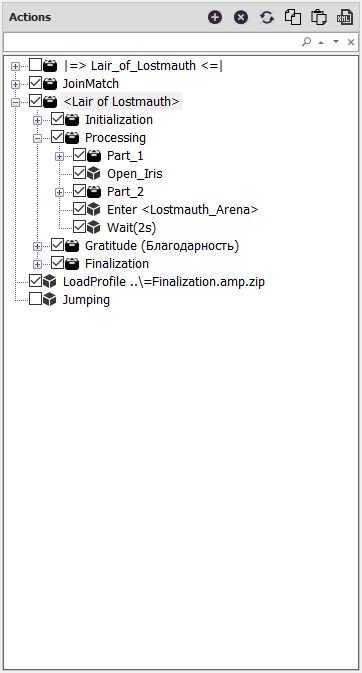

# **Панель Actions**

Данная панель содержит набор [*quester-команд*](../EntityTools-QuesterExtensions-RU.md#ref-Actions), управляющих действиями персонажа в игре. Команды организованы в древовидную структуру с помощью группирующей команды [*ActionPack*](http://www.neverwinter-bot.com/forums/viewtopic.php?f=150&t=7892&p=43902#p43903).  

---

## **Редактирование набора команд**

В заголовке панели расположены кнопки редактирования:  

 **Add Action** : Добавить новую [*quester-команду*](../EntityTools-QuesterExtensions-RU.md#ref-Actions).  
Дополнительно можно использовать сочетание горячих клавиш  ``Ins``.  

 **Delete selected Action** : Удалить выбранную [*quester-команду*](../EntityTools-QuesterExtensions-RU.md#ref-Actions).  
При попытке удаления [*ActionPack*](https://www.neverwinter-bot.com/forums/viewtopic.php?p=43903#p43903) будет выведено окно, в котором необходимо подтвердить удаление группирующей команды.  
Дополнительно можно использовать сочетание горячих клавиш  ``Ctrl+Del``.  

 **GatherInfo** : Запускает мастер инициализации выбранное команды, если он предусмотрен разработчиком.  
Мастер инициализации (GatherInfo) представляет собой диалоговое окно, с помощью которого пользователь задает обязательные параметры команды, например, идентификаторы квеста и НПС-квестодателя для [***PickUpMissionExt***](../Actions/PickUpMissionExt-RU.md).  

 **Copy Action** : Копировать [*quester-команду*](../EntityTools-QuesterExtensions-RU.md#ref-Actions) в буфер обмена.  
Дополнительно можно использовать сочетание горячих клавиш  ``Ctrl+C``.  

 **Paste Action** : Вставка [*quester-команды*](../EntityTools-QuesterExtensions-RU.md#ref-Actions) из буфера обмена.  
Дополнительно можно использовать сочетание горячих клавиш  ``Ctrl+V``.  

 **Edit Action XML** : Редактирование [*quester-команды*](../EntityTools-QuesterExtensions-RU.md#ref-Actions) в формате XML.  
Команда преобразовывается в XML-описание, которое открывается во внешнем текстовом редакторе, позволяющем вручную изменить значение любой опции, ассоциированных с ней условий или вложенных команд (при редактировании [*ActionPack*](https://www.neverwinter-bot.com/forums/viewtopic.php?p=43903#p43903)'а).  
После внесения и сохранения изменений в Quester-редакторе в модальном окне необходимо принять их, нажав кнопку ``Valid``, чтобы изменения отобразились в наборе команд.  
Это единственный метод редактирования, который позволяет изменить тип команд, вложенных в [*ActionPack*](https://www.neverwinter-bot.com/forums/viewtopic.php?p=43903#p43903) и имеющих схожие настройки, например, [*Grind*](https://www.neverwinter-bot.com/forums/viewtopic.php?p=43904#p43904) в [*MoveToEntity*](../Actions/MoveToEntity-EN.md).  

---

Для удобства редактирования чекбок рядом с каждой командой наглядно отображает статус активности (*Disabled*) и позволяет её активировать и деактивировать. Деактивированные команды при выполнении профиля всегда пропускаются.  

---

Изменение порядка (структуры) и перегруппировка [*quester-команд*](../EntityTools-QuesterExtensions-RU.md#ref-Actions) производится путем перетакивания (*Drag and Drop*) с зажатой левой кнопкой мыши (ЛКМ). При перетаскивании с зажатой правой кнопкой мыши (ПКМ), [*quester-команда*](../EntityTools-QuesterExtensions-RU.md#ref-Actions) копируется.  
По умолчанию [*quester-команда*](../EntityTools-QuesterExtensions-RU.md#ref-Actions), переремещаемая на [*ActionPack*](https://www.neverwinter-bot.com/forums/viewtopic.php?p=43903#p43903), вставляется в начало списка вложенных [*quester-команд*](../EntityTools-QuesterExtensions-RU.md#ref-Actions). Однако при удержании кнопки ``ALT`` [*quester-команда*](../EntityTools-QuesterExtensions-RU.md#ref-Actions) будет помещена ПОСЛЕ [*ActionPack*](https://www.neverwinter-bot.com/forums/viewtopic.php?p=43903#p43903)'а.

---

Команды с неправильным значением опций помечаются в дереве красной иконкой, при наведении на которую отображается подсказка, указывающая на причину ошибки.

---

## **Поиск команд**

Над деревом команд находится панель поиска:  

Поиск веденной подстроки производится в:  
* наименовании типа команды;
* текстовой метке команды (OverrideName);
* идентификаторе команды (ActionID).  

Данный инструмент отсутствует в штатном [*Quester-редакторе*](https://www.neverwinter-bot.com/forums/viewtopic.php?p=43901#p43901).

---

1. Введите в строку поиска искомый текст, идентификатор команды (*ActionID*) или его часть.  
2. Нажмите иконку лупы или клавишу ``Enter``;
3. Фокус в дереве команд переключится на первую найденная команду. Все найденный команды будут выделены в дереве желтым фоном;
4. Переход между найденными командами выполняется кнопками вверх и вниз справа в строке поиска.
5. Очистка результатов поиска производится кнопкой ``x``.

---

<a href="javascript:history.back()">Назад</a>  
[Назад к содержанию](../../index.md)