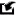

# Панель игнорируемых врагов (BlackList)

Данная панель содержит список идентификаторов противников, игнорируемых пресонажем во время боя, и предназначена для управления им. По умолчанию она скрыта и тображается в виде заголовка вдоль правой границы окна редактора.

---

В заголовке панели расположены кнопки:

 **Add Enemy** : Добавление идентификатора противника, в качестве которого используется [*InternalName*](../../General/EntityIdentification-RU.md#ref-InternalName) игровой сущности.
В отличие от [штатного *quester-редакторf*](https://www.neverwinter-bot.com/forums/viewtopic.php?p=43901#p43901) для выбора идентификатора противника не требутся наведение на него перицела персонажа в игре. Вмето этого противника необходимо выбрать в обозревателе игровых сущностей ([*EntityViewer*](../../General/EntityIdentification-RU.md#ref-EntityViewer)).

 **Import Enemies** : Импорт идентификаторов врагов из другого профиля:  

1) Сначала в диалоговом окне необходимо выбрать quester-профиль из которого будут импортироваться идентификаторы врагов.

2) Если список игнорируемых врагов в выбранном профиле пустой (***BlackList***) будет выбрано соответствующее предупреждение.

3) Затем необходимо отметить идентификаторы, которые необходимо импортировать:

    

4) Если идентфикатор уже содержится в списке ***BlackList***, он будет проигнорирован.

 **Delete selected Enemy** : Удаление выбранныого идентификатора врага из списка.  

 **Auto hide** : Переключение панели в режим ***автоматического скрытия***, в котором неактивная панель сворачивается и отображается в виде вкладки-заголовка.  

 **Pin** : Переключение панели в ***закрепленный режим***, при котором панель отображается целиком даже в неактивном состоянии.

---

<a href="javascript:history.back()">Назад</a>  
[Назад к содержанию](../../index.md)