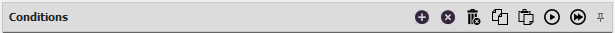

# **Панель Conditions**

Данная панель содержит набор [*условий*](../EntityTools-QuesterExtensions-RU.md#ref-Conditions), ассоциированных с [*командой*](../EntityTools-QuesterExtensions-RU.md#ref-Actions), выделенной на [*Панели команд*](ActionPanel-RU.md).  
Если используется плагин [***QuesterAssistant***](https://www.neverwinter-bot.com/forums/viewtopic.php?f=155&t=8742), условия могут быть организованы в древовидную структуру с помощью группирующей команды *``ConditionPack``*.  

---

## **Редактирование набора условий**

В заголовке панели расположены кнопки:  

 **Add Condition** : Добавление нового [*условия*](../EntityTools-QuesterExtensions-RU.md#ref-Conditions).  
Дополнительно можно использовать сочетание горячих клавиш  ``Ins``.  

 **Delete selected Condition** : Удаление выбранного [*условия*](../EntityTools-QuesterExtensions-RU.md#ref-Conditions).  
При попытке удаления *``ConditionPack``* будет выведено окно, в котором необходимо подтвердить удаление группирующего условия.  
Дополнительно можно использовать сочетание горячих клавиш  ``Ctrl+Del``.  

 **Delete all Condition** : Удаление всех [*quesr-условий*](../EntityTools-QuesterExtensions-RU.md#ref-Conditions) из набора.  
Чтобы предотвратить случайное удаление потребуется подтвердить действие в диалоговом окне.  

 **Copy Condition** : Копирование выбранного [*условия*](../EntityTools-QuesterExtensions-RU.md#ref-Conditions) в буфер обмена.  
Дополнительно можно использовать сочетание горячих клавиш  ``Ctrl+C``.  

 **Paste Condition** : Вставка [*условия*](../EntityTools-QuesterExtensions-RU.md#ref-Conditions) из буфера обмена.  
Копия [*условия*](../EntityTools-QuesterExtensions-RU.md#ref-Conditions) добавляется после выделенного [*условия*](../EntityTools-QuesterExtensions-RU.md#ref-Conditions).  
Если выделено группирующее условие *``ConditionPack``*, тогда:
- по умолчанию копия [*условия*](../EntityTools-QuesterExtensions-RU.md#ref-Conditions) добавляется в начало сеиска вложенных [*условий*](../EntityTools-QuesterExtensions-RU.md#ref-Conditions);
- если удерживается клавиша ``ALT`` копия [*условия*](../EntityTools-QuesterExtensions-RU.md#ref-Conditions) добавляется после *``ConditionPack``*'a.

Дополнительно можно использовать сочетание горячих клавиш  ``Ctrl+V``.  

 **Test Condition** : Проверка истиности выбранного [*условия*](../EntityTools-QuesterExtensions-RU.md#ref-Conditions).  
Результат проверки отображается в диалоговом окне и в панели логирования.  

 **Test Condition** : Проверка истиности всех [*условий*](../EntityTools-QuesterExtensions-RU.md#ref-Conditions) в наборе.  
Результат проверки отображается в диалоговом окне и в панели логирования.  

 **Auto hide** : Переключения панели в режим ***автоматического скрытия***, в котором неактивная панель сворачивается и отображается в виде вкладки-заголовка.  

 **Pin** : Переключение панели в ***закрепленный режим***, при котором панель отображается целиком даже в неактивном состоянии.

---

Для удобства редактирования чекбок рядом с каждым условием наглядно отображает состояние флага ***Locked***, изменяющего обязательность истинности данного [*условия*](../EntityTools-QuesterExtensions-RU.md#ref-Conditions) для запуска [*команды*](../EntityTools-QuesterExtensions-RU.md#ref-Actions), с которой она ассоциирована.  
Правила проверки набора условий описаны в [отдельной статье](../Conditions/ConditionsCheckLogicRule-RU.md).

---

Изменение порядка и перегруппировка [*условий*](../EntityTools-QuesterExtensions-RU.md#ref-Conditions) производится путем перетаскивания (*Drag and Drop*) с зажатой левой кнопкой мыши (ЛКМ).  
При перетаскивании с зажатой правой кнопкой мыши (ПКМ), [*условие*](../EntityTools-QuesterExtensions-RU.md#ref-Conditions) копируется.  
По умолчанию [*условие*](../EntityTools-QuesterExtensions-RU.md#ref-Actions), переремещаемое на *``ConditionPack``*, вставляется в начало списка вложенных [*условий*](../EntityTools-QuesterExtensions-RU.md#ref-Conditions). Однако при удержании кнопки ``ALT`` [*условие*](../EntityTools-QuesterExtensions-RU.md#ref-Conditions) будет помещено ПОСЛЕ *``ConditionPack``*'а.

---

<a href="javascript:history.back()">Назад</a>  
[Назад к содержанию](../../index.md)