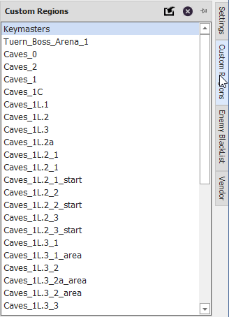
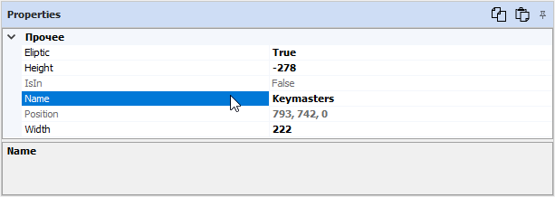
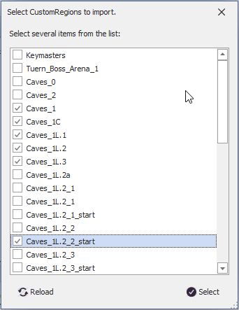
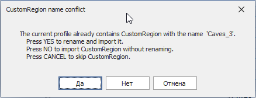
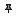
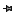

# Панель CustomRegions

Данная панель содержит список [*CustomRegion*](#ref-CustomRegion)'ов и предназначена для управления ими. По умолчанию она скрыта и тображается в виде заголовка вдоль правой границы окна редактора

**CustomRegion** - это прямоугольная или эллиптическая область на карте в плоскости ***Oxy***, заданная разработчиком quester-профиля и используемая для определения положения персонажа относительно неё (внутри или снаружи).

Если выделить [*CustomRegion*](#ref-CustomRegion), то его настройки отобразятся в панели [*Properties*](PropertiesPanel-RU.md), которая позволяет изменить большинство из них:

Добавить новые [*CustomRegion*](#ref-CustomRegion)'ы, а также изменить существующие можно с помощью инструментов, реализованных в [***Mapper***](../../Patches/Mapper/Mapper-CustomRegionTools-RU.md)'e.

---

В заголовке панели расположены кнопки:  

 **Import CustomRegions** : Импорт [*CustomRegion*](#ref-CustomRegion)'ов из другого профиля:  
1) Сначала в диалоговом окне необходимо выбрать quester-профиль из которого будут импортироваться [*CustomRegion*](#ref-CustomRegion)'ы.
2) Если выбранный профиль не содержит [*CustomRegion*](#ref-CustomRegion)'ов будет выбрано соответствующее предупреждение.
3) Затем необходимо отметить [*CustomRegion*](#ref-CustomRegion)'ы, которые необходимо импортировать:
    

4) Если наименование импортируемого [*CustomRegion*](#ref-CustomRegion)'а совпадает с [*CustomRegion*](#ref-CustomRegion)'ом, содедержащемся в списке, будет выведено предложение:
    - переименовать импортируемый [*CustomRegion*](#ref-CustomRegion), нажав кнопку ``Да(Yes)``;
    - импортировать [*CustomRegion*](#ref-CustomRegion) без переименования, нажав кнопку ``Нет(No)``;
    - проигнорировать [*CustomRegion*](#ref-CustomRegion) и отказаться от его импорта, нажав кнопку ``Отмена(Cancel)``.
    

 **Delete selected CustomRegion** : Удаление выбранного [*CustomRegion*](#ref-CustomRegion)'a из списка.  

 **Auto hide** : Переключение панели в режим ***автоматического скрытия***, в котором неактивная панель сворачивается и отображается в виде вкладки-заголовка.  

 **Pin** : Переключение панели в ***закрепленный режим***, при котором панель отображается целиком даже в неактивном состоянии.

---

<a href="javascript:history.back()">Назад</a>  
[Назад к содержанию](../../index.md)