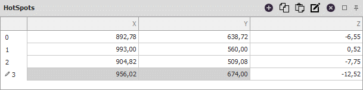
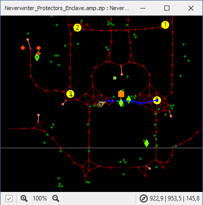

# **Панель маршрута патрулирования (HotSpots)**

Данная панель предназначена для редактирования маршрута партулирования, который состоит из последовательности точек в трехмерных координатах игрового мира и задается направление перемещения персонажа в процессе выполнения ассоциированной с ним [команды](../EntityTools-QuesterExtensions-RU.md%ref-Actions).

Изменение порядка точек патрулирования производится путем перетакивания выделенных точек (*Drag and Drop*) с зажатой левой кнопкой мыши (ЛКМ).

В отличие от [штатного quester-редактора](https://www.neverwinter-bot.com/forums/viewtopic.php?p=43901#p43901) точки патрулирования пронумерованы в соответствии с их отображением в [Mapper](../../Patches/Mapper/Mapper-RU.md)'e.  

---

## **Редактирование набора точек патрулирования**

В заголовке панели расположены кнопки:  
 **Add HotSpot** : Добавить новую точку патрулирования с координатами:
- ближайшей к персонажу точки *путевого графа*, расположенной от него на расстоянии менее [*Waypoint Distance*](../../Patches/Mapper/Mapper-MappingTools-RU.md#ref-WaypointDistance").  
- координаты персонажа, если точки путевого графа не нейдены.  

В список нельзя добавить точку патрулирования, если он содержит другую точку, расположенную от текущего местоположения на расстоянии менее [*Waypoint Distance*](../../Patches/Mapper/Mapper-MappingTools-RU.md#ref-WaypointDistance").
Дополнительно можно использовать глобальное сочетание горячих клавиш ``F5``.  

 **Copy HotSpots** : Копировать выделенные точки патрулирования в буфер обмена.  

 **Paste HotSpots** : Вставка точек патрулирования из буфера обмена.  

 **Edit Coordinates** : Включает и выключает режим ручного редактирования координат, позволяющий изменить значения отдельных координат точек патрулирования.  

 **Delete selected HotSpot** : Удалить выбранные точки патрулирования из списка.  

 **Auto hide** Переключение панели в режим ***автоматического скрытия***, в котором неактивная панель сворачивается и отображается в виде вкладки-заголовка.  

 **Pin** : Переключение панели в ***закрепленный режим***, при котором панель отображается целиком даже в неактивном состоянии.

---

<a href="javascript:history.back()">Назад</a>  
[Назад к содержанию](../../index.md)
