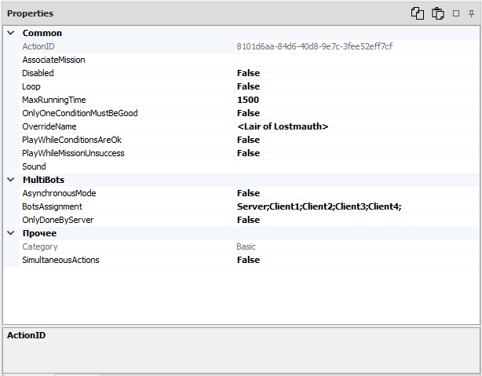

# **Панель настроек (Properties)**

Данная панель предназначена для редактирования настроек (опций) выбранной [*команды*](../EntityTools-QuesterExtensions-RU.md#ref-Actions), [*условия*](../EntityTools-QuesterExtensions-RU.md#ref-Conditions), [*CustomRegion*](../../General/CustomRegionSet-RU.md)'a или [*торговца*](VendorsPanel-RU.md) (Vendor'a).

---

В заголовке панели расположены кнопки:  

 **Copy value** : Копирование в буфер обмена значения выбранной настройки (опции).  

 **Paste value** : Вставка из буфера обмена значения настройки (опции).  
Для каждого типа настройки (опции) в буфере обмена сохраняется свое значение. Отличительная особенность данного инструмента в том, что поддерживается копирование и вставка сложных типов, таких как список координат, пунктов диалога и т.п.  
При отсутствии в буфере обмена значения того же типа, что и выделенная настройка (опция), будет выведено соответствующее сообщение.

 **Auto hide** Переключение панели в режим ***автоматического скрытия***, в котором неактивная панель сворачивается и отображается в виде вкладки-заголовка.  

 **Pin** : Переключение панели в ***закрепленный режим***, при котором панель отображается целиком даже в неактивном состоянии.

---

<a href="javascript:history.back()">Назад</a>  
[Назад к содержанию](../../index.md)