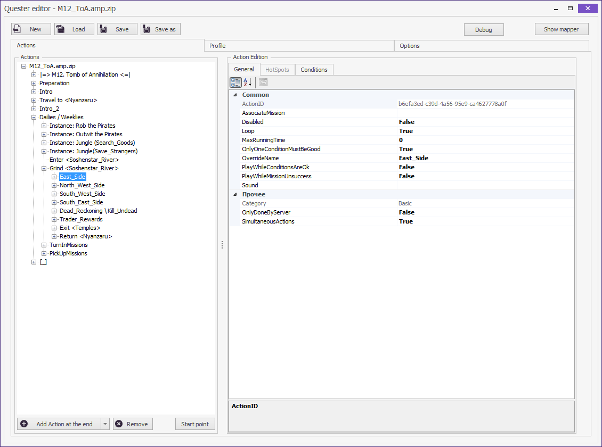
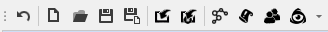

# **Модифицированный редактор quester-профиля**

Основным режимом работы [бота Astral](https://www.neverwinter-bot.com/forums/index.php) является [*Quester*](https://www.neverwinter-bot.com/forums/viewtopic.php?f=150&t=7892), предназначенный для управляления одним персонажем в процессе выполнения кампаний, прохождения подземелий и схваток, управление мастерской профессий и т.п.  
Все действия персонажа в данном режиме определяются заранее определенной последовательность команд и настроек поведения, которая называется **quester-профиль** или скрипт.  

Для создания и изменения quester-профиля используется специальный редактор.  

В плагине **EntityTools** реализован модифицированный *Quester-редактор*, который с помощью патча заменяет [штатный *редактор*](https://www.neverwinter-bot.com/forums/viewtopic.php?p=43901#p43901) бота Астрал.

<table width="100%">
    <!--<colgroup>
       <col span="1" style="width: 50%;">
       <col span="1" style="width: 50%;">
    </colgroup>-->
   <tbody>
      <tr>
         <th width="50%" align="center">Штатный UCC-редактор</th><th width="50%" align="center">Модифицированный UCC-редактор</th>
      </tr>
      <tr>
         <td></td><td></td>
      </tr>
   </tbody>
</table>
<!--|Штатный UCC-редактор|Модифицированный UCC-редактор|
|:------------:|:------------:|
|||

<!-- **Штатный Quester-Editor**  
<p align="center"></p>

**Модифицированный Quester-Editor**
<p align="center"></p> -->

## **Отличия модифицированного Quester-редактора от штатного**

1) Лаконичный адаптивный интерфейс, который можно настроить под свои потребности, перемещая панели в удобное место окна (присоединенные панели) или рабочего стола (плавающие панели), скрывая их, или настраивая всплытие при наведении курсора мыши. Настройка редактора сохраняется между сеансами в файл:  
   ```Astral_Folder\Settings\EntityTools\QuesterEditor.xml```  
   Штатный *quester-редактор* имеет неизменный интерфейс и плохо адаптируется к изменению размера окна, которое приводит к наложению элементов интерфейса друг на друга.

2) Мгновенный отклик и обновление интерфейса при изменение структуры *quester-профиля*.  
   Штатный *quester-редактор* при работе с длинным списком команд имеет заметную задержку при его обновлении после изменения свойств выбранной команды или перемещении её другую позицию.

3) Возможность редактирования отдельного *quester-профиля*, не связанного с активным (исполняемым) *quester-профилем*, управляющим действиями персонажа.
   Штатный *quester-редактор* предназначен исключительно для редактирования активного *quester-профиля*. Такая реализация может приводить к неприятным эффектам, если при редактировании *quester-профиля* произойдет загрузка нового *quester-профиля*. В этом случае несохраненные изменения будут утрачены.
   Реализованный в модифицированно *quester-редакторе* подход исключает возможность вышеуказанных негативных последствий, однако это приводит к тому, что внесенные в редакторе изменения не отражаются на исполняемом *quester-редакторе* и не модифицируют поведение персонажа в игре. Чтобы это произошло требуется [**выгрузить** редактируемый *quester-профиль* в исполнительный движок бота (*Engine*)](ProfileToolsPanel-RU.md#ref-UploadProfile).

4) Возможность отменить внесенные изменения, что особенно ценно при непредрамеренном удалении [*команды*](../EntityTools-QuesterExtensions-RU.md#ref-Actions), [*условия*](../EntityTools-QuesterExtensions-RU.md#ref-Condition), [*CustomRegion*](CustomRegionsPanel-RU.md)'а, торговца ([*Vendor*](VendorsPanel-RU.md)'a) или игнорируемого врага из [*BlackList*](BlackListPanel-RU.md).

5) Удобный [*поиск команд*](ActionsPanel-RU.md#ref-SearchActions) по наименованию типа, текстовой метке (OverrideName) или идентификатору.

6) Наличие панели логирования (Log), в которую выводится информация о внесенных изменениях и результатах тестов [*условия*](../EntityTools-QuesterExtensions-RU.md#ref-Condition).

---

## <a name="ref-ProfileToolsPanel"></a>**Основная [*панель инструментов*](ProfileToolsPanel-RU.md)**

На данной панели инструментов сгруппированы кнопки управления файлом профиля и вспомогательные инструменты. [*Подробнее...*](ProfileToolsPanel-RU.md)
<p align="center"></p>  

---

## <a name="ref-ActionsPanel"></a>**Панель команд ([Actions](ActionsPanel-RU.md))**

Cодержит набор [*команд*](../EntityTools-QuesterExtensions-RU.md#ref-Actions) и инструменты его редактирования. [*Подробнее...*](ActionsPanel-RU.md)  

---

## <a name="ref-ConditionsPanels"></a>**Панель условий ([Conditions](ConditionsPanel-RU.md))**

Cодержит набор [*условий*](../EntityTools-QuesterExtensions-RU.md#ref-Condition), ассоциированных с [*командой*](../EntityTools-QuesterExtensions-RU.md#ref-Actions) выбранной на панели [***Actions***](ActionsPanel-RU.md), и инструменты его редактирования. [*Подробнее...*](ConditionsPanel-RU.md)  

---

## <a name="ref-PropertiesPanel"></a>**Панель настроек ([Properties](PropertiesPanel-RU.md))**

Данная панель предназначена для редактирования настроек (опций) выбранной [*команды*](../EntityTools-QuesterExtensions-RU.md#ref-Actions), [*условия*](../EntityTools-QuesterExtensions-RU.md#ref-Conditions), [*CustomRegion*](CustomRegionsPanel-RU.md)'а, торговца ([*Vendor*](VendorsPanel-RU.md)'a). [*Подробнее...*](PropertiesPanel-RU.md)  

---

## <a name="ref-HotSpots"></a>**Панель маршрута патрулирования ([HotSpots](HotSpostPanel-RU.md))**

На этой панели отображается список точек патрулирования, используемый для некоторых команд, таких как *Grind*, *InteractNode*, [*MoveToEntity*](../Actions/MoveToEntity-EN.md) и т.п. [*Подробнее...*](HotSpostPanel-RU.md)  

---

## <a name="ref-CustomRegions"></a>**Панель [CustomRegions](CustomRegionsPanel-RU.md)**

Эта панели предназначена для отображения и редактирования списка *CustomRegion*'ов. [*Подробнее...*](CustomRegionsPanel-RU.md)  

---

## <a name="ref-Vendors"></a>**Панель торговцев ([Vendors](VendorsPanel-RU.md))**

Эта панели предназначена для отображения и редактирования списка продавцов (*Vendors*). [*Подробнее...*](VendorsPanel-RU.md)  

---

## <a name="ref-BlackList"></a>**Панель игнорируемых врагов ([BlackList](BlackListPanel-RU.md))**

Эта панели предназначена для отображения и редактирования списка игнорируемых врагов. [*Подробнее...*](BlackListPanel-RU.md)  

---

## <a name="ref-Settings"></a>**Панель настроек профиля ([Settings](SettingsPanel-RU.md))**

Эта панели предназначена для отображения и редактирования настроек профиля. [*Подробнее...*](SettingsPanel-RU.md) 

---

## <a name="ref-LogPanel"></a>**Панель логирования (Log)**

На указанной панели в хронологическом порядке выводится информация о внесенных изменениях и результатах тестов [*условия*](../EntityTools-QuesterExtensions-RU.md#ref-Condition).

---

<a href="javascript:history.back()">Назад</a>  
[Назад к содержанию](../../index.md)
