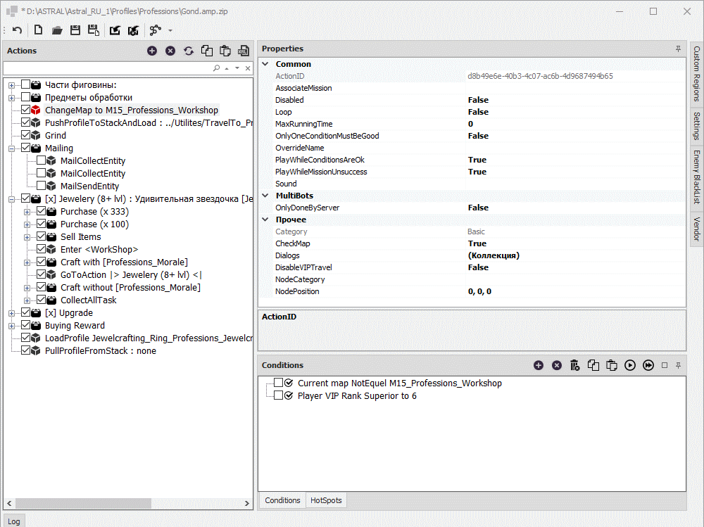

# **Модифицированный редактор quester-профиля**

Основным режимом работы [бота Astral](https://www.neverwinter-bot.com/forums/index.php) является [*Quester*](https://www.neverwinter-bot.com/forums/viewtopic.php?f=150&t=7892), предназначенный для управляления одним персонажем в процессе выполениня кампаний, прохождения подземелий и схваток, крафта предметов и т.п.  
Все действия персонажа в данном режиме определяются заранее определенной последовательность команд и настроек поведения, которая называется **quester-профиль** или скрипт.  

Для создания и изменения quester-профиля используется специальный редактор.  

В плагине **EntityTools** реализован модифицированный *Quester-редактор*, который с помощью патча заменяет [штатный *редактор*](https://www.neverwinter-bot.com/forums/viewtopic.php?p=43901#p43901) бота Астрал.

<!-- |Штатный UCC-редактор|Модифицированный UCC-редактор|
|:------------:|:------------:|
||| -->

**Штатный Quester-Editor**  
<p align="center"></p>

**Модифицированный Quester-Editor**
<p align="center"></p>

## **Отличия модифицированного Quester-редактора от штатного**

1) Лаконичный адаптивный интерфейс, который можно настроить под свои потребности, перемещая панели в удобное место окна (присоединенные панели) или рабочего стола (плавающие панели), скрывая их, или настраивая всплытие при наведении курсора мыши. Настройка редактора сохраняется между сеансами в файл:  
   ```Astral_Folder\Settings\EntityTools\QuesterEditor.xml```  
   Штатный ***UCC-редактор*** имеет неизменный интерфейс и плохо адаптируется к изменению размера окна, которое приводит к наложению элементов интерфейса друг на друга.

2) Мгновенный отклик и обновление интерфейса при изменение структуры *quester-профиля*.  
   Штатный ***quester-редактор*** при работе с длинным списком команд имеет заметную задержку при его обновлении после изменения свойств выбранной команды или перемещении её другую позицию.

3) Возможность редактирования отдельного quester-профиля, не связанного с активным quester-профилем, управляющим действиями персонажа.  
   Штатный ***quester-редактор*** предназначен исключительно для редактирования активного quester-профиля. Такая реализация может приводить к неприятным эффектам, если при редактировании quester-профиля произойдет загрузка нового *quester-профиля*. В этом случае несохраненные изменения будут утрачены.

4) Возможность отменить внесенные изменения, что особенно ценно при непредрамеренном удалении команды, условия, CustomRegion'а, продавца (Vendor'a) или игнорируемого врага из BlackList.

5) Наличие панели логирования (Log), в которую выводится информация о совершенных действиях и результатах тестов *quester-команд* и *quester-условий*.

---

## <a name="ref-ActionsPanel"></a>**Панель команд ([Actions](ActionsPanel-RU.md))**

Cодержит набор [*команд*](../EntityTools-QuesterExtensions-RU.md#ref-Actions) и инструменты его редактирования. [*Подробнее...*](ActionsPanel-RU.md)  

---

## <a name="ref-ConditionsPanels"></a>**Панель условий ([Conditions](ConditionsPanel-RU.md))**

Cодержит набор [*условий*](../EntityTools-QuesterExtensions-RU.md#ref-Condition), ассоциированных с [*командой*](../EntityTools-QuesterExtensions-RU.md#ref-Actions) выбранной на панели [***Actions***](ActionsPanel-RU.md), и инструменты его редактирования. [*Подробнее...*](ConditionsPanel-RU.md)  

---

## <a name="ref-PropertiesPanel"></a>**Панель настроек ([Properties](PropertiesPanel-RU.md))**

Данная панель предназначена для редактирования настроек (опций) выбранной [*команды*](../EntityTools-QuesterExtensions-RU.md#ref-Actions), [*условия*](../EntityTools-QuesterExtensions-RU.md#ref-Conditions), CustomRegion'a или Торговца (Vendor). [*Подробнее...*](PropertiesPanel-RU.md)  

---

## <a name="ref-HotSpots"></a>**Панель [HotSpots](HotSpostPanel-RU.md)**

На этой панели отображается список точек патрулирования, используемых для некоторых командах. Например, *Grind*, *InteractNode*, [*MoveToEntity*](../Actions/MoveToEntity-EN.md) и т.п. [*Подробнее...*](HotSpostPanel-RU.md)  

<!-- 
---

## <a name="ref-TacticPanel"></a>**Панель Tactic**

Эта панель предназначена для настройки особенностей поведения персонажа в бою, такие как условия использования зелий исцеления и правила переключения целей (Target Priority).

Изменение порядка приоритета целей *Target Priorities* производится путем перетаскивания (Drag & Drop) с зажатой левой кнопкой мыши (ЛКМ).  
Кроме того, добавление, удаление, копирования в ставка ** в(из) дерева и буфера обмена возможно с помощью кнопок, расположенных над соответствующим деревом, а также с помощью сочетания кнопок:
- ``Ctrl+C`` - копирование;
- ``Ctrl+V`` - вставка;
- ``Ctrl+Del`` - удаление;
- ``Ins`` - добавление.

---

## <a name="ref-ToolsPanels"></a>**Панели инструментов**

- **Панель управления профилем** содержит кнопки сохранения, загрузки и обновления, экспорта *ucc-профиля*. Данная панель может быть прикреплена к любой из границ окна, а также размещена в произвольном месте рабочего стола.  
- **Панель управления ucc-командами** закреплена внутри панелей [*Combat* или *Patrol*](#ref-ActionPanels) и содержит кнопки для добавления, удаления, копирования выделенной команды в буфер обмена и вставки из него, а также тестирования *ucc-команд(ы)*.  
- **Панель управления ucc-условиями** закреплена внутри панели [*Conditions*](#ref-ConditionsPanels) и содержит кнопки для добавления, удаления, копирования выделенного условия в буфер обмена и вставки из него, а также тестирования *ucc-условия(ий)*. -->

---

## <a name="ref-LogPanel"></a>**Панель Log**

На указанной панели в хронологическом порядке выводится информация о совершенных в редакторе действия.

---

<a href="javascript:history.back()">Назад</a>  
[Назад к содержанию](../../index.md)