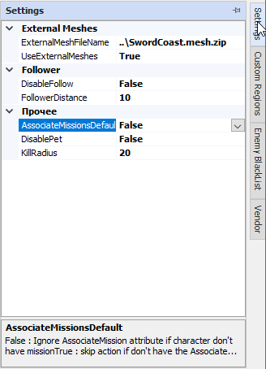

# Панель настроек профиля (Settings)

Данная панель отображает список настроек профиля и предназначена для их изменения. По умолчанию она скрыта и тображается в виде заголовка вдоль правой границы окна редактора.

---

##  **Использование внешних [*путевых графов*](../../Patches/Mapper/Mapper-RU.md#ref-Meshes) (ExternalMeshes)**

По умолчанию путевые графы локаций, используемых в профиле, хранятся в том же zip-архиве, что и сам *quester-профиль*.  
Однако, существует возможность сохранить путевые графы в отдельном файле для совместного использования в нескольких профилях. Для этого требуется активировать опцию ***UseExternalMeshes*** и указать относительный путь к файлу с расширением ``.mesh.zip`` (***UseExternalMeshFileName***).

В отличие от штатного quester-редактора можно указать путь к файлу, расположенному в дирректории, отличной от места расположения файла профиля. Штатный quester-редактор требует размещение файла внешних графов в той же дирректории, что и *quester-профиль*.

При [сохранении *quester-профиля* средстами редактора](ProfileToolsPanel-RU.md#ref-SaveAs) в другой дирректории, относительный путь к файлу внешних графов будет автоматически скорректирован.

**Данный подход имеет следующие преимущества:**

- позволяет сэкономить дисковое пространство, исключив многократное хранение одних и тех же [*путевых графов*](../../Patches/Mapper/Mapper-RU.md#ref-Meshes) в разных *quester-профилях*;  
- внесение изменений в путевой граф отражается на все *quester-профили*, использующие его совместно. Таким образом трудоемкую процедуру изменения путевого графа достаточно выполнить один раз. В противном случае для каждого *quester-профиля*, процедуру изменение [*путевых графов*](../../Patches/Mapper/Mapper-RU.md#ref-Meshes) необходимо выполнять отдельно.

---

##  **Настройки следования в групповом режиме (Follower)**

**Групповой режим (TeamMode)** - это режим взаимодействия нескольких экземпляров бота, запущенных как [client-server](https://www.neverwinter-bot.com/forums/viewtopic.php?p=44734#p44734), позволяющий организовать их взаимодействие, объединить управляемых ими персонажей в группу и осуществлять совместное управление ими.  
В данном режиме один бот является ведущим (*Server*), которые рассылает команды, а остальные боты - ведомыми (*Client*), принимающими и выполняющими команды.  
- Необходимость следования ведомых ботов за ведущим (*Server*) управляется опцией ***DisableFollow***.  
Если опция активирована, ведомые боты (*Client*) остаются на месте и по карте не перемещаются.
- Расстояние на котором в ведомые боты (*Client*) следуют за ведущим (*Server*) определяется опцией ***FollowerDistance***.

Данные опции могут быть изменены командой ``ChangeProfileValue``.

---

##  **Прочие опции (Other)**

***AssociateMissionDefault*** : флаг, определяющий режим проверки состояния квестов, активируемый опциями [PlayWhileMissionUnseccess](https://www.neverwinter-bot.com/forums/viewtopic.php?p=43902#p43902) для всех [*команд*](../EntityTools-QuesterExtensions-RU.md#ref-Actions) в профиле:
- ***True***: Проверка истина, если квест, заданный опцией [*AssociateMission*](https://www.neverwinter-bot.com/forums/viewtopic.php?p=43902#p43902), имеется в журнале заданий персонажа и не завершен, что соответствует статусу *InProgress*;
- ***False***: Проверка истина, если квест, заданный опцией [*AssociateMission*](https://www.neverwinter-bot.com/forums/viewtopic.php?p=43902#p43902), персонажем не был завершен, что соответствует статусу *Uncompleted*. Для этого наличие квеста в журнале заданий не обязательно, то есть допускается статус *HaventQuest*.

***DisablePet*** : флаг, отключающий автоматический призыв спутника.  
Данная опция может быть изменена командой ``ChangeProfileValue``.

***KillRadius*** : Расстояние, за пределами которого персонаж игнорирует врагов и не пытается их атаковать.  
Данная опция может быть изменена командой ``ChangeProfileValue``.

---

<a href="javascript:history.back()">Назад</a>  
[Назад к содержанию](../../index.md)