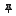

# Панель торговцев (Vendors)

Данная панель содержит список продавцов и предназначена для управления им. По умолчанию она скрыта и тображается в виде заголовка вдоль правой границы окна редактора.

Если выделить торговца, то его настройки отобразятся в панели [*Properties*](PropertiesPanel-RU.md), которая позволяет изменить большинство из них:

---

В заголовке панели расположены кнопки:

 **Add Vendor** : Добавить торговца.  

 **Import Vendors** : Импорт торговцев из другого профиля:  
1) Сначала в диалоговом окне необходимо выбрать quester-профиль из которого будут импортироваться торговцы.
2) Если выбранный профиль не содержит торговцев (***Vendors***) будет выбрано соответствующее предупреждение.
3) Затем необходимо отметить торговцев, которые необходимо импортировать:
    

4) Если торговец уже содержится в списке ***Vendors***, он будет проигнорирован.

 **Delete selected Vendor** : Удалить выбранного торговца из списка.  

 **Auto hide** Переключение панели в режим ***автоматического скрытия***, в котором неактивная панель сворачивается и отображается в виде вкладки-заголовка.  

 **Pin** : Переключение панели в ***закрепленный режим***, при котором панель отображается целиком даже в неактивном состоянии.

---

<a href="javascript:history.back()">Назад</a>  
[Назад к содержанию](../../index.md)