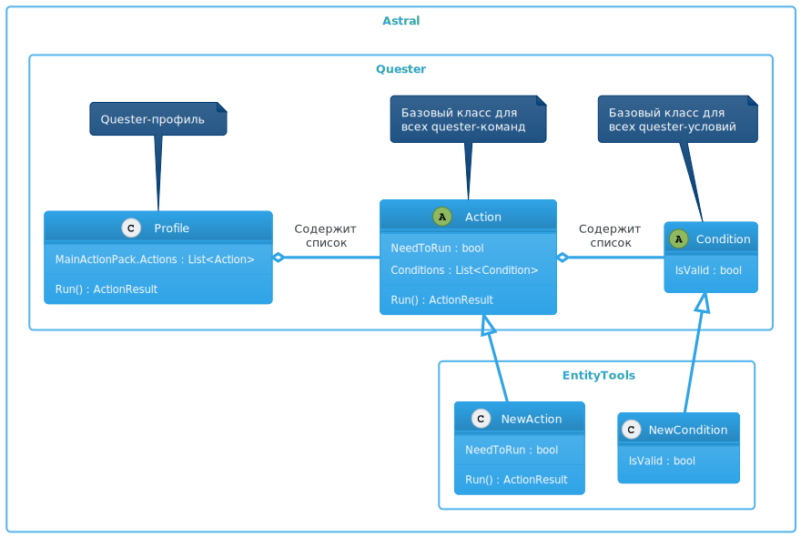

# **Расширение для роли [*Quester*](../General/Glossary-RU.md#ref-Quester)**

[*Quester*](../General/Glossary-RU.md#ref-Quester) - это [подсистема](https://www.neverwinter-bot.com/forums/viewtopic.php?p=43900#p43900) бота [*Astral*](https://www.neverwinter-bot.com/forums/index.php), предназначенная для управления одним персонажем и выполнения заранее определенной последовательности действий, которая называется ***профиль (рrofile)***.

Профили создаются в специальном [редакторе](Editor/QuesterEditor-RU.md) путем добавления команд ([*action*](Actions/Astral-Actions-RU.md)), каждая из которых имеет собственные [настройки](https://www.neverwinter-bot.com/forums/viewtopic.php?p=43902#p43902) и условия запуска ([*conditions*](https://www.neverwinter-bot.com/forums/viewtopic.php?p=43910#p43910)).  
Команды, как правило, управляют игровым персонажем и совершают несколько внутриигровых действий для достижения нужного результата. Например, команда [*InteractSpecificNPC*](Actions/Astral-Actions-RU.md#ref-InteractSpecificNPC) для взаимодействия с неигровым персонажем (NPC), выполняет перемещение игрового персонажа к месту нахождения NPC, активацию диалога и последовательный выбор заранее заданных вариантов ответов.

Плагин **EntityTools** реализует дополнительные команды и условия, которые могут быть использованы в профилях [*Quester'a*](../General/Glossary-RU.md#ref-Quester), а также инструменты для их настройки.
Большое внимание уделено обработке *Entity* - внутриигровым объектам, являющимся частью игрового процесса или декорациями. К *Entity* относятся все игровые или неигровые персонажи, спутники, противники и босы подземелий, <!--некоторые предметы интерьера, -->порталы и т.д. В некоторых случаях, *Entity* используются для реализации игровых механик. Например, пылающие и отравленные области на земле, причиняющие урон находящимся в них персонажам.

---

---

## **Команды**
1. [MoveToEntity](Actions/MoveToEntity-RU.md) : патрулирование по заданному маршруту, поиск и нападение на заданную [*Entity*](../General/EntityIdentification-RU.md).
2. [InteractEntities](Actions/InteractEntities-RU.md) : патрулирование по заданному маршруту, поиск и взаимодействие с заданной [*Entity*](../General/EntityIdentification-RU.md).
3. [MoveToTeammate](Actions/MoveToTeammate-RU.md) : сопровождение и оказание поддержки заданному члену группы.
4. [PickUpMissionExt](Actions/PickUpMissionExt-RU.md) : взятие квестового задания (миссии) у конкретного неигрового персонажа (NPC) или у вспомогательной внутриигровой диалоговой подсистемы.
5. [TurnInMissionExt](Actions/TurnInMissionExt-RU.md) : сдача квестового задания (миссии) конкретному неигровому персонажу (NPC).
6. [AddIgnoredFoes](Actions/AddIgnoredFoes-RU.md) : задает список противников, игнорируемых во время боя.
7. [RemoveIgnoredFoes](Actions/RemoveIgnoredFoes-RU.md) : удаление противников, игнорируемых во время боя, которые были добавлены командой [*AddIgnoreFoes*](Action/RemoveIgnoredFoes-RU.md).
8. [ChangeInstanceToLeader](Actions/ChangeInstanceToLeader-RU.md) : переход игрового персонажа на инстанс текущей карты, в котором находится лидер группы.
9. [PromoteTeammate](Actions/PromoteTeammate-RU.md) : Передача другому игроку лидерства в группе.
10. [ExecutePowerExt](Actions/ExecutePowerExt-RU.md) : Активация умения персонажа в заданном месте и в заданную цель.
11. [Jumping](Actions/Jumping-RU.md) : Перемещение персонажа одним или серией прыжков из заданной точки к целевой.
12. [UpgradeItem](Actions/UpgradeItem-RU.md) : Повышение ранга (уровня) предмета, заданного идентификатором. К таким предметам относятся волшебные камни и руны, знаки скакунов, артефактная экипировка и т.д.

---

## **Условия**
1. [EntityCount](Conditions/EntityCount-RU.md) : подсчёт количества *Entity* и сравнение его с референтным значением.
2. [EntityProperty](Conditions/EntityProperty-RU.md) : сопоставление значения заданного свойства ближайшего *Entity* с референтным значением.
3. [TeamMemberCount](Conditions/TeamMemberCount-RU.md) : подсчёт количества членов группы и сравнивает его с референтным значением.
4. [TeamLeaderMapInstance](Conditions/TeamLeaderMapInstance-RU.md) : сравнение инстанса, в котором находится игрок, с инстансом, в котором находится лидер группы.
5. [CheckShard](Conditions/CheckShard-RU.md) : проверка названия сервера, к которому подключен игровой клиент.
6. [IsInCustomRegionSet](Conditions/IsInCustomRegionSet-RU.md) : проверка местонахождения персонажа относительно области, заданной набором [*CustomRegion'ов*](../General/Glossary-RU.md#ref-CustomRegions).
7. [EquipmentLevel](Conditions/EquipmentLevel-RU.md) : проверка уровня заданного(го) предмета(ов) экипировки.

Правила проверки условий, ассоциированных с [*командой*](#ref-Actions), описаны в отдельной [*статье*](Conditions/ConditionsCheckLogicRule-RU.md).

---

<a href="javascript:history.back()">Назад</a>  
[Назад к содержанию](../index.md)