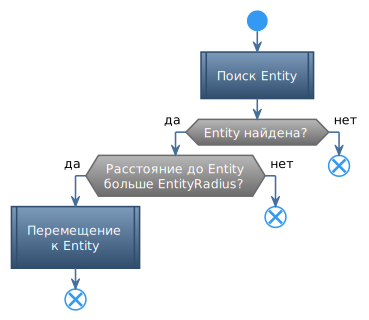

# **ApproachEntity**

Команда предназначена для перемещения персонажа к ближайшему *Entity*.

## **Описание**

1. Производится поиск *Entity*, удовлетворяющего критериям поиска.
2. Если расстояние до найденного *Entity* больше [*EntityRadius*](#ref-EntityRadius), персонаж перемещается к нему.
3. Команда пропускается, если не найдено подходящего *Entity* или оно расположено ближе чем [*EntityRadius*](#ref-EntityRadius).

---

| **Наименование** | **Описание** 
|:-----------------|:-------------
||**Настройки идентификации *Entity* (категория "Entity")**
|<a name ="ref-EntityID">***EntityID***</a><br/><a name ="ref-EntityIdType">***EntityIdType***</a><br/><a name ="ref-EntityNameType">***EntityNameType***</a> | Идентификация *Entity* производится сочетанием трех перечисленных слева свойств, которые подробно описаны в разделе [Идентификация *Entity*](../../General/EntityIdentification-RU.md).
|<a name ="ref-EntityRadius">***EntityRadius***</a> | Минимальное расстояние до целевой *Entity*, на которое необходимо приблизиться.
||**Дополнительные фильтры *Entity* (категория "Optional")**
|<a name ="ref-RegionCheck">***RegionCheck***</a> | Флаг, активирующий дополнительную проверку внутриигрового региона (не то же самое, что *CustomRegion*), в котором находится *Entity*.<br/>- ***True*** : Поиск *Entity* производится в том же регионе, в котором находится персонаж;<br/>- ***False*** : Проверка региона при поиске *Entity* не производится.
|<a name ="ref-HealthCheck">***HealthCheck***</a> | Дополнительная проверка уровня здоровья *Entity* (HP).<br/>- ***True*** : Игнорируются *Entity* с нулевым количеством очков здоровья (HP) либо, имеющие флаг ***IsDead***;<br/>- ***False*** : Здоровье *Entity* (HP) не проверяется.
|<a name ="ref-ReactionRange">***ReactionRange***</a> | Максимальное допустимое расстояние от *Entity* до персонажа. *Entity* на большем расстоянии игнорируются.<br/> Опция отключается при установке значения ``0``. При этом поиск производится среди всех видимых боту *Entity*.
|<a name ="ref-ReactionZRange">***ReactionZRange***</a> | Максимальная допустимая разница по высоте (ZAxis) между *Entity* и персонажем. *Entity*, находящиеся выше (ниже) заданной величины относительно персонажа, - игнорируются. <br/> Опция отключается при установке значения ``0``. При этом поиск производится среди всех видимых боту *Entity*.
|<a name ="ref-Aura">***Aura***</a> | Комплексная опция, позволяющая указать ауру и количество её экземпляров, которые проверяется на целевой *Entity*:<br/>- <a name ="ref-AuraName">***AuraName***</a> : Идентификатор ауры;<br/>- <a name ="ref-AuraNameType">***AuraNameType***</a> : Переключатель способа интерпретации [*AuraName*](#ref-AuraName) (*Simple* или *Regex*);<br/>- <a name ="ref-Stacks">***Stacks***</a> : Референтное количество экземпляров ауры;<br/>- <a name ="ref-Sign">***Sign***</a> : Переключатель, который задает соотношение референтного значения [*Stacks*](!ref-Stacks) с подсчитанным количеством экземпляров ауры.<br/>Для поиска *Entity*, у которого отсутствует заданная аура достаточно задать:<br/> ```Stacks := 0; Sign := Equals```

<!---

# **Внутренние условия**

Команда игнорируется (пропускается) в следующих случаях:
- Отсутствует *Entity*, удовлетворяющее критериям поиска.
- Расстояние между персонажем и ближайшим *Entity*, удовлетворяющим критериям поиска, меньше [*EntityRadius*](#ref-EntityRadius). -->

---

# **Блок-схема**
<p align="center"></p>

---

# **Аналоги**

В базовом функционале бота наиболее близкой по назначению является команда **Special : Approach**, которая, впрочем, не позволяет распознать и приблизиться к *Entity*.

---

<a href="javascript:history.back()">Назад</a>  
[Назад к перечню команд](../EntityTools-UccExtensions-RU.md#ref-Actions)  
[Назад к содержанию](../../index.md)