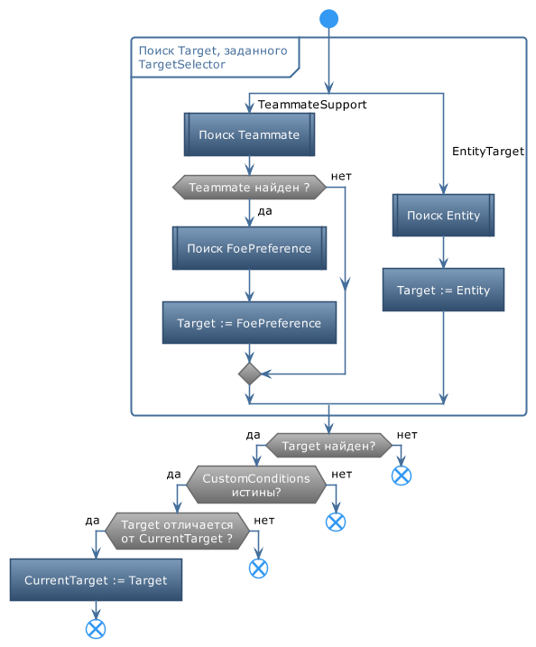

# **ChangeTarget**

Команда предназначена для замены текущей цели персонажа в бою на цель, заданную командой.

## **Описание алгоритма**

Логика работы ChangeTarget следующая:
1) Опция TargetSelector  задает принцип выбора цели.
2) При проверке команды, она смотрит на текущую цель (CurrentTarget) и сравнивает её с заданной в TargetSelector.
2.1) Если CurrentTarget не соответствует TargetSelector И рядом с персонажем есть нужная Entity - команда меняет CurrentTarget
2.2) в противном случае - игнорируется

---

# **Настройки команды**

| **Наименование** | **Описание** 
|:-----------------|:-------------
||**Название группы настроек  (категория "General")**
|<a name ="ref-TargetSelector">***TargetSelector***</a> | Комплексный алгоритм проверки и выбора актуальной цели: - ***EntityTarget*** : Поиск и указание в качестве цели *Entity*, заданного сочетанием трех свойств: <a name ="ref-EntityID">*EntityID*</a>, <a name ="ref-EntityIdType">*EntityIdType*</a> и <a name ="ref-EntityNameType">*EntityNameType*</a>. Подробное описание приведено в разделе [Идентификация *Entity*](../../General/EntityIdentification-RU.md). - ***TeammateSupport*** : Оказание поддержки заданному члену группы, атаками по его цели (асист) или по нападающим на него противникам (защита). Подробное описание приведено в разделе [*SupportTeammate*](../../General/SupportTeammate-RU.md).
||**Дополнительные настройки**
|<a name ="ref-Range">***Range***</a> | Дальность поиска противников, соответствующих [*TargetSelector*](#ref-TargetSelector). Если в пределах заданного расстояния нужный противник не найден - команда пропускается.
|<a name ="ref-CoolDown">***CoolDown***</a> | Стандартный кулдаун на возможность повторного применения команды. Минимальное значение 1000 мс.
|<a name ="ref-CustomConditions">***CustomConditions***</a> | Расширенный набор ucc-условий

---

# **Внутренние условия**

Условия запуска команды определяются значением опции [*TargetSelector*](#ref-TargetSelector).

---

# **Блок-схема**

---

# **Аналоги**
В базовом функционале бота похожие команды отсутствуют.

---

<a href="javascript:history.back()">Назад</a>  
[Назад к перечню команд](../EntityTools-UccExtensions-RU.md#ref-Actions)  
[Назад к содержанию](../../index.md)